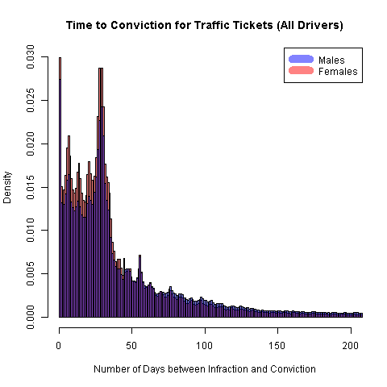
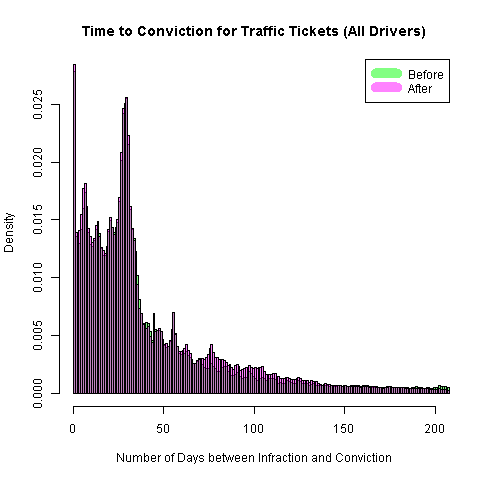

# Models of Time to Conviction

The dependent variable is the number of days that pass between the date that
an infraction was committed and the date it was recorded as a conviction.
Convictions are recorded when either the driver pays the fine, thereby admitting
guilt, or is found guilty after challenging the ticket in court.

There are 3,949,799 observations for tickets written between April 1, 2006 and
March 31, 2010.


## Histograms


### Gender difference in time to conviction




Each bar represents a different number of days. The vertical dashed lines denote
intervals of seven days.
Males fight the ticket more often.
Females will pay the ticket and admit guilt more often.


### Time to conviction before and after policy change



After the increased penalties, there is a slight lift in the number of cases
that settle over 70 to 140 days.
This indicates a slight uptick in the number of cases that are fought in court.
However, there is also a slight increase in the number of tickets that are paid quickly.


## Linear Regression Results (Standard Errors under Homoskedasticity)

No HCCME here, because life is too short. Let's get the answer first.

### Dependent variable: Days to Conviction


```R
Coefficients:
               Estimate Std. Error t value Pr(>|t|)    
(Intercept)     1.25498    2.35659   0.533 0.594352    
sexM           29.32682    0.14103 207.941  < 2e-16 ***
age_grp16-19   65.03904    2.36355  27.518  < 2e-16 ***
age_grp20-24   46.78470    2.35341  19.879  < 2e-16 ***
age_grp25-34   36.31714    2.35034  15.452  < 2e-16 ***
age_grp35-44   23.15629    2.35054   9.851  < 2e-16 ***
age_grp45-54    7.24071    2.35092   3.080 0.002070 **
age_grp55-64   -7.77373    2.35401  -3.302 0.000959 ***
age_grp65-199 -25.51773    2.36106 -10.808  < 2e-16 ***
policyTRUE    -11.62791    0.12778 -90.996  < 2e-16 ***
points         18.19733    0.05803 313.606  < 2e-16 ***
---
Signif. codes:  0 ‘***’ 0.001 ‘**’ 0.01 ‘*’ 0.05 ‘.’ 0.1 ‘ ’ 1

Residual standard error: 126.9 on 3949788 degrees of freedom
Multiple R-squared:  0.07218,	Adjusted R-squared:  0.07218
F-statistic: 3.073e+04 on 10 and 3949788 DF,  p-value: < 2.2e-16
```

Include an indicator for gender.

```R
Coefficients:
                 Estimate Std. Error t value Pr(>|t|)    
(Intercept)      -1.63621    2.35869  -0.694 0.487874    
sexM             33.29062    0.20122 165.444  < 2e-16 ***
age_grp16-19     65.03138    2.36332  27.517  < 2e-16 ***
age_grp20-24     46.76739    2.35319  19.874  < 2e-16 ***
age_grp25-34     36.32104    2.35011  15.455  < 2e-16 ***
age_grp35-44     23.17159    2.35031   9.859  < 2e-16 ***
age_grp45-54      7.26617    2.35069   3.091 0.001994 **
age_grp55-64     -7.74624    2.35379  -3.291 0.000998 ***
age_grp65-199   -25.48656    2.36083 -10.796  < 2e-16 ***
policyTRUE       -6.13543    0.23640 -25.954  < 2e-16 ***
points           18.21208    0.05802 313.877  < 2e-16 ***
sexM:policyTRUE  -7.75737    0.28091 -27.615  < 2e-16 ***
---
Signif. codes:  0 ‘***’ 0.001 ‘**’ 0.01 ‘*’ 0.05 ‘.’ 0.1 ‘ ’ 1

Residual standard error: 126.9 on 3949787 degrees of freedom
Multiple R-squared:  0.07236,	Adjusted R-squared:  0.07236
F-statistic: 2.801e+04 on 11 and 3949787 DF,  p-value: < 2.2e-16
```


There was no evidence for other interactions with the policy indicator.


### Dependent variable: Logarithm of (1 + ) Days to Conviction


```R
Coefficients:
                Estimate Std. Error t value Pr(>|t|)    
(Intercept)    3.0084780  0.0228343 131.752  < 2e-16 ***
sexM           0.2843241  0.0013666 208.058  < 2e-16 ***
age_grp16-19   0.4761715  0.0229018  20.792  < 2e-16 ***
age_grp20-24   0.4038426  0.0228036  17.710  < 2e-16 ***
age_grp25-34   0.3460687  0.0227738  15.196  < 2e-16 ***
age_grp35-44   0.1673921  0.0227757   7.350 1.99e-13 ***
age_grp45-54  -0.1164490  0.0227794  -5.112 3.19e-07 ***
age_grp55-64  -0.4486459  0.0228094 -19.669  < 2e-16 ***
age_grp65-199 -0.9117646  0.0228776 -39.854  < 2e-16 ***
policyTRUE    -0.0641208  0.0012382 -51.786  < 2e-16 ***
points         0.1481013  0.0005622 263.409  < 2e-16 ***
---
Signif. codes:  0 ‘***’ 0.001 ‘**’ 0.01 ‘*’ 0.05 ‘.’ 0.1 ‘ ’ 1

Residual standard error: 1.23 on 3949788 degrees of freedom
Multiple R-squared:  0.1136,	Adjusted R-squared:  0.1136
F-statistic: 5.06e+04 on 10 and 3949788 DF,  p-value: < 2.2e-16
```

Include an interaction with number of points.

```R
Coefficients:
                    Estimate Std. Error t value Pr(>|t|)    
(Intercept)        2.9710263  0.0229231 129.608  < 2e-16 ***
sexM               0.2840595  0.0013666 207.862  < 2e-16 ***
age_grp16-19       0.4778495  0.0229010  20.866  < 2e-16 ***
age_grp20-24       0.4054920  0.0228028  17.783  < 2e-16 ***
age_grp25-34       0.3479624  0.0227730  15.280  < 2e-16 ***
age_grp35-44       0.1694986  0.0227750   7.442 9.90e-14 ***
age_grp45-54      -0.1143125  0.0227787  -5.018 5.21e-07 ***
age_grp55-64      -0.4465010  0.0228087 -19.576  < 2e-16 ***
age_grp65-199     -0.9098506  0.0228769 -39.772  < 2e-16 ***
policyTRUE        -0.0091465  0.0032223  -2.839  0.00453 **
points             0.1620180  0.0009398 172.394  < 2e-16 ***
policyTRUE:points -0.0215299  0.0011651 -18.479  < 2e-16 ***
---
Signif. codes:  0 ‘***’ 0.001 ‘**’ 0.01 ‘*’ 0.05 ‘.’ 0.1 ‘ ’ 1

Residual standard error: 1.229 on 3949787 degrees of freedom
Multiple R-squared:  0.1136,	Adjusted R-squared:  0.1136
F-statistic: 4.604e+04 on 11 and 3949787 DF,  p-value: < 2.2e-16
```

Include an indicator for gender.

```R
Coefficients:
                   Estimate Std. Error t value Pr(>|t|)    
(Intercept)        2.958947   0.022939 128.991  < 2e-16 ***
sexM               0.303357   0.001953 155.324  < 2e-16 ***
age_grp16-19       0.477723   0.022900  20.861  < 2e-16 ***
age_grp20-24       0.405320   0.022802  17.775  < 2e-16 ***
age_grp25-34       0.347881   0.022773  15.276  < 2e-16 ***
age_grp35-44       0.169461   0.022774   7.441 1.00e-13 ***
age_grp45-54      -0.114302   0.022778  -5.018 5.22e-07 ***
age_grp55-64      -0.446481   0.022808 -19.575  < 2e-16 ***
age_grp65-199     -0.909801   0.022876 -39.770  < 2e-16 ***
policyTRUE         0.014659   0.003653   4.013 6.00e-05 ***
points             0.161352   0.000941 171.465  < 2e-16 ***
sexM:policyTRUE   -0.037739   0.002729 -13.830  < 2e-16 ***
policyTRUE:points -0.020388   0.001168 -17.456  < 2e-16 ***
---
Signif. codes:  0 ‘***’ 0.001 ‘**’ 0.01 ‘*’ 0.05 ‘.’ 0.1 ‘ ’ 1

Residual standard error: 1.229 on 3949786 degrees of freedom
Multiple R-squared:  0.1137,	Adjusted R-squared:  0.1137
F-statistic: 4.222e+04 on 12 and 3949786 DF,  p-value: < 2.2e-16
```


## Logistic Regression Results

### Dependent variable: Days to Conviction = 0

These drivers paid their ticket the same day.


```R
Coefficients:
                 Estimate Std. Error z value Pr(>|z|)    
(Intercept)     -5.392851   0.332384 -16.225  < 2e-16 ***
sexM            -0.093269   0.014728  -6.333 2.41e-10 ***
age_grp16-19     0.749107   0.332931   2.250 0.024447 *  
age_grp20-24     0.845477   0.332214   2.545 0.010929 *  
age_grp25-34     0.799224   0.332037   2.407 0.016083 *  
age_grp35-44     0.868552   0.332029   2.616 0.008899 **
age_grp45-54     1.210165   0.331982   3.645 0.000267 ***
age_grp55-64     1.789403   0.331978   5.390 7.04e-08 ***
age_grp65-199    2.586104   0.331963   7.790 6.68e-15 ***
policyTRUE       0.010148   0.016990   0.597 0.550331    
points          -0.097815   0.005308 -18.426  < 2e-16 ***
sexM:policyTRUE -0.041105   0.020392  -2.016 0.043829 *  
---
Signif. codes:  0 ‘***’ 0.001 ‘**’ 0.01 ‘*’ 0.05 ‘.’ 0.1 ‘ ’ 1

(Dispersion parameter for binomial family taken to be 1)

    Null deviance: 502396  on 3949798  degrees of freedom
Residual deviance: 484198  on 3949787  degrees of freedom
AIC: 484222
```

There were no other policy interactions worth reporting.


### Dependent variable: Days to Conviction > 30

These drivers did not pay their ticket within 30 days.
They might have fought the ticket in court but they might have paid late.


```R
Coefficients:
                  Estimate Std. Error z value Pr(>|z|)    
(Intercept)     -0.8626050  0.0375222 -22.989  < 2e-16 ***
sexM             0.3856331  0.0033028 116.761  < 2e-16 ***
age_grp16-19     0.5218710  0.0375618  13.894  < 2e-16 ***
age_grp20-24     0.6563048  0.0373928  17.552  < 2e-16 ***
age_grp25-34     0.6951881  0.0373394  18.618  < 2e-16 ***
age_grp35-44     0.3777357  0.0373374  10.117  < 2e-16 ***
age_grp45-54    -0.1115025  0.0373421  -2.986  0.00283 **
age_grp55-64    -0.6381974  0.0374059 -17.061  < 2e-16 ***
age_grp65-199   -1.2887242  0.0376225 -34.254  < 2e-16 ***
policyTRUE       0.0008913  0.0038722   0.230  0.81795    
points           0.1969884  0.0011293 174.435  < 2e-16 ***
sexM:policyTRUE -0.0143436  0.0046165  -3.107  0.00189 **
---
Signif. codes:  0 ‘***’ 0.001 ‘**’ 0.01 ‘*’ 0.05 ‘.’ 0.1 ‘ ’ 1

(Dispersion parameter for binomial family taken to be 1)

    Null deviance: 5468342  on 3949798  degrees of freedom
Residual deviance: 5110029  on 3949787  degrees of freedom
AIC: 5110053
```

### Dependent variable: Days to Conviction > 42

These drivers did not pay their ticket within 42 days.
They probably fought the ticket in court but those who did not might have paid late,
so this allows a grace period for the stragglers.
The number 42 was not only chosen because it is the answer to life, the universe and
everything but because it is a quantile that defines the end of the highest mode of the distribution.


```R
Coefficients:
                 Estimate Std. Error z value Pr(>|z|)    
(Intercept)     -1.663079   0.039005 -42.638  < 2e-16 ***
sexM             0.505708   0.003448 146.658  < 2e-16 ***
age_grp16-19     0.715849   0.039021  18.345  < 2e-16 ***
age_grp20-24     0.782695   0.038863  20.140  < 2e-16 ***
age_grp25-34     0.773590   0.038815  19.930  < 2e-16 ***
age_grp35-44     0.482517   0.038819  12.430  < 2e-16 ***
age_grp45-54     0.002301   0.038832   0.059  0.95275    
age_grp55-64    -0.509335   0.038920 -13.087  < 2e-16 ***
age_grp65-199   -1.139836   0.039226 -29.058  < 2e-16 ***
policyTRUE       0.014684   0.004116   3.568  0.00036 ***
points           0.214704   0.001088 197.272  < 2e-16 ***
sexM:policyTRUE -0.026862   0.004825  -5.568 2.58e-08 ***
---
Signif. codes:  0 ‘***’ 0.001 ‘**’ 0.01 ‘*’ 0.05 ‘.’ 0.1 ‘ ’ 1

(Dispersion parameter for binomial family taken to be 1)

    Null deviance: 5302820  on 3949798  degrees of freedom
Residual deviance: 4960526  on 3949787  degrees of freedom
AIC: 4960550
```

A policy interaction with the number of points was significant here.

```R
Coefficients:
                   Estimate Std. Error z value Pr(>|z|)    
(Intercept)       -1.701287   0.039159 -43.446  < 2e-16 ***
sexM               0.504024   0.003453 145.963  < 2e-16 ***
age_grp16-19       0.717077   0.039031  18.372  < 2e-16 ***
age_grp20-24       0.783915   0.038873  20.166  < 2e-16 ***
age_grp25-34       0.775018   0.038826  19.961  < 2e-16 ***
age_grp35-44       0.484119   0.038830  12.468  < 2e-16 ***
age_grp45-54       0.003891   0.038843   0.100     0.92    
age_grp55-64      -0.507727   0.038930 -13.042  < 2e-16 ***
age_grp65-199     -1.138420   0.039237 -29.014  < 2e-16 ***
policyTRUE         0.076911   0.006808  11.298  < 2e-16 ***
points             0.229437   0.001688 135.962  < 2e-16 ***
sexM:policyTRUE   -0.023950   0.004832  -4.957 7.16e-07 ***
policyTRUE:points -0.025192   0.002195 -11.479  < 2e-16 ***
---
Signif. codes:  0 ‘***’ 0.001 ‘**’ 0.01 ‘*’ 0.05 ‘.’ 0.1 ‘ ’ 1

(Dispersion parameter for binomial family taken to be 1)

    Null deviance: 5302820  on 3949798  degrees of freedom
Residual deviance: 4960394  on 3949786  degrees of freedom
AIC: 4960420

```


## Generalized Linear Model (Gamma Distribution) Results

The exponential distribution is a special case of the gamma distribution.
In any case, it is a model well-specified for a dependent variable positive support.

### Dependent variable: Days to Conviction


```R
Coefficients:
                Estimate Std. Error t value Pr(>|t|)    
(Intercept)    3.6342440  0.0291479 124.683  < 2e-16 ***
sexM           0.3971105  0.0017444 227.648  < 2e-16 ***
age_grp16-19   0.6177675  0.0292339  21.132  < 2e-16 ***
age_grp20-24   0.4589926  0.0291086  15.768  < 2e-16 ***
age_grp25-34   0.3625548  0.0290706  12.472  < 2e-16 ***
age_grp35-44   0.2213721  0.0290730   7.614 2.65e-14 ***
age_grp45-54   0.0097541  0.0290778   0.335    0.737    
age_grp55-64  -0.2349644  0.0291160  -8.070 7.04e-16 ***
age_grp65-199 -0.6081300  0.0292032 -20.824  < 2e-16 ***
policyTRUE    -0.1375989  0.0015805 -87.059  < 2e-16 ***
points         0.1404574  0.0007177 195.703  < 2e-16 ***
---
Signif. codes:  0 ‘***’ 0.001 ‘**’ 0.01 ‘*’ 0.05 ‘.’ 0.1 ‘ ’ 1

(Dispersion parameter for Gamma family taken to be 2.463208)

    Null deviance: 6543381  on 3949798  degrees of freedom
Residual deviance: 5902627  on 3949788  degrees of freedom
AIC: 42280969
```

There were no other interactions worth reporting. 
