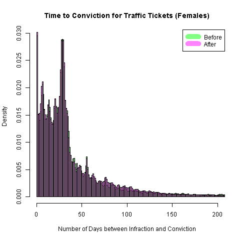

# Models of Time to Conviction - Female Drivers

The dependent variable is the number of days that pass between the date that
an infraction was committed and the date it was recorded as a conviction.
Convictions are recorded when either the driver pays the fine, thereby admitting
guilt, or is found guilty after challenging the ticket in court.

There are 1,154,069 observations for tickets written between April 1, 2006 and
March 31, 2010.


## Histograms


### Time to conviction before and after policy change



After the increased penalties, there is a slight lift in the number of cases
that settle over 70 to 140 days.
This indicates a slight uptick in the number of cases that are fought in court.
However, there is also a slight increase in the number of tickets that are paid quickly.


## Linear Regression Results (Standard Errors under Homoskedasticity)

No HCCME here, because life is too short. Let's get the answer first.

### Dependent variable: Days to Conviction


```R

```


There was no evidence for other interactions with the policy indicator.


### Dependent variable: Logarithm of (1 + ) Days to Conviction


```R

```

Include an interaction with number of points.

```R

```


## Logistic Regression Results

### Dependent variable: Days to Conviction = 0

These drivers paid their ticket the same day.


```R

```

There were no other policy interactions worth reporting.


### Dependent variable: Days to Conviction > 30

These drivers did not pay their ticket within 30 days.
They might have fought the ticket in court but they might have paid late.


```R

```

### Dependent variable: Days to Conviction > 42

These drivers did not pay their ticket within 42 days.
They probably fought the ticket in court but those who did not might have paid late,
so this allows a grace period for the stragglers.
The number 42 was not only chosen because it is the answer to life, the universe and
everything but because it is a quantile that defines the end of the highest mode of the distribution.


```R

```

A policy interaction with the number of points was significant here.

```R

```


## Generalized Linear Model (Gamma Distribution) Results

The exponential distribution is a special case of the gamma distribution.
In any case, it is a model well-specified for a dependent variable with positive support.

### Dependent variable: Days to Conviction


```R

```

There were no other interactions worth reporting.
