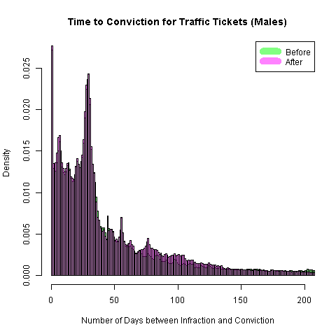

# Models of Time to Conviction - Male Drivers

The dependent variable is the number of days that pass between the date that
an infraction was committed and the date it was recorded as a conviction.
Convictions are recorded when either the driver pays the fine, thereby admitting
guilt, or is found guilty after challenging the ticket in court.

There are 2,795,730  observations for tickets written between April 1, 2006 and
March 31, 2010.


## Histograms


### Time to conviction before and after policy change



After the increased penalties, there is a slight lift in the number of cases
that settle over 70 to 140 days.
This indicates a slight uptick in the number of cases that are fought in court.
However, there is also a slight increase in the number of tickets that are paid quickly.


## Linear Regression Results (Standard Errors under Homoskedasticity)

No HCCME here, because life is too short. Let's get the answer first.

### Dependent variable: Days to Conviction


```R
Coefficients:
               Estimate Std. Error t value Pr(>|t|)    
(Intercept)    28.08896    2.65202  10.592  < 2e-16 ***
age_grp16-19   68.30700    2.66535  25.628  < 2e-16 ***
age_grp20-24   51.39591    2.65223  19.378  < 2e-16 ***
age_grp25-34   40.46465    2.64806  15.281  < 2e-16 ***
age_grp35-44   26.21584    2.64851   9.898  < 2e-16 ***
age_grp45-54    8.46306    2.64895   3.195  0.00140 **
age_grp55-64   -7.99513    2.65316  -3.013  0.00258 **
age_grp65-199 -27.23882    2.66237 -10.231  < 2e-16 ***
policyTRUE    -13.77236    0.16402 -83.969  < 2e-16 ***
points         18.62372    0.07052 264.095  < 2e-16 ***
---
Signif. codes:  0 ‘***’ 0.001 ‘**’ 0.01 ‘*’ 0.05 ‘.’ 0.1 ‘ ’ 1

Residual standard error: 137 on 2795720 degrees of freedom
Multiple R-squared:  0.06294,	Adjusted R-squared:  0.06294
F-statistic: 2.087e+04 on 9 and 2795720 DF,  p-value: < 2.2e-16
```


Interaction with number of points.

```R
Coefficients:
                  Estimate Std. Error t value Pr(>|t|)    
(Intercept)        27.5420     2.6655  10.333  < 2e-16 ***
age_grp16-19       68.3307     2.6654  25.637  < 2e-16 ***
age_grp20-24       51.4191     2.6523  19.387  < 2e-16 ***
age_grp25-34       40.4927     2.6481  15.291  < 2e-16 ***
age_grp35-44       26.2484     2.6486   9.910  < 2e-16 ***
age_grp45-54        8.4964     2.6490   3.207  0.00134 **
age_grp55-64       -7.9612     2.6532  -3.001  0.00269 **
age_grp65-199     -27.2085     2.6624 -10.220  < 2e-16 ***
policyTRUE        -12.9899     0.4172 -31.139  < 2e-16 ***
points             18.8221     0.1201 156.670  < 2e-16 ***
policyTRUE:points  -0.3008     0.1474  -2.040  0.04134 *  
---
Signif. codes:  0 ‘***’ 0.001 ‘**’ 0.01 ‘*’ 0.05 ‘.’ 0.1 ‘ ’ 1

Residual standard error: 137 on 2795719 degrees of freedom
Multiple R-squared:  0.06294,	Adjusted R-squared:  0.06294
F-statistic: 1.878e+04 on 10 and 2795719 DF,  p-value: < 2.2e-16
```

Interaction with age groups.

```R
Coefficients:
                          Estimate Std. Error t value Pr(>|t|)    
(Intercept)               24.80003    3.70757   6.689 2.25e-11 ***
age_grp16-19              74.92456    3.73480  20.061  < 2e-16 ***
age_grp20-24              59.05492    3.71490  15.897  < 2e-16 ***
age_grp25-34              46.90320    3.70919  12.645  < 2e-16 ***
age_grp35-44              29.27488    3.70972   7.891 2.99e-15 ***
age_grp45-54               8.53295    3.71069   2.300   0.0215 *  
age_grp55-64              -9.35865    3.71703  -2.518   0.0118 *  
age_grp65-199            -30.88340    3.73191  -8.276  < 2e-16 ***
policyTRUE                -7.41972    5.28367  -1.404   0.1602    
points                    18.68074    0.07051 264.928  < 2e-16 ***
age_grp16-19:policyTRUE  -13.21627    5.32983  -2.480   0.0132 *  
age_grp20-24:policyTRUE  -15.79752    5.30358  -2.979   0.0029 **
age_grp25-34:policyTRUE  -13.17307    5.29502  -2.488   0.0129 *  
age_grp35-44:policyTRUE   -6.17593    5.29573  -1.166   0.2435    
age_grp45-54:policyTRUE   -0.25739    5.29648  -0.049   0.9612    
age_grp55-64:policyTRUE    2.41982    5.30484   0.456   0.6483    
age_grp65-199:policyTRUE   6.31770    5.32349   1.187   0.2353    
---
Signif. codes:  0 ‘***’ 0.001 ‘**’ 0.01 ‘*’ 0.05 ‘.’ 0.1 ‘ ’ 1

Residual standard error: 137 on 2795713 degrees of freedom
Multiple R-squared:  0.06358,	Adjusted R-squared:  0.06358
F-statistic: 1.186e+04 on 16 and 2795713 DF,  p-value: < 2.2e-16
```


```R
Coefficients:
                          Estimate Std. Error t value Pr(>|t|)    
(Intercept)               25.66275    3.71977   6.899 5.24e-12 ***
age_grp16-19              74.87514    3.73484  20.048  < 2e-16 ***
age_grp20-24              58.98084    3.71499  15.876  < 2e-16 ***
age_grp25-34              46.78584    3.70941  12.613  < 2e-16 ***
age_grp35-44              29.12658    3.71008   7.851 4.14e-15 ***
age_grp45-54               8.37078    3.71112   2.256  0.02410 *  
age_grp55-64              -9.52875    3.71750  -2.563  0.01037 *  
age_grp65-199            -31.04111    3.73231  -8.317  < 2e-16 ***
policyTRUE                -8.71080    5.30283  -1.643  0.10045    
points                    18.40020    0.12064 152.526  < 2e-16 ***
age_grp16-19:policyTRUE  -13.17846    5.32984  -2.473  0.01341 *  
age_grp20-24:policyTRUE  -15.71556    5.30365  -2.963  0.00304 **
age_grp25-34:policyTRUE  -13.01483    5.29530  -2.458  0.01398 *  
age_grp35-44:policyTRUE   -5.96678    5.29622  -1.127  0.25991    
age_grp45-54:policyTRUE   -0.02412    5.29710  -0.005  0.99637    
age_grp55-64:policyTRUE    2.66621    5.30553   0.503  0.61529    
age_grp65-199:policyTRUE   6.54784    5.32409   1.230  0.21875    
policyTRUE:points          0.42612    0.14868   2.866  0.00416 **
---
Signif. codes:  0 ‘***’ 0.001 ‘**’ 0.01 ‘*’ 0.05 ‘.’ 0.1 ‘ ’ 1

Residual standard error: 137 on 2795712 degrees of freedom
Multiple R-squared:  0.06358,	Adjusted R-squared:  0.06358
F-statistic: 1.117e+04 on 17 and 2795712 DF,  p-value: < 2.2e-16
```


### Dependent variable: Logarithm of (1 + ) Days to Conviction


Include an interaction with number of points.

```R
Coefficients:
                   Estimate Std. Error t value Pr(>|t|)    
(Intercept)        3.234123   0.024611 131.407  < 2e-16 ***
age_grp16-19       0.512717   0.024610  20.834  < 2e-16 ***
age_grp20-24       0.453347   0.024489  18.512  < 2e-16 ***
age_grp25-34       0.382228   0.024450  15.633  < 2e-16 ***
age_grp35-44       0.194335   0.024455   7.947 1.92e-15 ***
age_grp45-54      -0.101193   0.024459  -4.137 3.51e-05 ***
age_grp55-64      -0.439975   0.024498 -17.960  < 2e-16 ***
age_grp65-199     -0.917489   0.024583 -37.323  < 2e-16 ***
policyTRUE        -0.008012   0.003852  -2.080   0.0375 *  
points             0.162846   0.001109 146.806  < 2e-16 ***
policyTRUE:points -0.025864   0.001361 -19.000  < 2e-16 ***
---
Signif. codes:  0 ‘***’ 0.001 ‘**’ 0.01 ‘*’ 0.05 ‘.’ 0.1 ‘ ’ 1

Residual standard error: 1.265 on 2795719 degrees of freedom
Multiple R-squared:  0.1105,	Adjusted R-squared:  0.1104
F-statistic: 3.471e+04 on 10 and 2795719 DF,  p-value: < 2.2e-16
```


## Logistic Regression Results

### Dependent variable: Days to Conviction = 0

These drivers paid their ticket the same day.


```R
Coefficients:
               Estimate Std. Error z value Pr(>|z|)    
(Intercept)   -5.638560   0.378897 -14.882  < 2e-16 ***
age_grp16-19   0.856802   0.379822   2.256 0.024083 *  
age_grp20-24   0.952381   0.378964   2.513 0.011967 *  
age_grp25-34   0.967365   0.378725   2.554 0.010641 *  
age_grp35-44   1.030128   0.378725   2.720 0.006528 **
age_grp45-54   1.380813   0.378653   3.647 0.000266 ***
age_grp55-64   1.933464   0.378647   5.106 3.29e-07 ***
age_grp65-199  2.763120   0.378615   7.298 2.92e-13 ***
policyTRUE    -0.031802   0.011307  -2.813 0.004913 **
points        -0.099982   0.006238 -16.029  < 2e-16 ***
---
Signif. codes:  0 ‘***’ 0.001 ‘**’ 0.01 ‘*’ 0.05 ‘.’ 0.1 ‘ ’ 1

(Dispersion parameter for binomial family taken to be 1)

    Null deviance: 349443  on 2795729  degrees of freedom
Residual deviance: 335882  on 2795720  degrees of freedom
AIC: 335902
```

There were no other policy interactions worth reporting.


### Dependent variable: Days to Conviction > 30

These drivers did not pay their ticket within 30 days.
They might have fought the ticket in court but they might have paid late.


```R
Coefficients:
                   Estimate Std. Error z value Pr(>|z|)    
(Intercept)       -0.525699   0.039231 -13.400  < 2e-16 ***
age_grp16-19       0.575260   0.039182  14.682  < 2e-16 ***
age_grp20-24       0.723308   0.038977  18.557  < 2e-16 ***
age_grp25-34       0.737402   0.038907  18.953  < 2e-16 ***
age_grp35-44       0.403497   0.038905  10.371  < 2e-16 ***
age_grp45-54      -0.096837   0.038908  -2.489   0.0128 *  
age_grp55-64      -0.621897   0.038985 -15.952  < 2e-16 ***
age_grp65-199     -1.276709   0.039240 -32.536  < 2e-16 ***
policyTRUE         0.032227   0.007135   4.517 6.28e-06 ***
points             0.203525   0.002006 101.476  < 2e-16 ***
policyTRUE:points -0.017827   0.002627  -6.785 1.16e-11 ***
---
Signif. codes:  0 ‘***’ 0.001 ‘**’ 0.01 ‘*’ 0.05 ‘.’ 0.1 ‘ ’ 1

(Dispersion parameter for binomial family taken to be 1)

    Null deviance: 3850714  on 2795729  degrees of freedom
Residual deviance: 3591092  on 2795719  degrees of freedom
AIC: 3591114
```

### Dependent variable: Days to Conviction > 42

These drivers did not pay their ticket within 42 days.
They probably fought the ticket in court but those who did not might have paid late,
so this allows a grace period for the stragglers.
The number 42 was not only chosen because it is the answer to life, the universe and
everything but because it is a quantile that defines the end of the highest mode of the distribution.


A policy interaction with the number of points was significant here.

```R
Coefficients:
                   Estimate Std. Error z value Pr(>|z|)    
(Intercept)       -1.212331   0.040738 -29.759  < 2e-16 ***
age_grp16-19       0.758364   0.040676  18.644  < 2e-16 ***
age_grp20-24       0.842256   0.040489  20.802  < 2e-16 ***
age_grp25-34       0.810790   0.040428  20.055  < 2e-16 ***
age_grp35-44       0.514825   0.040434  12.732  < 2e-16 ***
age_grp45-54       0.032456   0.040449   0.802    0.422    
age_grp55-64      -0.479836   0.040552 -11.832  < 2e-16 ***
age_grp65-199     -1.119326   0.040907 -27.363  < 2e-16 ***
policyTRUE         0.056870   0.006929   8.208 2.25e-16 ***
points             0.221646   0.001929 114.900  < 2e-16 ***
policyTRUE:points -0.026746   0.002494 -10.726  < 2e-16 ***
---
Signif. codes:  0 ‘***’ 0.001 ‘**’ 0.01 ‘*’ 0.05 ‘.’ 0.1 ‘ ’ 1

(Dispersion parameter for binomial family taken to be 1)

    Null deviance: 3817983  on 2795729  degrees of freedom
Residual deviance: 3582872  on 2795719  degrees of freedom
AIC: 3582894
```


## Generalized Linear Model (Gamma Distribution) Results

The exponential distribution is a special case of the gamma distribution.
In any case, it is a model well-specified for a dependent variable with positive support.

### Dependent variable: Days to Conviction


```R
Coefficients:
               Estimate Std. Error t value Pr(>|t|)    
(Intercept)    4.032954   0.030048 134.218  < 2e-16 ***
age_grp16-19   0.625664   0.030199  20.718  < 2e-16 ***
age_grp20-24   0.488624   0.030050  16.260  < 2e-16 ***
age_grp25-34   0.393717   0.030003  13.123  < 2e-16 ***
age_grp35-44   0.256744   0.030008   8.556  < 2e-16 ***
age_grp45-54   0.046461   0.030013   1.548    0.122    
age_grp55-64  -0.200056   0.030061  -6.655 2.83e-11 ***
age_grp65-199 -0.588683   0.030165 -19.515  < 2e-16 ***
policyTRUE    -0.149104   0.001858 -80.235  < 2e-16 ***
points         0.129931   0.000799 162.619  < 2e-16 ***
---
Signif. codes:  0 ‘***’ 0.001 ‘**’ 0.01 ‘*’ 0.05 ‘.’ 0.1 ‘ ’ 1

(Dispersion parameter for Gamma family taken to be 2.410889)

    Null deviance: 4740275  on 2795729  degrees of freedom
Residual deviance: 4372580  on 2795720  degrees of freedom
AIC: 30569186
```

There were no other interactions worth reporting.
