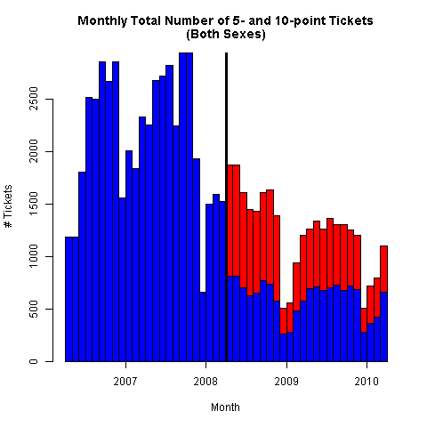
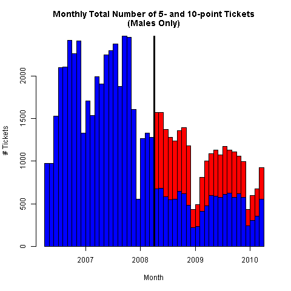
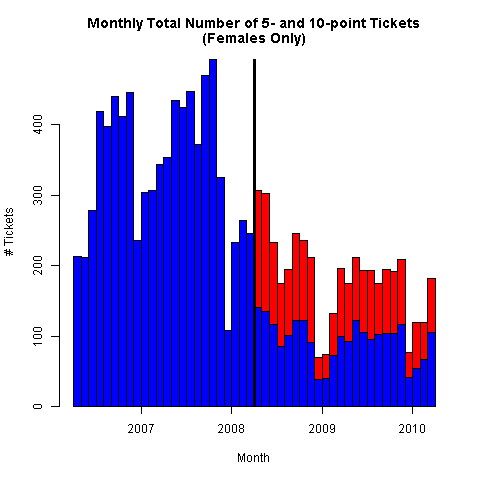
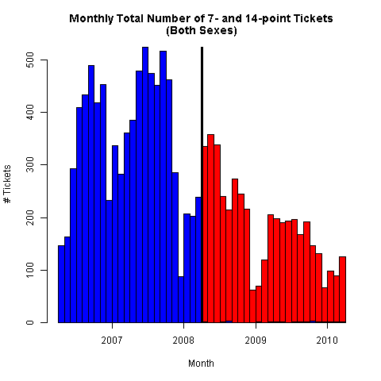
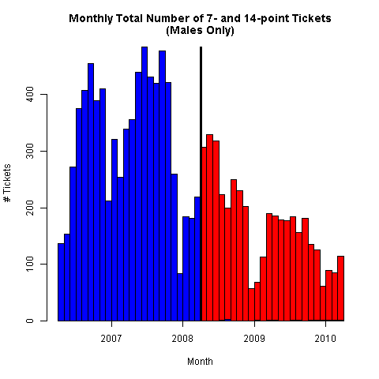
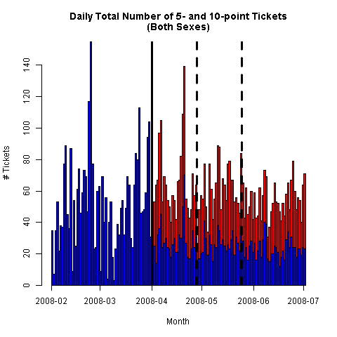
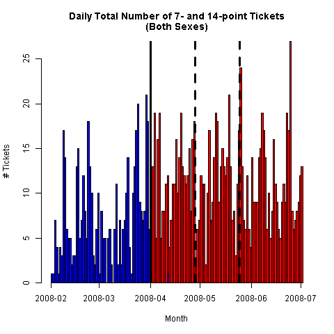

# Draft 1: Second version

Current point groups have been further consolidated in the regressions below.

Scroll down to the bottom for regressions with 2-day, 2-week and 4-week performance windows centered on April 1, 2008, the date the new penalties were introduced.

<!---
# UNDER CONSTRUCTION!

Please see the old version in ```README_v1.md```.
--->

## Data

The example dataset contains traffic violations in the Province of Quebec in the years from 1998 to 2010.
The dataset is the complete record of demerit points for the Province of Quebec through those years.
However, the dataset contains only the total number of demerit points awarded at a single roadside stop, not the points for a single violation.
There are no labels for the particular infraction.
The dataset also contains the age and sex of each driver, along with an individual identifier.
The data are aggregated by sex, age_group, demerit point value and recorded daily.
Each aggregate observation for a given point value is weighted by the number of drivers in a particular sex:age_group:point category for a particular day.
These totals are obtained from the SAAQ website [here](http://www.bdso.gouv.qc.ca/pls/ken/ken213_afich_tabl.page_tabl?p_iden_tran=REPERRUNYAW46-44034787356|@}zb&p_lang=2&p_m_o=SAAQ&p_id_ss_domn=718&p_id_raprt=3370).
It is numerically the same as recording 1 or zero with one observation for each licensed driver every day (except that most would be zeros).

### Drivers' History

A new categorical variable ```curr_pts_grp``` was added to capture the number of demerit points that a driver has accumulated over the past two years.
This was simple to calculate for the violation events.
For the non-events, an aggregate calculation was performed to take an inventory of the population of drivers with different point histories for each sex and age category.
To reduce the computational burden, the violation history was aggregated into the number of points for point levels 0-10, and in categories 11-20, 21-30 and 30-150, 150 being the highest observed.
In roughly 35% of the driver-days, drivers have no point history.
A further 45% have up to 10 demerit points in the last two years.
The 11-20 category accounts for the next decile.
The remaining decile  is split 7-3% between the next two categories, 21-30 and 30-150, respectively.
The last three categories were consolidated into a 10-150 point category.


### Policy Change: Excessive Speeding

On April 1, 2008 (no joke) the SAAQ implemented stiffer penalties on speeding violations, which involved doubling of the demerit points awarded for excessive speeding violations, higher fines and revocation of licenses.
Under this policy change, some violations are associated with different demerit point levels.

### Sample selection

The sample was limited to an equal window of two years before and after the date of the policy change,
from April 1, 2006 to March 31, 2010.
The summer months account for a large fraction of the infractions, so it is important to either impose symmetry over the calendar year or explicitly model the seasonality.


## Time Series Plots


### Pairs of Point Values for Related Speeding violations

Plots of the number of instances of tickets with selected pairs of point values.
Coloring should be clear from the context: original point value occurs before the
date of the policy change, the double-point tickets occur afterward.

#### Monthly Series

The 5- and 10-point ticket volumes highlight the strategic choice of pairs of offences.





The 7- and 14- point pair is much cleaner comparison,
since the combinations of other tickets worth 7 points are relatively rare.






#### Daily Series

For a close-up view of the behaviour around the policy change,
the following plots show that there is not much evidence of leniency in the days following the policy change.
If anything, it appears that policy stepped up enforcement to get the message across.
The dotted vertical lines indicate the window of advertising dates for the SAAQ publicity
campaign << Vitesse 2008 >> documented in a marketing report available
[here](https://saaq.gouv.qc.ca/fileadmin/documents/publications/espace-recherche/evaluation-campagne-vitesse-2008.pdf).






### Accumulated Points Balances (Included later)

For each driver, an accumulated demerit point balance
is calculated as the sum of the points awarded to each driver for all violations committed over a two-year rolling window.
A rolling window is used, as opposed to cumulative demerit points, to avoid continually growing balances over the sample period.
The two-year horizon is chosen because that is the time period over which demerit points remain on a driver's record,
potentially counting toward a revocation.

## Tables - Summary Statistics

This table shows the number of individual tickets handed out
for males and females in each two-year window before
and after the policy change.
This is the entire sample used in the regressions below,
along with some totals of the subgroups.


```R
> # Violation frequencies:
> saaq_tab
   points   M_before    M_after   F_before    F_after
1       0 2617459603 2714777888 2109324267 2229733937
2       1     101298     122899      45382      61778
3       2     533167     572194     249669     283108
4       3     701053     627807     247991     239554
5       4      15567      15278       2216       2470
6       5      43006      12368       8172       2272
7       6        496      12000         21       3296
8       7       7688         18        648          6
9       9       7382       5791       2587       2431
10     10          0      12747          0       2137
11     12        127          0          1          0
12     14          0       4145          0        302
13     15         17          0          1          0
14     18          3        560          0         23
15     21          0          0          0          0
16     24          0         98          0          4
17     30          0         17          0          0
18     36          0          4          0          0
>
> # Column totals (frequency of ticket events):
> saaq_tab_sums
M_before  M_after F_before  F_after
 1409804  1385926   556688   597381
>
> # Total for males:
> saaq_tab_sums['M_before'] + saaq_tab_sums['M_after']
M_before
 2795730
>
> # Total for females:
> saaq_tab_sums['F_before'] + saaq_tab_sums['F_after']
F_before
 1154069
>
> # Total before policy:
> saaq_tab_sums['M_before'] + saaq_tab_sums['F_before']
M_before
 1966492
>
> # Total after policy:
> saaq_tab_sums['M_after'] + saaq_tab_sums['F_after']
M_after
1983307
>
> # Grand total number of tickets:
> sum(saaq_tab_sums)
[1] 3949799
>
> # Percent of driver-days with tickets:
>
> # Before policy change:
> sum(saaq_tab_sums['M_before'] + saaq_tab_sums['F_before']) /
+   sum(saaq_tab_denoms['M_before'] + saaq_tab_denoms['F_before'])
[1] 0.0004160317
>
> # After policy change:
> sum(saaq_tab_sums['M_after'] + saaq_tab_sums['F_after']) /
+   sum(saaq_tab_denoms['M_after'] + saaq_tab_denoms['F_after'])
[1] 0.0004011128
>
> # Entire window:
> sum(saaq_tab_sums)/sum(saaq_tab_denoms)
[1] 0.0004084043
>
```

I second-guessed myself when I saw the large numbers of low-point tickets.
They seem like enormous numbers.
Back of envelope: 200 police per 100,000 x 8 million population is about 16000 police officers in Quebec, making about 24 million police-officer-days in which to hand out all of these tickets.
With a total of 3,950,016 tickets in the sample, this is about one ticket per week on average and most police are busy catching the real bad guys.
The numbers make sense.
Still, I double-checked these totals from the raw data and I get exactly the same figures.
The zero-ticket driver-days have higher numbers than I expect for the reasons I explained about the total driving population.

Still, the percentages make sense. An average of 4 tickets in 30 years.
Many people get no tickets. The average driver gets one every several years.
The speeders bring up the average about 10% but the policy reduces it by 4% overall.

## Linear Probability Models

The following are linear probability regression models estimated from data aggregated by age groups and categories of previous demerit points.
The non-events, denominators for the event probabilities, are the total number of licensed drivers in the same sex and age groups and categories of previous demerit points.

### All violations combined

This includes all infractions, regardless of the relation to speeding or the policy change.

This regression shows the results without any variables related to the policy change.

#### Pooled regression without policy indicators (male and female drivers):
```R
Coefficients:
                     Estimate Std. Error  t value Pr(>|t|)    
(Intercept)        -2.943e-05  4.647e-06   -6.333  2.4e-10 ***
age_grp16-19        4.708e-04  4.809e-06   97.898  < 2e-16 ***
age_grp20-24        3.852e-04  4.703e-06   81.910  < 2e-16 ***
age_grp25-34        2.651e-04  4.664e-06   56.854  < 2e-16 ***
age_grp35-44        2.229e-04  4.660e-06   47.824  < 2e-16 ***
age_grp45-54        1.749e-04  4.658e-06   37.559  < 2e-16 ***
age_grp55-64        1.219e-04  4.664e-06   26.126  < 2e-16 ***
age_grp65-199       5.125e-05  4.671e-06   10.971  < 2e-16 ***
sexM                1.630e-04  4.174e-07  390.600  < 2e-16 ***
curr_pts_grp1-3     5.461e-04  6.236e-07  875.696  < 2e-16 ***
curr_pts_grp4-6     1.114e-03  1.103e-06 1009.516  < 2e-16 ***
curr_pts_grp7-9     1.588e-03  1.822e-06  871.297  < 2e-16 ***
curr_pts_grp10-150  2.207e-03  2.245e-06  983.003  < 2e-16 ***
---
Signif. codes:  0 ‘***’ 0.001 ‘**’ 0.01 ‘*’ 0.05 ‘.’ 0.1 ‘ ’ 1

Residual standard error: 0.0202 on 9675245481 degrees of freedom
Multiple R-squared:  0.0004156,	Adjusted R-squared:  0.0004156
F-statistic: 3.352e+05 on 12 and 9675245481 DF,  p-value: < 2.2e-16
```

Now introduce an indicator variable for the period after the policy change was in effect.

#### Pooled regression with policy indicators but without policy interactions (male and female drivers):
```R
Coefficients:
                     Estimate Std. Error  t value Pr(>|t|)    
(Intercept)        -1.116e-05  4.651e-06   -2.399   0.0164 *  
policyTRUE         -3.653e-05  4.112e-07  -88.838   <2e-16 ***
age_grp16-19        4.717e-04  4.809e-06   98.089   <2e-16 ***
age_grp20-24        3.851e-04  4.703e-06   81.876   <2e-16 ***
age_grp25-34        2.652e-04  4.664e-06   56.868   <2e-16 ***
age_grp35-44        2.225e-04  4.660e-06   47.747   <2e-16 ***
age_grp45-54        1.753e-04  4.658e-06   37.633   <2e-16 ***
age_grp55-64        1.226e-04  4.664e-06   26.292   <2e-16 ***
age_grp65-199       5.247e-05  4.672e-06   11.232   <2e-16 ***
sexM                1.626e-04  4.174e-07  389.632   <2e-16 ***
curr_pts_grp1-3     5.474e-04  6.238e-07  877.522   <2e-16 ***
curr_pts_grp4-6     1.116e-03  1.104e-06 1011.226   <2e-16 ***
curr_pts_grp7-9     1.590e-03  1.822e-06  872.451   <2e-16 ***
curr_pts_grp10-150  2.211e-03  2.246e-06  984.599   <2e-16 ***
---
Signif. codes:  0 ‘***’ 0.001 ‘**’ 0.01 ‘*’ 0.05 ‘.’ 0.1 ‘ ’ 1

Residual standard error: 0.0202 on 9675245480 degrees of freedom
Multiple R-squared:  0.0004164,	Adjusted R-squared:  0.0004164
F-statistic: 3.1e+05 on 13 and 9675245480 DF,  p-value: < 2.2e-16
```

Now introduce interactions with the indicator variable for the period after the policy change was in effect.


#### Pooled regression with policy indicators and interactions (male and female drivers):
```R
Coefficients:
                                Estimate Std. Error  t value Pr(>|t|)    
(Intercept)                    9.207e-05  6.529e-06   14.101  < 2e-16 ***
age_grp16-19                   4.562e-04  6.790e-06   67.184  < 2e-16 ***
age_grp20-24                   3.656e-04  6.623e-06   55.205  < 2e-16 ***
age_grp25-34                   2.453e-04  6.567e-06   37.350  < 2e-16 ***
age_grp35-44                   1.932e-04  6.561e-06   29.451  < 2e-16 ***
age_grp45-54                   1.456e-04  6.559e-06   22.196  < 2e-16 ***
age_grp55-64                   9.396e-05  6.570e-06   14.302  < 2e-16 ***
age_grp65-199                  2.531e-05  6.581e-06    3.846 0.000120 ***
policyTRUE                    -4.813e-06  9.274e-06   -0.519 0.603790    
curr_pts_grp1-3                5.955e-04  9.076e-07  656.200  < 2e-16 ***
curr_pts_grp4-6                1.214e-03  1.646e-06  737.554  < 2e-16 ***
curr_pts_grp7-9                1.713e-03  2.729e-06  627.723  < 2e-16 ***
curr_pts_grp10-150             2.573e-03  3.553e-06  724.287  < 2e-16 ***
age_grp16-19:policyTRUE       -3.938e-05  9.619e-06   -4.094 4.24e-05 ***
age_grp20-24:policyTRUE       -4.030e-05  9.405e-06   -4.285 1.83e-05 ***
age_grp25-34:policyTRUE       -3.524e-05  9.325e-06   -3.779 0.000158 ***
age_grp35-44:policyTRUE       -1.512e-05  9.319e-06   -1.622 0.104775    
age_grp45-54:policyTRUE       -1.181e-05  9.314e-06   -1.268 0.204882    
age_grp55-64:policyTRUE       -7.917e-06  9.328e-06   -0.849 0.396034    
age_grp65-199:policyTRUE       4.100e-06  9.343e-06    0.439 0.660748    
policyTRUE:curr_pts_grp1-3    -5.372e-05  1.246e-06  -43.122  < 2e-16 ***
policyTRUE:curr_pts_grp4-6    -1.127e-04  2.212e-06  -50.941  < 2e-16 ***
policyTRUE:curr_pts_grp7-9    -1.382e-04  3.660e-06  -37.759  < 2e-16 ***
policyTRUE:curr_pts_grp10-150 -5.016e-04  4.578e-06 -109.556  < 2e-16 ***
---
Signif. codes:  0 ‘***’ 0.001 ‘**’ 0.01 ‘*’ 0.05 ‘.’ 0.1 ‘ ’ 1

Residual standard error: 0.0202 on 9675245470 degrees of freedom
Multiple R-squared:  0.0004027,	Adjusted R-squared:  0.0004027
F-statistic: 1.695e+05 on 23 and 9675245470 DF,  p-value: < 2.2e-16
```

To detect any gender differences, male dummies were added, along with a male dummy policy interaction.

#### Pooled regression with policy indicators and interactions (male and female drivers, with male dummies):
```R
Coefficients:
                                Estimate Std. Error  t value Pr(>|t|)    
(Intercept)                   -4.237e-05  6.544e-06   -6.474 9.55e-11 ***
age_grp16-19                   4.971e-04  6.792e-06   73.196  < 2e-16 ***
age_grp20-24                   4.101e-04  6.625e-06   61.903  < 2e-16 ***
age_grp25-34                   2.883e-04  6.568e-06   43.887  < 2e-16 ***
age_grp35-44                   2.356e-04  6.563e-06   35.896  < 2e-16 ***
age_grp45-54                   1.866e-04  6.560e-06   28.445  < 2e-16 ***
age_grp55-64                   1.315e-04  6.571e-06   20.007  < 2e-16 ***
age_grp65-199                  5.374e-05  6.582e-06    8.165 3.22e-16 ***
policyTRUE                     2.523e-05  9.294e-06    2.715  0.00663 **
sexM                           1.805e-04  5.970e-07  302.323  < 2e-16 ***
curr_pts_grp1-3                5.731e-04  9.106e-07  629.352  < 2e-16 ***
curr_pts_grp4-6                1.173e-03  1.651e-06  710.460  < 2e-16 ***
curr_pts_grp7-9                1.660e-03  2.735e-06  606.997  < 2e-16 ***
curr_pts_grp10-150             2.506e-03  3.560e-06  703.874  < 2e-16 ***
policyTRUE:sexM               -3.517e-05  8.350e-07  -42.116  < 2e-16 ***
age_grp16-19:policyTRUE       -4.944e-05  9.620e-06   -5.139 2.77e-07 ***
age_grp20-24:policyTRUE       -5.103e-05  9.407e-06   -5.425 5.80e-08 ***
age_grp25-34:policyTRUE       -4.597e-05  9.327e-06   -4.928 8.29e-07 ***
age_grp35-44:policyTRUE       -2.582e-05  9.321e-06   -2.770  0.00560 **
age_grp45-54:policyTRUE       -2.231e-05  9.316e-06   -2.394  0.01665 *  
age_grp55-64:policyTRUE       -1.785e-05  9.329e-06   -1.913  0.05572 .  
age_grp65-199:policyTRUE      -4.003e-06  9.343e-06   -0.428  0.66835    
policyTRUE:curr_pts_grp1-3    -4.885e-05  1.250e-06  -39.077  < 2e-16 ***
policyTRUE:curr_pts_grp4-6    -1.038e-04  2.220e-06  -46.751  < 2e-16 ***
policyTRUE:curr_pts_grp7-9    -1.265e-04  3.668e-06  -34.498  < 2e-16 ***
policyTRUE:curr_pts_grp10-150 -4.870e-04  4.588e-06 -106.145  < 2e-16 ***
---
Signif. codes:  0 ‘***’ 0.001 ‘**’ 0.01 ‘*’ 0.05 ‘.’ 0.1 ‘ ’ 1

Residual standard error: 0.0202 on 9675245468 degrees of freedom
Multiple R-squared:  0.0004185,	Adjusted R-squared:  0.0004185
F-statistic: 1.62e+05 on 25 and 9675245468 DF,  p-value: < 2.2e-16
```

To detect any further gender differences, the same regression is run on each sample separately.

#### Male drivers:
```R
Coefficients:
                                Estimate Std. Error t value Pr(>|t|)    
(Intercept)                    1.058e-04  8.494e-06  12.459  < 2e-16 ***
age_grp16-19                   6.357e-04  8.947e-06  71.058  < 2e-16 ***
age_grp20-24                   4.917e-04  8.664e-06  56.754  < 2e-16 ***
age_grp25-34                   3.177e-04  8.562e-06  37.110  < 2e-16 ***
age_grp35-44                   2.416e-04  8.552e-06  28.248  < 2e-16 ***
age_grp45-54                   1.914e-04  8.548e-06  22.394  < 2e-16 ***
age_grp55-64                   1.307e-04  8.565e-06  15.258  < 2e-16 ***
age_grp65-199                  3.865e-05  8.580e-06   4.505 6.64e-06 ***
policyTRUE                    -6.887e-07  1.218e-05  -0.057  0.95490    
curr_pts_grp1-3                6.517e-04  1.299e-06 501.573  < 2e-16 ***
curr_pts_grp4-6                1.267e-03  2.185e-06 580.057  < 2e-16 ***
curr_pts_grp7-9                1.751e-03  3.454e-06 506.902  < 2e-16 ***
curr_pts_grp10-150             2.580e-03  4.297e-06 600.395  < 2e-16 ***
age_grp16-19:policyTRUE       -7.275e-05  1.277e-05  -5.695 1.24e-08 ***
age_grp20-24:policyTRUE       -7.515e-05  1.241e-05  -6.054 1.41e-09 ***
age_grp25-34:policyTRUE       -6.118e-05  1.227e-05  -4.986 6.16e-07 ***
age_grp35-44:policyTRUE       -3.318e-05  1.226e-05  -2.707  0.00679 **
age_grp45-54:policyTRUE       -2.398e-05  1.225e-05  -1.958  0.05025 .  
age_grp55-64:policyTRUE       -1.828e-05  1.227e-05  -1.489  0.13639    
age_grp65-199:policyTRUE      -2.175e-06  1.229e-05  -0.177  0.85954    
policyTRUE:curr_pts_grp1-3    -6.777e-05  1.794e-06 -37.787  < 2e-16 ***
policyTRUE:curr_pts_grp4-6    -1.287e-04  2.954e-06 -43.558  < 2e-16 ***
policyTRUE:curr_pts_grp7-9    -1.460e-04  4.660e-06 -31.342  < 2e-16 ***
policyTRUE:curr_pts_grp10-150 -5.112e-04  5.568e-06 -91.808  < 2e-16 ***
---
Signif. codes:  0 ‘***’ 0.001 ‘**’ 0.01 ‘*’ 0.05 ‘.’ 0.1 ‘ ’ 1

Residual standard error: 0.02288 on 5335033197 degrees of freedom
Multiple R-squared:  0.0004588,	Adjusted R-squared:  0.0004588
F-statistic: 1.065e+05 on 23 and 5335033197 DF,  p-value: < 2.2e-16
```

#### Female drivers:
```R
Coefficients:
                                Estimate Std. Error t value Pr(>|t|)    
(Intercept)                    3.618e-05  1.069e-05   3.384 0.000715 ***
age_grp16-19                   2.668e-04  1.093e-05  24.401  < 2e-16 ***
age_grp20-24                   2.685e-04  1.077e-05  24.919  < 2e-16 ***
age_grp25-34                   2.140e-04  1.072e-05  19.955  < 2e-16 ***
age_grp35-44                   1.909e-04  1.072e-05  17.806  < 2e-16 ***
age_grp45-54                   1.403e-04  1.072e-05  13.095  < 2e-16 ***
age_grp55-64                   9.135e-05  1.073e-05   8.515  < 2e-16 ***
age_grp65-199                  4.161e-05  1.074e-05   3.873 0.000107 ***
policyTRUE                    -6.225e-06  1.483e-05  -0.420 0.674692    
curr_pts_grp1-3                4.398e-04  1.207e-06 364.263  < 2e-16 ***
curr_pts_grp4-6                9.110e-04  2.584e-06 352.603  < 2e-16 ***
curr_pts_grp7-9                1.275e-03  5.002e-06 254.829  < 2e-16 ***
curr_pts_grp10-150             1.877e-03  8.406e-06 223.265  < 2e-16 ***
age_grp16-19:policyTRUE        1.008e-05  1.516e-05   0.665 0.505973    
age_grp20-24:policyTRUE        1.827e-06  1.495e-05   0.122 0.902720    
age_grp25-34:policyTRUE       -8.017e-06  1.488e-05  -0.539 0.590017    
age_grp35-44:policyTRUE        1.906e-06  1.487e-05   0.128 0.898024    
age_grp45-54:policyTRUE       -9.446e-07  1.487e-05  -0.064 0.949348    
age_grp55-64:policyTRUE        1.580e-06  1.488e-05   0.106 0.915445    
age_grp65-199:policyTRUE       9.430e-06  1.490e-05   0.633 0.526891    
policyTRUE:curr_pts_grp1-3    -1.106e-05  1.645e-06  -6.721 1.80e-11 ***
policyTRUE:curr_pts_grp4-6    -1.427e-05  3.429e-06  -4.162 3.16e-05 ***
policyTRUE:curr_pts_grp7-9    -2.125e-06  6.581e-06  -0.323 0.746759    
policyTRUE:curr_pts_grp10-150 -2.078e-04  1.053e-05 -19.738  < 2e-16 ***
---
Signif. codes:  0 ‘***’ 0.001 ‘**’ 0.01 ‘*’ 0.05 ‘.’ 0.1 ‘ ’ 1

Residual standard error: 0.0163 on 4340212249 degrees of freedom
Multiple R-squared:  0.0002095,	Adjusted R-squared:  0.0002095
F-statistic: 3.955e+04 on 23 and 4340212249 DF,  p-value: < 2.2e-16
```

Given the differences in results, the remaining regressions are run separately by gender.

### One-point violations (for speeding 11-20 over)

This is the cleanest point level because there is a single violation that could have occurred.


#### Male drivers:
```R
Coefficients:
                                Estimate Std. Error t value Pr(>|t|)    
(Intercept)                    1.578e-06  2.407e-06   0.656 0.511938    
age_grp16-19                   4.866e-05  2.535e-06  19.196  < 2e-16 ***
age_grp20-24                   2.725e-05  2.455e-06  11.102  < 2e-16 ***
age_grp25-34                   2.548e-05  2.426e-06  10.506  < 2e-16 ***
age_grp35-44                   2.536e-05  2.423e-06  10.465  < 2e-16 ***
age_grp45-54                   2.277e-05  2.422e-06   9.403  < 2e-16 ***
age_grp55-64                   1.828e-05  2.427e-06   7.532 4.99e-14 ***
age_grp65-199                  8.842e-06  2.431e-06   3.638 0.000275 ***
policyTRUE                     2.147e-06  3.450e-06   0.622 0.533738    
curr_pts_grp1-3                4.772e-05  3.681e-07 129.622  < 2e-16 ***
curr_pts_grp4-6                8.576e-05  6.190e-07 138.539  < 2e-16 ***
curr_pts_grp7-9                1.266e-04  9.786e-07 129.362  < 2e-16 ***
curr_pts_grp10-150             2.075e-04  1.217e-06 170.465  < 2e-16 ***
age_grp16-19:policyTRUE       -1.426e-06  3.619e-06  -0.394 0.693554    
age_grp20-24:policyTRUE       -5.016e-06  3.517e-06  -1.426 0.153758    
age_grp25-34:policyTRUE       -1.554e-06  3.476e-06  -0.447 0.654866    
age_grp35-44:policyTRUE        1.083e-06  3.473e-06   0.312 0.755196    
age_grp45-54:policyTRUE        2.173e-06  3.470e-06   0.626 0.531245    
age_grp55-64:policyTRUE        2.083e-06  3.477e-06   0.599 0.549022    
age_grp65-199:policyTRUE       2.318e-06  3.482e-06   0.666 0.505558    
policyTRUE:curr_pts_grp1-3     4.491e-06  5.081e-07   8.838  < 2e-16 ***
policyTRUE:curr_pts_grp4-6     8.749e-06  8.370e-07  10.452  < 2e-16 ***
policyTRUE:curr_pts_grp7-9     1.118e-05  1.320e-06   8.466  < 2e-16 ***
policyTRUE:curr_pts_grp10-150 -1.267e-05  1.578e-06  -8.030 9.72e-16 ***
---
Signif. codes:  0 ‘***’ 0.001 ‘**’ 0.01 ‘*’ 0.05 ‘.’ 0.1 ‘ ’ 1

Residual standard error: 0.006482 on 5335033197 degrees of freedom
Multiple R-squared:  3.518e-05,	Adjusted R-squared:  3.517e-05
F-statistic:  8160 on 23 and 5335033197 DF,  p-value: < 2.2e-16
```

#### Female drivers:
```R
Coefficients:
                                Estimate Std. Error t value Pr(>|t|)    
(Intercept)                    1.114e-06  3.259e-06   0.342  0.73239    
age_grp16-19                   3.190e-05  3.332e-06   9.575  < 2e-16 ***
age_grp20-24                   2.551e-05  3.284e-06   7.768 7.97e-15 ***
age_grp25-34                   2.050e-05  3.269e-06   6.272 3.57e-10 ***
age_grp35-44                   1.737e-05  3.267e-06   5.316 1.06e-07 ***
age_grp45-54                   1.344e-05  3.266e-06   4.113 3.90e-05 ***
age_grp55-64                   9.335e-06  3.270e-06   2.855  0.00431 **
age_grp65-199                  4.796e-06  3.275e-06   1.465  0.14304    
policyTRUE                    -1.580e-06  4.521e-06  -0.349  0.72675    
curr_pts_grp1-3                3.411e-05  3.680e-07  92.680  < 2e-16 ***
curr_pts_grp4-6                5.969e-05  7.874e-07  75.808  < 2e-16 ***
curr_pts_grp7-9                8.417e-05  1.524e-06  55.212  < 2e-16 ***
curr_pts_grp10-150             1.569e-04  2.562e-06  61.256  < 2e-16 ***
age_grp16-19:policyTRUE        7.269e-06  4.619e-06   1.574  0.11557    
age_grp20-24:policyTRUE        3.317e-06  4.557e-06   0.728  0.46664    
age_grp25-34:policyTRUE        5.087e-06  4.535e-06   1.122  0.26197    
age_grp35-44:policyTRUE        6.432e-06  4.533e-06   1.419  0.15592    
age_grp45-54:policyTRUE        5.665e-06  4.532e-06   1.250  0.21131    
age_grp55-64:policyTRUE        5.469e-06  4.536e-06   1.206  0.22790    
age_grp65-199:policyTRUE       5.169e-06  4.542e-06   1.138  0.25516    
policyTRUE:curr_pts_grp1-3     8.156e-06  5.015e-07  16.262  < 2e-16 ***
policyTRUE:curr_pts_grp4-6     1.518e-05  1.045e-06  14.519  < 2e-16 ***
policyTRUE:curr_pts_grp7-9     1.929e-05  2.006e-06   9.618  < 2e-16 ***
policyTRUE:curr_pts_grp10-150  1.523e-05  3.208e-06   4.746 2.07e-06 ***
---
Signif. codes:  0 ‘***’ 0.001 ‘**’ 0.01 ‘*’ 0.05 ‘.’ 0.1 ‘ ’ 1

Residual standard error: 0.004969 on 4340212249 degrees of freedom
Multiple R-squared:  1.664e-05,	Adjusted R-squared:  1.664e-05
F-statistic:  3141 on 23 and 4340212249 DF,  p-value: < 2.2e-16
```

### Two-point violations (speeding 21-30 over or 7 other violations)

#### Male drivers:
```R
Coefficients:
                                Estimate Std. Error t value Pr(>|t|)    
(Intercept)                   -6.756e-06  5.343e-06  -1.265 0.206036    
age_grp16-19                   1.873e-04  5.627e-06  33.284  < 2e-16 ***
age_grp20-24                   1.764e-04  5.450e-06  32.369  < 2e-16 ***
age_grp25-34                   1.601e-04  5.386e-06  29.727  < 2e-16 ***
age_grp35-44                   1.506e-04  5.379e-06  27.989  < 2e-16 ***
age_grp45-54                   1.394e-04  5.376e-06  25.924  < 2e-16 ***
age_grp55-64                   1.158e-04  5.387e-06  21.489  < 2e-16 ***
age_grp65-199                  6.916e-05  5.396e-06  12.815  < 2e-16 ***
policyTRUE                     1.236e-07  7.659e-06   0.016 0.987123    
curr_pts_grp1-3                2.514e-04  8.173e-07 307.635  < 2e-16 ***
curr_pts_grp4-6                4.597e-04  1.374e-06 334.489  < 2e-16 ***
curr_pts_grp7-9                6.028e-04  2.173e-06 277.441  < 2e-16 ***
curr_pts_grp10-150             7.824e-04  2.703e-06 289.493  < 2e-16 ***
age_grp16-19:policyTRUE        3.607e-06  8.035e-06   0.449 0.653488    
age_grp20-24:policyTRUE       -1.689e-07  7.808e-06  -0.022 0.982741    
age_grp25-34:policyTRUE       -7.592e-06  7.718e-06  -0.984 0.325256    
age_grp35-44:policyTRUE       -3.832e-06  7.710e-06  -0.497 0.619157    
age_grp45-54:policyTRUE       -1.427e-06  7.705e-06  -0.185 0.853087    
age_grp55-64:policyTRUE       -1.228e-06  7.719e-06  -0.159 0.873588    
age_grp65-199:policyTRUE       1.817e-06  7.730e-06   0.235 0.814166    
policyTRUE:curr_pts_grp1-3    -4.138e-06  1.128e-06  -3.668 0.000244 ***
policyTRUE:curr_pts_grp4-6    -3.209e-06  1.858e-06  -1.727 0.084162 .  
policyTRUE:curr_pts_grp7-9     5.409e-06  2.931e-06   1.845 0.064969 .  
policyTRUE:curr_pts_grp10-150 -1.069e-04  3.502e-06 -30.524  < 2e-16 ***
---
Signif. codes:  0 ‘***’ 0.001 ‘**’ 0.01 ‘*’ 0.05 ‘.’ 0.1 ‘ ’ 1

Residual standard error: 0.01439 on 5335033197 degrees of freedom
Multiple R-squared:  0.0001432,	Adjusted R-squared:  0.0001432
F-statistic: 3.321e+04 on 23 and 5335033197 DF,  p-value: < 2.2e-16
```

#### Female drivers:
```R
Coefficients:
                                Estimate Std. Error t value Pr(>|t|)    
(Intercept)                   -1.221e-06  7.265e-06  -0.168    0.866    
age_grp16-19                   1.166e-04  7.429e-06  15.698  < 2e-16 ***
age_grp20-24                   1.262e-04  7.322e-06  17.235  < 2e-16 ***
age_grp25-34                   1.150e-04  7.288e-06  15.781  < 2e-16 ***
age_grp35-44                   1.075e-04  7.284e-06  14.756  < 2e-16 ***
age_grp45-54                   8.623e-05  7.283e-06  11.840  < 2e-16 ***
age_grp55-64                   6.174e-05  7.290e-06   8.469  < 2e-16 ***
age_grp65-199                  3.448e-05  7.301e-06   4.723 2.32e-06 ***
policyTRUE                    -3.580e-06  1.008e-05  -0.355    0.722    
curr_pts_grp1-3                1.937e-04  8.205e-07 236.040  < 2e-16 ***
curr_pts_grp4-6                3.815e-04  1.756e-06 217.318  < 2e-16 ***
curr_pts_grp7-9                4.966e-04  3.399e-06 146.112  < 2e-16 ***
curr_pts_grp10-150             6.562e-04  5.712e-06 114.874  < 2e-16 ***
age_grp16-19:policyTRUE        1.194e-05  1.030e-05   1.160    0.246    
age_grp20-24:policyTRUE        8.879e-06  1.016e-05   0.874    0.382    
age_grp25-34:policyTRUE        3.914e-06  1.011e-05   0.387    0.699    
age_grp35-44:policyTRUE        7.160e-06  1.011e-05   0.708    0.479    
age_grp45-54:policyTRUE        5.950e-06  1.010e-05   0.589    0.556    
age_grp55-64:policyTRUE        5.211e-06  1.011e-05   0.515    0.606    
age_grp65-199:policyTRUE       6.318e-06  1.013e-05   0.624    0.533    
policyTRUE:curr_pts_grp1-3     6.343e-06  1.118e-06   5.673 1.40e-08 ***
policyTRUE:curr_pts_grp4-6     2.063e-05  2.330e-06   8.854  < 2e-16 ***
policyTRUE:curr_pts_grp7-9     3.745e-05  4.472e-06   8.373  < 2e-16 ***
policyTRUE:curr_pts_grp10-150 -2.887e-05  7.153e-06  -4.036 5.44e-05 ***
---
Signif. codes:  0 ‘***’ 0.001 ‘**’ 0.01 ‘*’ 0.05 ‘.’ 0.1 ‘ ’ 1

Residual standard error: 0.01108 on 4340212249 degrees of freedom
Multiple R-squared:  8.349e-05,	Adjusted R-squared:  8.348e-05
F-statistic: 1.576e+04 on 23 and 4340212249 DF,  p-value: < 2.2e-16
```

### Three-point violations (speeding 31-60 over or 9 other violations)

This demerit point level is influenced by the policy change in that the penalty for speeding 40-45 over in a 100km/hr zone is doubled to 6 points, with no other changes to the penalties for the other offences.
For this reason, both 3- and 6-point violations are included in the sample, after the policy change. That is, the 6-point violations are not included in the sample before the window.

#### Male drivers:
```R
Coefficients:
                                Estimate Std. Error t value Pr(>|t|)    
(Intercept)                    9.125e-05  5.884e-06  15.509  < 2e-16 ***
age_grp16-19                   2.764e-04  6.198e-06  44.600  < 2e-16 ***
age_grp20-24                   2.352e-04  6.002e-06  39.195  < 2e-16 ***
age_grp25-34                   1.255e-04  5.931e-06  21.167  < 2e-16 ***
age_grp35-44                   7.701e-05  5.924e-06  13.001  < 2e-16 ***
age_grp45-54                   4.586e-05  5.921e-06   7.745 9.53e-15 ***
age_grp55-64                   1.610e-05  5.933e-06   2.713 0.006662 **
age_grp65-199                 -1.970e-05  5.943e-06  -3.314 0.000919 ***
policyTRUE                     2.764e-06  8.435e-06   0.328 0.743110    
curr_pts_grp1-3                3.234e-04  9.001e-07 359.355  < 2e-16 ***
curr_pts_grp4-6                6.482e-04  1.513e-06 428.270  < 2e-16 ***
curr_pts_grp7-9                8.994e-04  2.393e-06 375.887  < 2e-16 ***
curr_pts_grp10-150             1.330e-03  2.976e-06 446.857  < 2e-16 ***
age_grp16-19:policyTRUE       -5.189e-05  8.849e-06  -5.864 4.51e-09 ***
age_grp20-24:policyTRUE       -5.395e-05  8.599e-06  -6.275 3.50e-10 ***
age_grp25-34:policyTRUE       -4.736e-05  8.500e-06  -5.572 2.52e-08 ***
age_grp35-44:policyTRUE       -3.262e-05  8.491e-06  -3.841 0.000122 ***
age_grp45-54:policyTRUE       -2.847e-05  8.485e-06  -3.355 0.000793 ***
age_grp55-64:policyTRUE       -2.441e-05  8.501e-06  -2.872 0.004078 **
age_grp65-199:policyTRUE      -1.209e-05  8.513e-06  -1.421 0.155406    
policyTRUE:curr_pts_grp1-3    -5.405e-05  1.242e-06 -43.509  < 2e-16 ***
policyTRUE:curr_pts_grp4-6    -9.960e-05  2.047e-06 -48.668  < 2e-16 ***
policyTRUE:curr_pts_grp7-9    -1.083e-04  3.228e-06 -33.554  < 2e-16 ***
policyTRUE:curr_pts_grp10-150 -2.816e-04  3.857e-06 -73.012  < 2e-16 ***
---
Signif. codes:  0 ‘***’ 0.001 ‘**’ 0.01 ‘*’ 0.05 ‘.’ 0.1 ‘ ’ 1

Residual standard error: 0.01585 on 5335033197 degrees of freedom
Multiple R-squared:  0.0002452,	Adjusted R-squared:  0.0002452
F-statistic: 5.689e+04 on 23 and 5335033197 DF,  p-value: < 2.2e-16
```

#### Female drivers:
```R
Coefficients:
                                Estimate Std. Error t value Pr(>|t|)    
(Intercept)                    3.406e-05  6.973e-06   4.884 1.04e-06 ***
age_grp16-19                   9.841e-05  7.130e-06  13.802  < 2e-16 ***
age_grp20-24                   1.050e-04  7.027e-06  14.943  < 2e-16 ***
age_grp25-34                   7.402e-05  6.995e-06  10.583  < 2e-16 ***
age_grp35-44                   6.446e-05  6.992e-06   9.220  < 2e-16 ***
age_grp45-54                   4.087e-05  6.990e-06   5.847 5.00e-09 ***
age_grp55-64                   2.129e-05  6.997e-06   3.043  0.00234 **
age_grp65-199                  3.105e-06  7.007e-06   0.443  0.65770    
policyTRUE                    -1.768e-06  9.674e-06  -0.183  0.85498    
curr_pts_grp1-3                2.016e-04  7.875e-07 256.054  < 2e-16 ***
curr_pts_grp4-6                4.399e-04  1.685e-06 261.079  < 2e-16 ***
curr_pts_grp7-9                6.419e-04  3.262e-06 196.756  < 2e-16 ***
curr_pts_grp10-150             9.426e-04  5.483e-06 171.918  < 2e-16 ***
age_grp16-19:policyTRUE       -4.630e-06  9.885e-06  -0.468  0.63955    
age_grp20-24:policyTRUE       -5.857e-06  9.751e-06  -0.601  0.54807    
age_grp25-34:policyTRUE       -1.387e-05  9.705e-06  -1.430  0.15282    
age_grp35-44:policyTRUE       -9.436e-06  9.701e-06  -0.973  0.33070    
age_grp45-54:policyTRUE       -1.089e-05  9.698e-06  -1.123  0.26157    
age_grp55-64:policyTRUE       -7.901e-06  9.707e-06  -0.814  0.41569    
age_grp65-199:policyTRUE      -1.163e-06  9.720e-06  -0.120  0.90474    
policyTRUE:curr_pts_grp1-3    -2.073e-05  1.073e-06 -19.312  < 2e-16 ***
policyTRUE:curr_pts_grp4-6    -3.687e-05  2.237e-06 -16.484  < 2e-16 ***
policyTRUE:curr_pts_grp7-9    -3.652e-05  4.293e-06  -8.508  < 2e-16 ***
policyTRUE:curr_pts_grp10-150 -1.352e-04  6.866e-06 -19.693  < 2e-16 ***
---
Signif. codes:  0 ‘***’ 0.001 ‘**’ 0.01 ‘*’ 0.05 ‘.’ 0.1 ‘ ’ 1

Residual standard error: 0.01063 on 4340212249 degrees of freedom
Multiple R-squared:  0.0001051,	Adjusted R-squared:  0.0001051
F-statistic: 1.984e+04 on 23 and 4340212249 DF,  p-value: < 2.2e-16
```


### Four-point violations (speeding 31-45 over or 9 other violations)

Four demerit points can be awarded for any of 10 individual offences or for a one- or two-point speeding violation, combined with a three- or two-point violation for an offence other than speeding, or, finally, for any two non-speeding offences worth two points each.

#### Male drivers:
```R
Coefficients:
                                Estimate Std. Error t value Pr(>|t|)    
(Intercept)                    1.715e-05  8.927e-07  19.212  < 2e-16 ***
age_grp16-19                   5.133e-05  9.402e-07  54.593  < 2e-16 ***
age_grp20-24                   1.027e-06  9.105e-07   1.128 0.259402    
age_grp25-34                  -1.330e-05  8.998e-07 -14.784  < 2e-16 ***
age_grp35-44                  -1.638e-05  8.987e-07 -18.230  < 2e-16 ***
age_grp45-54                  -1.718e-05  8.982e-07 -19.129  < 2e-16 ***
age_grp55-64                  -1.722e-05  9.001e-07 -19.127  < 2e-16 ***
age_grp65-199                 -1.704e-05  9.016e-07 -18.897  < 2e-16 ***
policyTRUE                    -5.052e-06  1.280e-06  -3.948 7.88e-05 ***
curr_pts_grp1-3                3.258e-06  1.365e-07  23.858  < 2e-16 ***
curr_pts_grp4-6                1.235e-05  2.296e-07  53.778  < 2e-16 ***
curr_pts_grp7-9                2.305e-05  3.630e-07  63.511  < 2e-16 ***
curr_pts_grp10-150             5.597e-05  4.515e-07 123.959  < 2e-16 ***
age_grp16-19:policyTRUE       -4.963e-07  1.343e-06  -0.370 0.711618    
age_grp20-24:policyTRUE        4.391e-06  1.304e-06   3.366 0.000762 ***
age_grp25-34:policyTRUE        5.040e-06  1.290e-06   3.908 9.30e-05 ***
age_grp35-44:policyTRUE        5.029e-06  1.288e-06   3.904 9.47e-05 ***
age_grp45-54:policyTRUE        5.024e-06  1.287e-06   3.903 9.51e-05 ***
age_grp55-64:policyTRUE        4.920e-06  1.290e-06   3.815 0.000136 ***
age_grp65-199:policyTRUE       4.927e-06  1.291e-06   3.815 0.000136 ***
policyTRUE:curr_pts_grp1-3    -9.158e-07  1.885e-07  -4.859 1.18e-06 ***
policyTRUE:curr_pts_grp4-6    -2.304e-06  3.105e-07  -7.420 1.17e-13 ***
policyTRUE:curr_pts_grp7-9    -4.380e-06  4.897e-07  -8.945  < 2e-16 ***
policyTRUE:curr_pts_grp10-150 -1.667e-05  5.852e-07 -28.494  < 2e-16 ***
---
Signif. codes:  0 ‘***’ 0.001 ‘**’ 0.01 ‘*’ 0.05 ‘.’ 0.1 ‘ ’ 1

Residual standard error: 0.002404 on 5335033197 degrees of freedom
Multiple R-squared:  3.131e-05,	Adjusted R-squared:  3.131e-05
F-statistic:  7263 on 23 and 5335033197 DF,  p-value: < 2.2e-16
```

#### Female drivers:
```R
Coefficients:
                                Estimate Std. Error t value Pr(>|t|)    
(Intercept)                    8.175e-07  6.814e-07   1.200  0.23024    
age_grp16-19                   8.032e-06  6.968e-07  11.527  < 2e-16 ***
age_grp20-24                   1.922e-06  6.867e-07   2.799  0.00512 **
age_grp25-34                   2.241e-07  6.835e-07   0.328  0.74297    
age_grp35-44                  -3.329e-07  6.832e-07  -0.487  0.62606    
age_grp45-54                  -6.322e-07  6.831e-07  -0.926  0.35468    
age_grp55-64                  -7.365e-07  6.837e-07  -1.077  0.28138    
age_grp65-199                 -5.993e-07  6.848e-07  -0.875  0.38150    
policyTRUE                     7.334e-07  9.454e-07   0.776  0.43785    
curr_pts_grp1-3                1.237e-06  7.696e-08  16.075  < 2e-16 ***
curr_pts_grp4-6                4.006e-06  1.647e-07  24.327  < 2e-16 ***
curr_pts_grp7-9                5.972e-06  3.188e-07  18.735  < 2e-16 ***
curr_pts_grp10-150             1.993e-05  5.358e-07  37.198  < 2e-16 ***
age_grp16-19:policyTRUE       -2.684e-07  9.660e-07  -0.278  0.78110    
age_grp20-24:policyTRUE       -7.458e-08  9.529e-07  -0.078  0.93762    
age_grp25-34:policyTRUE       -7.501e-07  9.483e-07  -0.791  0.42897    
age_grp35-44:policyTRUE       -6.718e-07  9.480e-07  -0.709  0.47854    
age_grp45-54:policyTRUE       -6.786e-07  9.477e-07  -0.716  0.47395    
age_grp55-64:policyTRUE       -7.320e-07  9.486e-07  -0.772  0.44027    
age_grp65-199:policyTRUE      -8.538e-07  9.499e-07  -0.899  0.36872    
policyTRUE:curr_pts_grp1-3    -4.389e-07  1.049e-07  -4.185 2.85e-05 ***
policyTRUE:curr_pts_grp4-6    -1.051e-06  2.186e-07  -4.811 1.50e-06 ***
policyTRUE:curr_pts_grp7-9    -1.989e-07  4.195e-07  -0.474  0.63543    
policyTRUE:curr_pts_grp10-150 -4.609e-06  6.709e-07  -6.869 6.45e-12 ***
---
Signif. codes:  0 ‘***’ 0.001 ‘**’ 0.01 ‘*’ 0.05 ‘.’ 0.1 ‘ ’ 1

Residual standard error: 0.001039 on 4340212249 degrees of freedom
Multiple R-squared:  3.461e-06,	Adjusted R-squared:  3.456e-06
F-statistic: 653.1 on 23 and 4340212249 DF,  p-value: < 2.2e-16
```
### Five-point violations (speeding 46-60 over or a handheld device violation)

This captures a variety of speeding violations, based on the speed zone, some of which are changed to 10 points.
In both cases, the 5 point ticket can be a combination of some of the above offences.
For this reason, both 5- and 10-point violations are included in the sample after the policy change.


#### Male drivers:
```R
Coefficients:
                                Estimate Std. Error t value Pr(>|t|)    
(Intercept)                   -2.451e-06  1.326e-06  -1.848   0.0646 .  
age_grp16-19                   4.752e-05  1.397e-06  34.015  < 2e-16 ***
age_grp20-24                   3.989e-05  1.353e-06  29.488  < 2e-16 ***
age_grp25-34                   1.938e-05  1.337e-06  14.497  < 2e-16 ***
age_grp35-44                   8.736e-06  1.335e-06   6.542 6.06e-11 ***
age_grp45-54                   5.213e-06  1.335e-06   3.905 9.41e-05 ***
age_grp55-64                   2.808e-06  1.337e-06   2.099   0.0358 *  
age_grp65-199                  1.609e-06  1.340e-06   1.201   0.2298    
policyTRUE                     9.810e-07  1.901e-06   0.516   0.6059    
curr_pts_grp1-3                2.023e-05  2.029e-07  99.690  < 2e-16 ***
curr_pts_grp4-6                4.704e-05  3.412e-07 137.867  < 2e-16 ***
curr_pts_grp7-9                7.446e-05  5.394e-07 138.046  < 2e-16 ***
curr_pts_grp10-150             1.400e-04  6.709e-07 208.739  < 2e-16 ***
age_grp16-19:policyTRUE       -1.364e-05  1.995e-06  -6.840 7.91e-12 ***
age_grp20-24:policyTRUE       -1.596e-05  1.938e-06  -8.232  < 2e-16 ***
age_grp25-34:policyTRUE       -8.913e-06  1.916e-06  -4.652 3.29e-06 ***
age_grp35-44:policyTRUE       -4.188e-06  1.914e-06  -2.188   0.0287 *  
age_grp45-54:policyTRUE       -2.903e-06  1.913e-06  -1.517   0.1291    
age_grp55-64:policyTRUE       -1.516e-06  1.916e-06  -0.791   0.4289    
age_grp65-199:policyTRUE      -8.500e-07  1.919e-06  -0.443   0.6578    
policyTRUE:curr_pts_grp1-3    -1.045e-05  2.801e-07 -37.313  < 2e-16 ***
policyTRUE:curr_pts_grp4-6    -2.480e-05  4.613e-07 -53.746  < 2e-16 ***
policyTRUE:curr_pts_grp7-9    -3.842e-05  7.276e-07 -52.804  < 2e-16 ***
policyTRUE:curr_pts_grp10-150 -6.388e-05  8.695e-07 -73.469  < 2e-16 ***
---
Signif. codes:  0 ‘***’ 0.001 ‘**’ 0.01 ‘*’ 0.05 ‘.’ 0.1 ‘ ’ 1

Residual standard error: 0.003573 on 5335033197 degrees of freedom
Multiple R-squared:  3.41e-05,	Adjusted R-squared:  3.409e-05
F-statistic:  7909 on 23 and 5335033197 DF,  p-value: < 2.2e-16
```

#### Female drivers:
```R
Coefficients:
                                Estimate Std. Error t value Pr(>|t|)    
(Intercept)                   -2.518e-07  1.116e-06  -0.226  0.82156    
age_grp16-19                   8.156e-06  1.142e-06   7.144 9.06e-13 ***
age_grp20-24                   8.726e-06  1.125e-06   7.756 8.80e-15 ***
age_grp25-34                   4.486e-06  1.120e-06   4.006 6.19e-05 ***
age_grp35-44                   2.641e-06  1.119e-06   2.360  0.01829 *  
age_grp45-54                   1.422e-06  1.119e-06   1.270  0.20401    
age_grp55-64                   7.811e-07  1.120e-06   0.697  0.48566    
age_grp65-199                  2.840e-07  1.122e-06   0.253  0.80014    
policyTRUE                     8.653e-08  1.549e-06   0.056  0.95545    
curr_pts_grp1-3                7.418e-06  1.261e-07  58.835  < 2e-16 ***
curr_pts_grp4-6                1.958e-05  2.698e-07  72.585  < 2e-16 ***
curr_pts_grp7-9                3.744e-05  5.223e-07  71.673  < 2e-16 ***
curr_pts_grp10-150             7.586e-05  8.778e-07  86.419  < 2e-16 ***
age_grp16-19:policyTRUE       -2.607e-06  1.583e-06  -1.647  0.09957 .  
age_grp20-24:policyTRUE       -4.036e-06  1.561e-06  -2.585  0.00973 **
age_grp25-34:policyTRUE       -2.290e-06  1.554e-06  -1.474  0.14048    
age_grp35-44:policyTRUE       -1.550e-06  1.553e-06  -0.998  0.31833    
age_grp45-54:policyTRUE       -9.367e-07  1.553e-06  -0.603  0.54636    
age_grp55-64:policyTRUE       -4.890e-07  1.554e-06  -0.315  0.75305    
age_grp65-199:policyTRUE      -1.550e-07  1.556e-06  -0.100  0.92065    
policyTRUE:curr_pts_grp1-3    -3.715e-06  1.718e-07 -21.622  < 2e-16 ***
policyTRUE:curr_pts_grp4-6    -9.226e-06  3.581e-07 -25.762  < 2e-16 ***
policyTRUE:curr_pts_grp7-9    -1.946e-05  6.873e-07 -28.318  < 2e-16 ***
policyTRUE:curr_pts_grp10-150 -4.192e-05  1.099e-06 -38.137  < 2e-16 ***
---
Signif. codes:  0 ‘***’ 0.001 ‘**’ 0.01 ‘*’ 0.05 ‘.’ 0.1 ‘ ’ 1

Residual standard error: 0.001702 on 4340212249 degrees of freedom
Multiple R-squared:  8.368e-06,	Adjusted R-squared:  8.363e-06
F-statistic:  1579 on 23 and 4340212249 DF,  p-value: < 2.2e-16
```

### Seven-point violations (speeding 61-80 over or combinations)

The only offence that merits precisely 7 demerit points is speeding 61-80 over, only before the policy change, after which it was changed to a 14-point offence.

There are plenty of 7-point offences before the change but not many 7-point combinations of offences afterwards.
Likewise, there were hardly any 14-point events before the change, because it would involve combining a number of unusually-paired offences, which might include, say, one 12 point offence plus 2 points for a minor offence.

Still, there is some confounding with the policy change effect from other offences, since 14 points can be earned from the 10-point speeding (which was once 5 points) combined with a four-point violation.
Together, these changes are found in the regression with the event defined as either a 7- or 14-point violation.

The following regression is done including both 7- and 14-point violations in the sample after the policy change but only 7-point violations before.

#### Male drivers:
```R
Coefficients:
                                Estimate Std. Error t value Pr(>|t|)    
(Intercept)                   -3.538e-07  5.532e-07  -0.640   0.5224    
age_grp16-19                   1.518e-05  5.826e-07  26.059  < 2e-16 ***
age_grp20-24                   9.826e-06  5.642e-07  17.415  < 2e-16 ***
age_grp25-34                   3.561e-06  5.576e-07   6.387 1.69e-10 ***
age_grp35-44                   6.582e-07  5.569e-07   1.182   0.2372    
age_grp45-54                   9.076e-10  5.566e-07   0.002   0.9987    
age_grp55-64                  -2.009e-07  5.578e-07  -0.360   0.7186    
age_grp65-199                 -3.963e-08  5.587e-07  -0.071   0.9435    
policyTRUE                     1.279e-07  7.929e-07   0.161   0.8718    
curr_pts_grp1-3                3.139e-06  8.461e-08  37.094  < 2e-16 ***
curr_pts_grp4-6                8.331e-06  1.423e-07  58.552  < 2e-16 ***
curr_pts_grp7-9                1.397e-05  2.249e-07  62.102  < 2e-16 ***
curr_pts_grp10-150             3.820e-05  2.798e-07 136.527  < 2e-16 ***
age_grp16-19:policyTRUE       -6.171e-06  8.319e-07  -7.418 1.19e-13 ***
age_grp20-24:policyTRUE       -4.107e-06  8.083e-07  -5.081 3.75e-07 ***
age_grp25-34:policyTRUE       -1.959e-06  7.990e-07  -2.451   0.0142 *  
age_grp35-44:policyTRUE       -3.008e-07  7.983e-07  -0.377   0.7064    
age_grp45-54:policyTRUE        1.725e-08  7.977e-07   0.022   0.9827    
age_grp55-64:policyTRUE        1.580e-07  7.991e-07   0.198   0.8432    
age_grp65-199:policyTRUE       1.969e-08  8.003e-07   0.025   0.9804    
policyTRUE:curr_pts_grp1-3    -1.994e-06  1.168e-07 -17.072  < 2e-16 ***
policyTRUE:curr_pts_grp4-6    -5.329e-06  1.924e-07 -27.697  < 2e-16 ***
policyTRUE:curr_pts_grp7-9    -7.087e-06  3.034e-07 -23.355  < 2e-16 ***
policyTRUE:curr_pts_grp10-150 -1.916e-05  3.626e-07 -52.842  < 2e-16 ***
---
Signif. codes:  0 ‘***’ 0.001 ‘**’ 0.01 ‘*’ 0.05 ‘.’ 0.1 ‘ ’ 1

Residual standard error: 0.00149 on 5335033197 degrees of freedom
Multiple R-squared:  1.15e-05,	Adjusted R-squared:  1.149e-05
F-statistic:  2667 on 23 and 5335033197 DF,  p-value: < 2.2e-16
```

#### Female drivers:
```R
Coefficients:
                                Estimate Std. Error t value Pr(>|t|)    
(Intercept)                   -1.925e-08  3.076e-07  -0.063  0.95011    
age_grp16-19                   1.766e-06  3.146e-07   5.616 1.96e-08 ***
age_grp20-24                   9.441e-07  3.100e-07   3.045  0.00232 **
age_grp25-34                   3.384e-07  3.086e-07   1.097  0.27283    
age_grp35-44                   1.036e-07  3.084e-07   0.336  0.73688    
age_grp45-54                   3.211e-08  3.084e-07   0.104  0.91707    
age_grp55-64                  -2.461e-08  3.087e-07  -0.080  0.93644    
age_grp65-199                 -3.936e-09  3.091e-07  -0.013  0.98984    
policyTRUE                     1.008e-08  4.268e-07   0.024  0.98116    
curr_pts_grp1-3                5.374e-07  3.474e-08  15.468  < 2e-16 ***
curr_pts_grp4-6                2.280e-06  7.434e-08  30.672  < 2e-16 ***
curr_pts_grp7-9                2.696e-06  1.439e-07  18.730  < 2e-16 ***
curr_pts_grp10-150             1.026e-05  2.419e-07  42.405  < 2e-16 ***
age_grp16-19:policyTRUE       -1.066e-06  4.361e-07  -2.446  0.01446 *  
age_grp20-24:policyTRUE       -3.843e-07  4.302e-07  -0.893  0.37166    
age_grp25-34:policyTRUE       -2.230e-07  4.281e-07  -0.521  0.60252    
age_grp35-44:policyTRUE       -7.966e-08  4.280e-07  -0.186  0.85233    
age_grp45-54:policyTRUE       -2.349e-08  4.278e-07  -0.055  0.95621    
age_grp55-64:policyTRUE        2.287e-08  4.282e-07   0.053  0.95741    
age_grp65-199:policyTRUE      -4.092e-09  4.288e-07  -0.010  0.99239    
policyTRUE:curr_pts_grp1-3    -3.646e-07  4.734e-08  -7.702 1.34e-14 ***
policyTRUE:curr_pts_grp4-6    -1.544e-06  9.867e-08 -15.650  < 2e-16 ***
policyTRUE:curr_pts_grp7-9    -1.191e-06  1.894e-07  -6.287 3.23e-10 ***
policyTRUE:curr_pts_grp10-150 -4.866e-06  3.029e-07 -16.065  < 2e-16 ***
---
Signif. codes:  0 ‘***’ 0.001 ‘**’ 0.01 ‘*’ 0.05 ‘.’ 0.1 ‘ ’ 1

Residual standard error: 0.0004691 on 4340212249 degrees of freedom
Multiple R-squared:  1.456e-06,	Adjusted R-squared:  1.45e-06
F-statistic: 274.7 on 23 and 4340212249 DF,  p-value: < 2.2e-16
```

### Nine-points and up (speeding 80 or more and 10 other 9- or 12-point offences)

This includes as events all infractions classified as 9 points and up before the policy change.
That is, all the 9-, 12-, 15-, 18- and  21-point violations before the policy change.
Then I include all of the point values that are double those values after the policy change.
That is, in addition to the above, I include all the 24-, 30-, and 36-point violations.
This excludes the 10- and 14-point violations that are the doubled 5- and 7-point violations in the previous regressions.
It does, however, include the 7 different non-speeding 9-point violations
and the 3 different non-speeding 12-point violations,
which are the same before and after the policy change.
Note that 12- and 15- point violations never happen after the policy change (```policy == TRUE```) and 24-points and up are technically possible but never happen before the change.
It appears that the non-speeding 12-point violations never happen after the change.

Points in rows vs. post-policy change TRUE for males:
```R
> table(saaq_data[sel_obs & saaq_data[, 'events'], 'points'],
+       saaq_data[sel_obs & saaq_data[, 'events'], 'policy'], useNA = 'ifany')

     FALSE TRUE
  9   6140 5020
  12   125    0
  15    17    0
  18     4  549
  24     0   96
  30     0   17
  36     0    4
```
(Units are number of rows, that is date-age-sex-point observations, not necessarily individuals.)

Finally, the 4 crazies who got 18 points before the change are equally matched by 4 others (yes, only 4 individuals, 1 per row in each).


#### Male drivers:
```R
Coefficients:
                                Estimate Std. Error t value Pr(>|t|)    
(Intercept)                    5.309e-06  6.014e-07   8.828  < 2e-16 ***
age_grp16-19                   7.485e-06  6.334e-07  11.816  < 2e-16 ***
age_grp20-24                   1.193e-06  6.134e-07   1.945   0.0517 .  
age_grp25-34                  -2.989e-06  6.062e-07  -4.932 8.16e-07 ***
age_grp35-44                  -4.206e-06  6.054e-07  -6.947 3.72e-12 ***
age_grp45-54                  -4.457e-06  6.051e-07  -7.365 1.77e-13 ***
age_grp55-64                  -4.686e-06  6.064e-07  -7.727 1.10e-14 ***
age_grp65-199                 -4.046e-06  6.074e-07  -6.661 2.72e-11 ***
policyTRUE                    -1.678e-06  8.621e-07  -1.947   0.0516 .  
curr_pts_grp1-3                2.327e-06  9.199e-08  25.294  < 2e-16 ***
curr_pts_grp4-6                5.319e-06  1.547e-07  34.385  < 2e-16 ***
curr_pts_grp7-9                9.505e-06  2.446e-07  38.867  < 2e-16 ***
curr_pts_grp10-150             2.257e-05  3.042e-07  74.197  < 2e-16 ***
age_grp16-19:policyTRUE       -8.627e-07  9.044e-07  -0.954   0.3401    
age_grp20-24:policyTRUE        5.573e-07  8.788e-07   0.634   0.5260    
age_grp25-34:policyTRUE        1.129e-06  8.687e-07   1.299   0.1938    
age_grp35-44:policyTRUE        1.491e-06  8.678e-07   1.718   0.0857 .  
age_grp45-54:policyTRUE        1.439e-06  8.672e-07   1.659   0.0972 .  
age_grp55-64:policyTRUE        1.555e-06  8.688e-07   1.790   0.0735 .  
age_grp65-199:policyTRUE       1.550e-06  8.700e-07   1.781   0.0749 .  
policyTRUE:curr_pts_grp1-3    -5.196e-07  1.270e-07  -4.092 4.27e-05 ***
policyTRUE:curr_pts_grp4-6    -1.483e-06  2.092e-07  -7.090 1.34e-12 ***
policyTRUE:curr_pts_grp7-9    -3.254e-06  3.299e-07  -9.863  < 2e-16 ***
policyTRUE:curr_pts_grp10-150 -7.255e-06  3.942e-07 -18.404  < 2e-16 ***
---
Signif. codes:  0 ‘***’ 0.001 ‘**’ 0.01 ‘*’ 0.05 ‘.’ 0.1 ‘ ’ 1

Residual standard error: 0.00162 on 5335033197 degrees of freedom
Multiple R-squared:  4.774e-06,	Adjusted R-squared:  4.77e-06
F-statistic:  1107 on 23 and 5335033197 DF,  p-value: < 2.2e-16
```

#### Female drivers:
```R
Coefficients:
                                Estimate Std. Error t value Pr(>|t|)    
(Intercept)                    1.679e-06  7.072e-07   2.374  0.01757 *  
age_grp16-19                   1.674e-06  7.231e-07   2.316  0.02058 *  
age_grp20-24                   1.164e-07  7.127e-07   0.163  0.87026    
age_grp25-34                  -5.844e-07  7.094e-07  -0.824  0.41004    
age_grp35-44                  -8.605e-07  7.090e-07  -1.214  0.22489    
age_grp45-54                  -1.020e-06  7.089e-07  -1.438  0.15036    
age_grp55-64                  -1.034e-06  7.096e-07  -1.457  0.14510    
age_grp65-199                 -4.525e-07  7.106e-07  -0.637  0.52433    
policyTRUE                    -1.282e-07  9.811e-07  -0.131  0.89606    
curr_pts_grp1-3                1.199e-06  7.986e-08  15.008  < 2e-16 ***
curr_pts_grp4-6                3.849e-06  1.709e-07  22.520  < 2e-16 ***
curr_pts_grp7-9                5.642e-06  3.308e-07  17.053  < 2e-16 ***
curr_pts_grp10-150             1.344e-05  5.560e-07  24.170  < 2e-16 ***
age_grp16-19:policyTRUE       -3.710e-07  1.002e-06  -0.370  0.71134    
age_grp20-24:policyTRUE        5.028e-08  9.889e-07   0.051  0.95945    
age_grp25-34:policyTRUE        1.220e-07  9.842e-07   0.124  0.90131    
age_grp35-44:policyTRUE        4.936e-08  9.838e-07   0.050  0.95999    
age_grp45-54:policyTRUE       -3.022e-08  9.835e-07  -0.031  0.97549    
age_grp55-64:policyTRUE       -3.426e-09  9.844e-07  -0.003  0.99722    
age_grp65-199:policyTRUE       1.187e-07  9.858e-07   0.120  0.90412    
policyTRUE:curr_pts_grp1-3    -3.105e-07  1.088e-07  -2.853  0.00433 **
policyTRUE:curr_pts_grp4-6    -1.305e-06  2.268e-07  -5.753 8.77e-09 ***
policyTRUE:curr_pts_grp7-9    -1.318e-06  4.353e-07  -3.028  0.00246 **
policyTRUE:curr_pts_grp10-150 -5.951e-06  6.963e-07  -8.547  < 2e-16 ***
---
Signif. codes:  0 ‘***’ 0.001 ‘**’ 0.01 ‘*’ 0.05 ‘.’ 0.1 ‘ ’ 1

Residual standard error: 0.001078 on 4340212249 degrees of freedom
Multiple R-squared:  8.064e-07,	Adjusted R-squared:  8.011e-07
F-statistic: 152.2 on 23 and 4340212249 DF,  p-value: < 2.2e-16
```

There is not much going on in the higher point categories for the ladies.

Points in rows vs. post-policy change TRUE for females:
```R
> table(saaq_data[sel_obs & saaq_data[, 'events'], 'points'],
+       saaq_data[sel_obs & saaq_data[, 'events'], 'policy'], useNA = 'ifany')

     FALSE TRUE
  9   2263 2136
  12     1    0
  15     1    0
  18     0   23
  24     0    4
```

All of the incidents above 12 points in the above table are individuals (i.e. one driver per row).
That is, it only happened 6 times that a lady got a ticket for speeding more than 100 km/hr over the speed limit.
Compare this to 263 events for males.
So, for the female drivers, most of the action in this regression is from the 9- point to the 18-point speeding violation,
although most of the 9-point violations relate to the 7 offences other than speeding.


### Two-day Window: All violations combined

This includes all infractions, regardless of the relation to speeding or the policy change.
Observations are restricted to the day immediately before the change, March 31, 2008, and the first day of the new policy, April 1, 2008.

It looks as though some drivers were caught by surprise that day:

#### Male drivers:
```R
Coefficients:
                                Estimate Std. Error t value Pr(>|t|)    
(Intercept)                   -9.708e-05  2.447e-04  -0.397  0.69151    
age_grp16-19                   5.911e-04  2.567e-04   2.303  0.02127 *  
age_grp20-24                   5.835e-04  2.495e-04   2.338  0.01936 *  
age_grp25-34                   5.679e-04  2.466e-04   2.303  0.02128 *  
age_grp35-44                   4.571e-04  2.463e-04   1.856  0.06348 .  
age_grp45-54                   4.131e-04  2.461e-04   1.679  0.09324 .  
age_grp55-64                   3.288e-04  2.466e-04   1.334  0.18236    
age_grp65-199                  2.247e-04  2.469e-04   0.910  0.36278    
policyTRUE                     9.537e-05  3.460e-04   0.276  0.78283    
curr_pts_grp1-3                6.768e-04  3.554e-05  19.043  < 2e-16 ***
curr_pts_grp4-6                1.196e-03  5.671e-05  21.090  < 2e-16 ***
curr_pts_grp7-9                1.716e-03  8.703e-05  19.714  < 2e-16 ***
curr_pts_grp10-150             2.530e-03  1.028e-04  24.613  < 2e-16 ***
age_grp16-19:policyTRUE       -1.501e-04  3.630e-04  -0.414  0.67919    
age_grp20-24:policyTRUE       -1.745e-04  3.529e-04  -0.495  0.62094    
age_grp25-34:policyTRUE       -1.809e-04  3.487e-04  -0.519  0.60401    
age_grp35-44:policyTRUE       -1.213e-04  3.484e-04  -0.348  0.72777    
age_grp45-54:policyTRUE       -8.411e-05  3.481e-04  -0.242  0.80907    
age_grp55-64:policyTRUE       -6.421e-05  3.487e-04  -0.184  0.85392    
age_grp65-199:policyTRUE      -4.774e-05  3.492e-04  -0.137  0.89126    
policyTRUE:curr_pts_grp1-3     4.610e-05  5.026e-05   0.917  0.35905    
policyTRUE:curr_pts_grp4-6     5.845e-05  8.019e-05   0.729  0.46603    
policyTRUE:curr_pts_grp7-9     3.346e-04  1.230e-04   2.720  0.00653 **
policyTRUE:curr_pts_grp10-150  4.115e-04  1.453e-04   2.832  0.00463 **
---
Signif. codes:  0 ‘***’ 0.001 ‘**’ 0.01 ‘*’ 0.05 ‘.’ 0.1 ‘ ’ 1

Residual standard error: 0.02406 on 7210895 degrees of freedom
Multiple R-squared:  0.000544,	Adjusted R-squared:  0.0005408
F-statistic: 170.7 on 23 and 7210895 DF,  p-value: < 2.2e-16
```

#### Female drivers:
```R
Coefficients:
                                Estimate Std. Error t value Pr(>|t|)    
(Intercept)                   -1.938e-05  2.969e-04  -0.065 0.947938    
age_grp16-19                   1.153e-04  3.034e-04   0.380 0.704065    
age_grp20-24                   2.639e-04  2.993e-04   0.882 0.377926    
age_grp25-34                   2.718e-04  2.978e-04   0.913 0.361376    
age_grp35-44                   2.636e-04  2.977e-04   0.886 0.375849    
age_grp45-54                   2.101e-04  2.976e-04   0.706 0.480135    
age_grp55-64                   1.469e-04  2.979e-04   0.493 0.621987    
age_grp65-199                  1.038e-04  2.983e-04   0.348 0.727762    
policyTRUE                    -1.474e-06  4.198e-04  -0.004 0.997200    
curr_pts_grp1-3                5.090e-04  3.236e-05  15.727  < 2e-16 ***
curr_pts_grp4-6                1.060e-03  6.515e-05  16.276  < 2e-16 ***
curr_pts_grp7-9                2.003e-03  1.229e-04  16.297  < 2e-16 ***
curr_pts_grp10-150             2.038e-03  1.934e-04  10.537  < 2e-16 ***
age_grp16-19:policyTRUE       -1.116e-06  4.291e-04  -0.003 0.997924    
age_grp20-24:policyTRUE        6.694e-05  4.233e-04   0.158 0.874349    
age_grp25-34:policyTRUE        3.310e-05  4.212e-04   0.079 0.937355    
age_grp35-44:policyTRUE       -1.887e-05  4.210e-04  -0.045 0.964256    
age_grp45-54:policyTRUE       -3.865e-05  4.209e-04  -0.092 0.926825    
age_grp55-64:policyTRUE        2.966e-05  4.213e-04   0.070 0.943868    
age_grp65-199:policyTRUE       6.028e-05  4.219e-04   0.143 0.886381    
policyTRUE:curr_pts_grp1-3     7.118e-05  4.577e-05   1.555 0.119860    
policyTRUE:curr_pts_grp4-6    -9.125e-05  9.210e-05  -0.991 0.321832    
policyTRUE:curr_pts_grp7-9    -6.657e-04  1.738e-04  -3.831 0.000128 ***
policyTRUE:curr_pts_grp10-150 -1.926e-05  2.734e-04  -0.070 0.943844    
---
Signif. codes:  0 ‘***’ 0.001 ‘**’ 0.01 ‘*’ 0.05 ‘.’ 0.1 ‘ ’ 1

Residual standard error: 0.01722 on 5894541 degrees of freedom
Multiple R-squared:  0.0002889,	Adjusted R-squared:  0.000285
F-statistic: 74.07 on 23 and 5894541 DF,  p-value: < 2.2e-16
```

These are a little messy so I also include the two-week window.

### Two-week Window: All violations combined

This includes all infractions, regardless of the relation to speeding or the policy change.
Observations are restricted to the week immediately before the change, from March 25, 2008, and the first week that the new policy was in effect, up to April 7, 2008.

#### Male drivers:
```R
Coefficients:
                                Estimate Std. Error t value Pr(>|t|)    
(Intercept)                   -1.036e-04  9.899e-05  -1.047  0.29503    
age_grp16-19                   5.981e-04  1.039e-04   5.759 8.48e-09 ***
age_grp20-24                   7.251e-04  1.010e-04   7.181 6.91e-13 ***
age_grp25-34                   6.226e-04  9.977e-05   6.241 4.35e-10 ***
age_grp35-44                   5.416e-04  9.966e-05   5.435 5.49e-08 ***
age_grp45-54                   4.586e-04  9.959e-05   4.605 4.12e-06 ***
age_grp55-64                   4.152e-04  9.977e-05   4.162 3.16e-05 ***
age_grp65-199                  2.945e-04  9.991e-05   2.947  0.00320 **
policyTRUE                     2.645e-05  1.400e-04   0.189  0.85017    
curr_pts_grp1-3                7.992e-04  1.439e-05  55.549  < 2e-16 ***
curr_pts_grp4-6                1.519e-03  2.297e-05  66.149  < 2e-16 ***
curr_pts_grp7-9                2.276e-03  3.525e-05  64.575  < 2e-16 ***
curr_pts_grp10-150             3.102e-03  4.166e-05  74.458  < 2e-16 ***
age_grp16-19:policyTRUE       -1.661e-05  1.469e-04  -0.113  0.90996    
age_grp20-24:policyTRUE       -9.093e-05  1.428e-04  -0.637  0.52436    
age_grp25-34:policyTRUE       -6.852e-05  1.411e-04  -0.486  0.62728    
age_grp35-44:policyTRUE       -8.898e-05  1.410e-04  -0.631  0.52793    
age_grp45-54:policyTRUE       -3.836e-05  1.409e-04  -0.272  0.78540    
age_grp55-64:policyTRUE       -6.649e-05  1.411e-04  -0.471  0.63756    
age_grp65-199:policyTRUE      -3.944e-05  1.413e-04  -0.279  0.78022    
policyTRUE:curr_pts_grp1-3    -8.558e-05  2.034e-05  -4.208 2.58e-05 ***
policyTRUE:curr_pts_grp4-6    -8.746e-05  3.245e-05  -2.695  0.00703 **
policyTRUE:curr_pts_grp7-9    -2.813e-04  4.978e-05  -5.651 1.59e-08 ***
policyTRUE:curr_pts_grp10-150 -1.647e-04  5.878e-05  -2.802  0.00509 **
---
Signif. codes:  0 ‘***’ 0.001 ‘**’ 0.01 ‘*’ 0.05 ‘.’ 0.1 ‘ ’ 1

Residual standard error: 0.02576 on 50480141 degrees of freedom
Multiple R-squared:  0.0006131,	Adjusted R-squared:  0.0006126
F-statistic:  1346 on 23 and 50480141 DF,  p-value: < 2.2e-16
```

#### Female drivers:
```R
Coefficients:
                                Estimate Std. Error t value Pr(>|t|)    
(Intercept)                    6.430e-05  1.196e-04   0.538  0.59080    
age_grp16-19                   2.002e-04  1.222e-04   1.638  0.10146    
age_grp20-24                   2.843e-04  1.206e-04   2.357  0.01840 *  
age_grp25-34                   2.419e-04  1.200e-04   2.016  0.04380 *  
age_grp35-44                   2.061e-04  1.199e-04   1.718  0.08574 .  
age_grp45-54                   1.691e-04  1.199e-04   1.410  0.15851    
age_grp55-64                   9.576e-05  1.200e-04   0.798  0.42491    
age_grp65-199                  3.229e-05  1.202e-04   0.269  0.78816    
policyTRUE                    -4.210e-05  1.691e-04  -0.249  0.80342    
curr_pts_grp1-3                5.522e-04  1.304e-05  42.334  < 2e-16 ***
curr_pts_grp4-6                1.131e-03  2.627e-05  43.075  < 2e-16 ***
curr_pts_grp7-9                1.917e-03  4.953e-05  38.702  < 2e-16 ***
curr_pts_grp10-150             2.569e-03  7.809e-05  32.893  < 2e-16 ***
age_grp16-19:policyTRUE       -3.099e-05  1.729e-04  -0.179  0.85770    
age_grp20-24:policyTRUE        3.265e-05  1.705e-04   0.191  0.84816    
age_grp25-34:policyTRUE        4.952e-05  1.697e-04   0.292  0.77037    
age_grp35-44:policyTRUE        3.856e-05  1.696e-04   0.227  0.82014    
age_grp45-54:policyTRUE        1.924e-05  1.695e-04   0.113  0.90964    
age_grp55-64:policyTRUE        3.817e-05  1.697e-04   0.225  0.82202    
age_grp65-199:policyTRUE       4.316e-05  1.699e-04   0.254  0.79953    
policyTRUE:curr_pts_grp1-3    -2.396e-07  1.844e-05  -0.013  0.98963    
policyTRUE:curr_pts_grp4-6    -3.864e-05  3.709e-05  -1.042  0.29756    
policyTRUE:curr_pts_grp7-9    -3.033e-04  6.998e-05  -4.334 1.47e-05 ***
policyTRUE:curr_pts_grp10-150 -3.554e-04  1.100e-04  -3.230  0.00124 **
---
Signif. codes:  0 ‘***’ 0.001 ‘**’ 0.01 ‘*’ 0.05 ‘.’ 0.1 ‘ ’ 1

Residual standard error: 0.01835 on 41262169 degrees of freedom
Multiple R-squared:  0.0002963,	Adjusted R-squared:  0.0002958
F-statistic: 531.8 on 23 and 41262169 DF,  p-value: < 2.2e-16
```

## 28-day window: All violations combined

This includes all infractions, regardless of the relation to speeding or the policy change.
Observations are restricted to the two weeks immediately before the change, from March 18, 2008, and the first two weeks that the new policy was in effect, up to April 14, 2008.

#### Male drivers:
```R
Coefficients:
                                Estimate Std. Error t value Pr(>|t|)    
(Intercept)                   -1.033e-04  6.906e-05  -1.496 0.134699    
age_grp16-19                   6.138e-04  7.246e-05   8.472  < 2e-16 ***
age_grp20-24                   7.103e-04  7.044e-05  10.083  < 2e-16 ***
age_grp25-34                   6.026e-04  6.960e-05   8.658  < 2e-16 ***
age_grp35-44                   5.412e-04  6.953e-05   7.784 7.03e-15 ***
age_grp45-54                   4.594e-04  6.948e-05   6.612 3.79e-11 ***
age_grp55-64                   3.908e-04  6.961e-05   5.615 1.97e-08 ***
age_grp65-199                  2.765e-04  6.970e-05   3.967 7.29e-05 ***
policyTRUE                     5.043e-05  9.771e-05   0.516 0.605808    
curr_pts_grp1-3                7.474e-04  1.004e-05  74.418  < 2e-16 ***
curr_pts_grp4-6                1.427e-03  1.604e-05  88.942  < 2e-16 ***
curr_pts_grp7-9                2.041e-03  2.463e-05  82.864  < 2e-16 ***
curr_pts_grp10-150             2.952e-03  2.913e-05 101.334  < 2e-16 ***
age_grp16-19:policyTRUE       -6.547e-05  1.025e-04  -0.639 0.523032    
age_grp20-24:policyTRUE       -1.110e-04  9.966e-05  -1.114 0.265485    
age_grp25-34:policyTRUE       -9.235e-05  9.848e-05  -0.938 0.348367    
age_grp35-44:policyTRUE       -1.035e-04  9.838e-05  -1.052 0.292655    
age_grp45-54:policyTRUE       -5.740e-05  9.830e-05  -0.584 0.559306    
age_grp55-64:policyTRUE       -5.774e-05  9.848e-05  -0.586 0.557702    
age_grp65-199:policyTRUE      -2.567e-05  9.862e-05  -0.260 0.794619    
policyTRUE:curr_pts_grp1-3    -4.058e-05  1.419e-05  -2.859 0.004253 **
policyTRUE:curr_pts_grp4-6    -4.689e-05  2.265e-05  -2.070 0.038432 *  
policyTRUE:curr_pts_grp7-9    -9.395e-05  3.474e-05  -2.704 0.006852 **
policyTRUE:curr_pts_grp10-150 -1.490e-04  4.101e-05  -3.634 0.000279 ***
---
Signif. codes:  0 ‘***’ 0.001 ‘**’ 0.01 ‘*’ 0.05 ‘.’ 0.1 ‘ ’ 1

Residual standard error: 0.02543 on 100961499 degrees of freedom
Multiple R-squared:  0.0005668,	Adjusted R-squared:  0.0005666
F-statistic:  2490 on 23 and 100961499 DF,  p-value: < 2.2e-16
```

#### Female drivers:
```R
Coefficients:
                                Estimate Std. Error t value Pr(>|t|)    
(Intercept)                    4.518e-05  8.278e-05   0.546 0.585249    
age_grp16-19                   1.954e-04  8.462e-05   2.310 0.020899 *  
age_grp20-24                   2.762e-04  8.346e-05   3.309 0.000936 ***
age_grp25-34                   2.356e-04  8.305e-05   2.837 0.004558 **
age_grp35-44                   2.066e-04  8.301e-05   2.489 0.012814 *  
age_grp45-54                   1.648e-04  8.299e-05   1.985 0.047100 *  
age_grp55-64                   1.031e-04  8.307e-05   1.241 0.214633    
age_grp65-199                  3.612e-05  8.318e-05   0.434 0.664150    
policyTRUE                    -4.385e-05  1.171e-04  -0.375 0.707925    
curr_pts_grp1-3                4.985e-04  9.033e-06  55.184  < 2e-16 ***
curr_pts_grp4-6                1.079e-03  1.820e-05  59.314  < 2e-16 ***
curr_pts_grp7-9                1.673e-03  3.432e-05  48.739  < 2e-16 ***
curr_pts_grp10-150             2.492e-03  5.414e-05  46.037  < 2e-16 ***
age_grp16-19:policyTRUE        1.706e-05  1.196e-04   0.143 0.886635    
age_grp20-24:policyTRUE        6.964e-05  1.180e-04   0.590 0.555096    
age_grp25-34:policyTRUE        6.881e-05  1.174e-04   0.586 0.557899    
age_grp35-44:policyTRUE        5.686e-05  1.174e-04   0.484 0.628103    
age_grp45-54:policyTRUE        4.795e-05  1.173e-04   0.409 0.682820    
age_grp55-64:policyTRUE        5.369e-05  1.175e-04   0.457 0.647582    
age_grp65-199:policyTRUE       6.855e-05  1.176e-04   0.583 0.560034    
policyTRUE:curr_pts_grp1-3     4.121e-05  1.276e-05   3.229 0.001241 **
policyTRUE:curr_pts_grp4-6     3.448e-05  2.567e-05   1.343 0.179233    
policyTRUE:curr_pts_grp7-9    -5.675e-05  4.843e-05  -1.172 0.241346    
policyTRUE:curr_pts_grp10-150 -1.765e-04  7.606e-05  -2.321 0.020289 *  
---
Signif. codes:  0 ‘***’ 0.001 ‘**’ 0.01 ‘*’ 0.05 ‘.’ 0.1 ‘ ’ 1

Residual standard error: 0.01796 on 82522700 degrees of freedom
Multiple R-squared:  0.0002866,	Adjusted R-squared:  0.0002863
F-statistic:  1029 on 23 and 82522700 DF,  p-value: < 2.2e-16
```


### Two-week Window: All violations combined, restricted to ```curr_pts_grp == '1-3'```


#### Male drivers:
```R
Coefficients:
                           Estimate Std. Error t value Pr(>|t|)    
(Intercept)               1.690e-16  4.323e-04   0.000 1.000000    
age_grp16-19              9.995e-04  4.406e-04   2.268 0.023304 *  
age_grp20-24              1.513e-03  4.363e-04   3.467 0.000526 ***
age_grp25-34              1.480e-03  4.340e-04   3.411 0.000648 ***
age_grp35-44              1.245e-03  4.338e-04   2.870 0.004107 **
age_grp45-54              1.159e-03  4.338e-04   2.671 0.007554 **
age_grp55-64              1.022e-03  4.345e-04   2.352 0.018671 *  
age_grp65-199             8.104e-04  4.360e-04   1.859 0.063048 .  
policyTRUE               -4.616e-17  6.120e-04   0.000 1.000000    
age_grp16-19:policyTRUE  -1.153e-04  6.238e-04  -0.185 0.853374    
age_grp20-24:policyTRUE  -1.901e-04  6.176e-04  -0.308 0.758196    
age_grp25-34:policyTRUE  -1.931e-04  6.144e-04  -0.314 0.753249    
age_grp35-44:policyTRUE  -1.041e-04  6.142e-04  -0.170 0.865361    
age_grp45-54:policyTRUE  -1.139e-04  6.141e-04  -0.186 0.852814    
age_grp55-64:policyTRUE  -5.317e-05  6.152e-04  -0.086 0.931122    
age_grp65-199:policyTRUE -8.498e-05  6.172e-04  -0.138 0.890493    
---
Signif. codes:  0 ‘***’ 0.001 ‘**’ 0.01 ‘*’ 0.05 ‘.’ 0.1 ‘ ’ 1

Residual standard error: 0.03388 on 7822109 degrees of freedom
Multiple R-squared:  3.715e-05,	Adjusted R-squared:  3.523e-05
F-statistic: 19.37 on 15 and 7822109 DF,  p-value: < 2.2e-16
```

A small but insignificant decrease for all age groups.

#### Female drivers:
```R
Coefficients:
                           Estimate Std. Error t value Pr(>|t|)
(Intercept)               2.076e-15  1.050e-03   0.000    1.000
age_grp16-19              5.935e-04  1.055e-03   0.563    0.574
age_grp20-24              1.001e-03  1.052e-03   0.951    0.342
age_grp25-34              8.897e-04  1.051e-03   0.847    0.397
age_grp35-44              7.950e-04  1.051e-03   0.756    0.449
age_grp45-54              8.296e-04  1.051e-03   0.789    0.430
age_grp55-64              6.692e-04  1.052e-03   0.636    0.525
age_grp65-199             5.479e-04  1.053e-03   0.520    0.603
policyTRUE               -2.652e-15  1.480e-03   0.000    1.000
age_grp16-19:policyTRUE  -2.150e-04  1.486e-03  -0.145    0.885
age_grp20-24:policyTRUE   3.220e-06  1.482e-03   0.002    0.998
age_grp25-34:policyTRUE   7.503e-05  1.481e-03   0.051    0.960
age_grp35-44:policyTRUE   2.905e-05  1.481e-03   0.020    0.984
age_grp45-54:policyTRUE  -8.238e-05  1.481e-03  -0.056    0.956
age_grp55-64:policyTRUE  -7.336e-05  1.482e-03  -0.050    0.961
age_grp65-199:policyTRUE  4.390e-05  1.484e-03   0.030    0.976

Residual standard error: 0.0283 on 4510010 degrees of freedom
Multiple R-squared:  2.375e-05,	Adjusted R-squared:  2.042e-05
F-statistic:  7.14 on 15 and 4510010 DF,  p-value: 5.804e-16
```

The results were similar for ```curr_pts_grp == '4-6'``` except that fewer statistics were significant given the smaller sample sizes.
In an attempt to enlarge the sample sizes, I also ran these with the one-month window
(two weeks on each side, from March 18, 2008 to April 14, 2008)
but the results were qualitatively similar.

## Placebo regressions


### Two-week Window, centered on April 1, 2007: All violations combined

#### Note: Placebo regressions

This includes all infractions, regardless of the relation to speeding or the policy change.
Observations are restricted to the week immediately before the placebo, from March 25, 2007, and the first week that the placebo was in effect, up to April 7, 2007.


#### Male drivers:
```R
Coefficients:
                                 Estimate Std. Error t value Pr(>|t|)    
(Intercept)                    -6.174e-05  9.457e-05  -0.653  0.51386    
age_grp16-19                    7.960e-04  9.967e-05   7.986 1.39e-15 ***
age_grp20-24                    8.251e-04  9.647e-05   8.552  < 2e-16 ***
age_grp25-34                    5.952e-04  9.533e-05   6.244 4.26e-10 ***
age_grp35-44                    5.256e-04  9.521e-05   5.520 3.39e-08 ***
age_grp45-54                    4.554e-04  9.516e-05   4.786 1.70e-06 ***
age_grp55-64                    3.939e-04  9.536e-05   4.130 3.62e-05 ***
age_grp65-199                   2.720e-04  9.553e-05   2.847  0.00441 **
placeboTRUE                     3.539e-05  1.337e-04   0.265  0.79130    
curr_pts_grp1-3                 8.402e-04  1.462e-05  57.473  < 2e-16 ***
curr_pts_grp4-6                 1.636e-03  2.477e-05  66.049  < 2e-16 ***
curr_pts_grp7-9                 2.241e-03  3.956e-05  56.651  < 2e-16 ***
curr_pts_grp10-150              3.031e-03  4.949e-05  61.249  < 2e-16 ***
age_grp16-19:placeboTRUE       -2.327e-04  1.409e-04  -1.651  0.09877 .  
age_grp20-24:placeboTRUE       -1.391e-04  1.364e-04  -1.019  0.30797    
age_grp25-34:placeboTRUE       -8.375e-05  1.348e-04  -0.621  0.53439    
age_grp35-44:placeboTRUE       -1.122e-04  1.346e-04  -0.833  0.40459    
age_grp45-54:placeboTRUE       -9.109e-05  1.346e-04  -0.677  0.49848    
age_grp55-64:placeboTRUE       -1.051e-04  1.348e-04  -0.779  0.43577    
age_grp65-199:placeboTRUE      -7.819e-05  1.351e-04  -0.579  0.56270    
placeboTRUE:curr_pts_grp1-3    -1.637e-04  2.066e-05  -7.921 2.36e-15 ***
placeboTRUE:curr_pts_grp4-6    -3.864e-04  3.500e-05 -11.040  < 2e-16 ***
placeboTRUE:curr_pts_grp7-9    -4.487e-04  5.586e-05  -8.033 9.49e-16 ***
placeboTRUE:curr_pts_grp10-150 -4.157e-04  6.982e-05  -5.955 2.60e-09 ***
---
Signif. codes:  0 ‘***’ 0.001 ‘**’ 0.01 ‘*’ 0.05 ‘.’ 0.1 ‘ ’ 1

Residual standard error: 0.02506 on 50359442 degrees of freedom
Multiple R-squared:  0.0005076,	Adjusted R-squared:  0.0005071
F-statistic:  1112 on 23 and 50359442 DF,  p-value: < 2.2e-16
```


#### Female drivers:
```R
Coefficients:
                                 Estimate Std. Error t value Pr(>|t|)    
(Intercept)                     2.786e-05  1.182e-04   0.236  0.81365    
age_grp16-19                    2.253e-04  1.209e-04   1.863  0.06243 .  
age_grp20-24                    3.840e-04  1.191e-04   3.223  0.00127 **
age_grp25-34                    3.266e-04  1.186e-04   2.755  0.00588 **
age_grp35-44                    2.885e-04  1.185e-04   2.434  0.01493 *  
age_grp45-54                    2.172e-04  1.185e-04   1.832  0.06688 .  
age_grp55-64                    1.440e-04  1.186e-04   1.214  0.22473    
age_grp65-199                   7.751e-05  1.188e-04   0.652  0.51414    
placeboTRUE                    -4.124e-05  1.671e-04  -0.247  0.80503    
curr_pts_grp1-3                 5.778e-04  1.357e-05  42.583  < 2e-16 ***
curr_pts_grp4-6                 1.327e-03  2.928e-05  45.301  < 2e-16 ***
curr_pts_grp7-9                 1.658e-03  5.699e-05  29.088  < 2e-16 ***
curr_pts_grp10-150              2.914e-03  9.844e-05  29.604  < 2e-16 ***
age_grp16-19:placeboTRUE       -1.240e-05  1.709e-04  -0.073  0.94216    
age_grp20-24:placeboTRUE       -6.529e-05  1.684e-04  -0.388  0.69821    
age_grp25-34:placeboTRUE       -5.261e-05  1.676e-04  -0.314  0.75356    
age_grp35-44:placeboTRUE       -3.671e-05  1.675e-04  -0.219  0.82656    
age_grp45-54:placeboTRUE        8.924e-07  1.675e-04   0.005  0.99575    
age_grp55-64:placeboTRUE       -5.653e-06  1.676e-04  -0.034  0.97310    
age_grp65-199:placeboTRUE       2.163e-05  1.679e-04   0.129  0.89751    
placeboTRUE:curr_pts_grp1-3    -9.294e-05  1.917e-05  -4.848 1.25e-06 ***
placeboTRUE:curr_pts_grp4-6    -3.834e-04  4.135e-05  -9.273  < 2e-16 ***
placeboTRUE:curr_pts_grp7-9    -2.496e-04  8.037e-05  -3.106  0.00190 **
placeboTRUE:curr_pts_grp10-150 -1.191e-03  1.389e-04  -8.573  < 2e-16 ***
---
Signif. codes:  0 ‘***’ 0.001 ‘**’ 0.01 ‘*’ 0.05 ‘.’ 0.1 ‘ ’ 1

Residual standard error: 0.0178 on 40478828 degrees of freedom
Multiple R-squared:  0.0002456,	Adjusted R-squared:  0.0002451
F-statistic: 432.4 on 23 and 40478828 DF,  p-value: < 2.2e-16
```


### Two-week Window, centered on April 1, 2009: All violations combined

#### Note: Placebo regressions

This includes all infractions, regardless of the relation to speeding or the policy change.
Observations are restricted to the week immediately before the placebo, from March 25, 2009, and the first week that the placebo was in effect, up to April 7, 2009.


#### Male drivers:
```R
Coefficients:
                                 Estimate Std. Error t value Pr(>|t|)    
(Intercept)                    -3.378e-05  8.669e-05  -0.390 0.696769    
age_grp16-19                    5.692e-04  9.059e-05   6.283 3.32e-10 ***
age_grp20-24                    6.010e-04  8.833e-05   6.804 1.02e-11 ***
age_grp25-34                    4.116e-04  8.733e-05   4.713 2.44e-06 ***
age_grp35-44                    3.504e-04  8.726e-05   4.016 5.92e-05 ***
age_grp45-54                    3.318e-04  8.718e-05   3.806 0.000141 ***
age_grp55-64                    2.803e-04  8.732e-05   3.209 0.001330 **
age_grp65-199                   2.005e-04  8.743e-05   2.293 0.021836 *  
placeboTRUE                    -3.206e-05  1.226e-04  -0.261 0.793712    
curr_pts_grp1-3                 6.141e-04  1.229e-05  49.978  < 2e-16 ***
curr_pts_grp4-6                 1.248e-03  1.978e-05  63.081  < 2e-16 ***
curr_pts_grp7-9                 1.659e-03  3.121e-05  53.164  < 2e-16 ***
curr_pts_grp10-150              2.184e-03  3.547e-05  61.584  < 2e-16 ***
age_grp16-19:placeboTRUE        3.236e-05  1.281e-04   0.253 0.800618    
age_grp20-24:placeboTRUE       -5.161e-05  1.249e-04  -0.413 0.679509    
age_grp25-34:placeboTRUE       -2.725e-05  1.235e-04  -0.221 0.825396    
age_grp35-44:placeboTRUE       -1.321e-05  1.234e-04  -0.107 0.914761    
age_grp45-54:placeboTRUE       -2.331e-05  1.233e-04  -0.189 0.850095    
age_grp55-64:placeboTRUE       -2.715e-05  1.235e-04  -0.220 0.825982    
age_grp65-199:placeboTRUE      -1.068e-05  1.236e-04  -0.086 0.931197    
placeboTRUE:curr_pts_grp1-3    -8.599e-05  1.738e-05  -4.948 7.48e-07 ***
placeboTRUE:curr_pts_grp4-6    -1.929e-04  2.799e-05  -6.891 5.53e-12 ***
placeboTRUE:curr_pts_grp7-9    -1.417e-04  4.417e-05  -3.209 0.001333 **
placeboTRUE:curr_pts_grp10-150 -4.178e-04  5.020e-05  -8.323  < 2e-16 ***
---
Signif. codes:  0 ‘***’ 0.001 ‘**’ 0.01 ‘*’ 0.05 ‘.’ 0.1 ‘ ’ 1

Residual standard error: 0.02223 on 52104751 degrees of freedom
Multiple R-squared:  0.0004365,	Adjusted R-squared:  0.000436
F-statistic: 989.2 on 23 and 52104751 DF,  p-value: < 2.2e-16
```


#### Female drivers:
```R
Coefficients:
                                 Estimate Std. Error t value Pr(>|t|)    
(Intercept)                    -2.115e-05  1.052e-04  -0.201  0.84069    
age_grp16-19                    2.851e-04  1.075e-04   2.653  0.00797 **
age_grp20-24                    3.336e-04  1.061e-04   3.145  0.00166 **
age_grp25-34                    2.887e-04  1.056e-04   2.735  0.00624 **
age_grp35-44                    2.573e-04  1.055e-04   2.439  0.01474 *  
age_grp45-54                    2.112e-04  1.055e-04   2.003  0.04521 *  
age_grp55-64                    1.411e-04  1.056e-04   1.337  0.18136    
age_grp65-199                   1.107e-04  1.057e-04   1.047  0.29494    
placeboTRUE                     3.668e-06  1.488e-04   0.025  0.98033    
curr_pts_grp1-3                 4.819e-04  1.158e-05  41.630  < 2e-16 ***
curr_pts_grp4-6                 1.038e-03  2.349e-05  44.214  < 2e-16 ***
curr_pts_grp7-9                 1.590e-03  4.465e-05  35.608  < 2e-16 ***
curr_pts_grp10-150              1.864e-03  6.645e-05  28.042  < 2e-16 ***
age_grp16-19:placeboTRUE       -4.817e-05  1.519e-04  -0.317  0.75121    
age_grp20-24:placeboTRUE       -2.347e-05  1.500e-04  -0.156  0.87567    
age_grp25-34:placeboTRUE       -5.080e-05  1.493e-04  -0.340  0.73359    
age_grp35-44:placeboTRUE       -2.613e-05  1.492e-04  -0.175  0.86097    
age_grp45-54:placeboTRUE       -3.931e-05  1.491e-04  -0.264  0.79211    
age_grp55-64:placeboTRUE       -5.998e-07  1.493e-04  -0.004  0.99679    
age_grp65-199:placeboTRUE      -1.596e-05  1.495e-04  -0.107  0.91498    
placeboTRUE:curr_pts_grp1-3    -8.726e-05  1.637e-05  -5.330 9.82e-08 ***
placeboTRUE:curr_pts_grp4-6    -1.702e-04  3.323e-05  -5.123 3.01e-07 ***
placeboTRUE:curr_pts_grp7-9    -1.988e-04  6.320e-05  -3.146  0.00166 **
placeboTRUE:curr_pts_grp10-150 -4.068e-04  9.399e-05  -4.329 1.50e-05 ***
---
Signif. codes:  0 ‘***’ 0.001 ‘**’ 0.01 ‘*’ 0.05 ‘.’ 0.1 ‘ ’ 1

Residual standard error: 0.01646 on 42779386 degrees of freedom
Multiple R-squared:  0.0002433,	Adjusted R-squared:  0.0002428
F-statistic: 452.7 on 23 and 42779386 DF,  p-value: < 2.2e-16
```


### Two-year Window, centered on April 1, 2007: All violations combined

#### Note: Placebo regressions

This includes all infractions, regardless of the relation to speeding or the policy change.
Observations are restricted to the year immediately before the placebo, from April 1, 2006, and the first year that the placebo was in effect, up to March 31, 2008.


#### Male drivers:
```R
Coefficients:
                                 Estimate Std. Error t value Pr(>|t|)    
(Intercept)                     1.142e-04  1.219e-05   9.372  < 2e-16 ***
age_grp16-19                    6.495e-04  1.286e-05  50.518  < 2e-16 ***
age_grp20-24                    4.905e-04  1.243e-05  39.463  < 2e-16 ***
age_grp25-34                    3.097e-04  1.229e-05  25.207  < 2e-16 ***
age_grp35-44                    2.342e-04  1.227e-05  19.091  < 2e-16 ***
age_grp45-54                    1.806e-04  1.227e-05  14.725  < 2e-16 ***
age_grp55-64                    1.183e-04  1.229e-05   9.626  < 2e-16 ***
age_grp65-199                   2.465e-05  1.231e-05   2.002   0.0453 *  
placeboTRUE                    -1.648e-05  1.723e-05  -0.957   0.3387    
curr_pts_grp1-3                 6.583e-04  1.906e-06 345.461  < 2e-16 ***
curr_pts_grp4-6                 1.280e-03  3.287e-06 389.396  < 2e-16 ***
curr_pts_grp7-9                 1.767e-03  5.296e-06 333.696  < 2e-16 ***
curr_pts_grp10-150              2.569e-03  6.784e-06 378.647  < 2e-16 ***
age_grp16-19:placeboTRUE       -2.567e-05  1.815e-05  -1.414   0.1573    
age_grp20-24:placeboTRUE        2.293e-06  1.758e-05   0.130   0.8962    
age_grp25-34:placeboTRUE        1.582e-05  1.737e-05   0.911   0.3623    
age_grp35-44:placeboTRUE        1.431e-05  1.735e-05   0.825   0.4095    
age_grp45-54:placeboTRUE        2.122e-05  1.734e-05   1.224   0.2210    
age_grp55-64:placeboTRUE        2.425e-05  1.737e-05   1.396   0.1627    
age_grp65-199:placeboTRUE       2.737e-05  1.740e-05   1.573   0.1158    
placeboTRUE:curr_pts_grp1-3    -1.276e-05  2.639e-06  -4.836 1.32e-06 ***
placeboTRUE:curr_pts_grp4-6    -2.290e-05  4.452e-06  -5.142 2.71e-07 ***
placeboTRUE:curr_pts_grp7-9    -2.967e-05  7.065e-06  -4.200 2.67e-05 ***
placeboTRUE:curr_pts_grp10-150  1.840e-05  8.856e-06   2.078   0.0377 *  
---
Signif. codes:  0 ‘***’ 0.001 ‘**’ 0.01 ‘*’ 0.05 ‘.’ 0.1 ‘ ’ 1

Residual standard error: 0.02319 on 2618869383 degrees of freedom
Multiple R-squared:  0.0004736,	Adjusted R-squared:  0.0004736
F-statistic: 5.396e+04 on 23 and 2618869383 DF,  p-value: < 2.2e-16
```


#### Female drivers:
```R
Coefficients:
                                 Estimate Std. Error t value Pr(>|t|)    
(Intercept)                     3.227e-05  1.547e-05   2.086  0.03693 *  
age_grp16-19                    2.723e-04  1.581e-05  17.224  < 2e-16 ***
age_grp20-24                    2.684e-04  1.558e-05  17.225  < 2e-16 ***
age_grp25-34                    2.186e-04  1.551e-05  14.095  < 2e-16 ***
age_grp35-44                    1.978e-04  1.550e-05  12.758  < 2e-16 ***
age_grp45-54                    1.443e-04  1.550e-05   9.309  < 2e-16 ***
age_grp55-64                    9.438e-05  1.552e-05   6.083 1.18e-09 ***
age_grp65-199                   4.313e-05  1.554e-05   2.775  0.00551 **
placeboTRUE                     7.611e-06  2.134e-05   0.357  0.72140    
curr_pts_grp1-3                 4.466e-04  1.766e-06 252.850  < 2e-16 ***
curr_pts_grp4-6                 9.252e-04  3.913e-06 236.426  < 2e-16 ***
curr_pts_grp7-9                 1.245e-03  7.719e-06 161.272  < 2e-16 ***
curr_pts_grp10-150              1.851e-03  1.346e-05 137.513  < 2e-16 ***
age_grp16-19:placeboTRUE       -1.012e-05  2.182e-05  -0.464  0.64292    
age_grp20-24:placeboTRUE        3.515e-07  2.151e-05   0.016  0.98696    
age_grp25-34:placeboTRUE       -9.185e-06  2.141e-05  -0.429  0.66789    
age_grp35-44:placeboTRUE       -1.373e-05  2.140e-05  -0.642  0.52099    
age_grp45-54:placeboTRUE       -7.634e-06  2.139e-05  -0.357  0.72124    
age_grp55-64:placeboTRUE       -5.976e-06  2.141e-05  -0.279  0.78019    
age_grp65-199:placeboTRUE      -3.150e-06  2.145e-05  -0.147  0.88324    
placeboTRUE:curr_pts_grp1-3    -1.301e-05  2.414e-06  -5.390 7.06e-08 ***
placeboTRUE:curr_pts_grp4-6    -2.516e-05  5.199e-06  -4.839 1.30e-06 ***
placeboTRUE:curr_pts_grp7-9     5.077e-05  1.011e-05   5.020 5.18e-07 ***
placeboTRUE:curr_pts_grp10-150  4.180e-05  1.720e-05   2.429  0.01513 *  
---
Signif. codes:  0 ‘***’ 0.001 ‘**’ 0.01 ‘*’ 0.05 ‘.’ 0.1 ‘ ’ 1

Residual standard error: 0.01624 on 2109880931 degrees of freedom
Multiple R-squared:  0.0001961,	Adjusted R-squared:  0.0001961
F-statistic: 1.8e+04 on 23 and 2109880931 DF,  p-value: < 2.2e-16
```


### Two-year Window, centered on April 1, 2007: All violations combined

#### Note: Placebo regressions (without ```curr_pts_grp``` interactions)

This includes all infractions, regardless of the relation to speeding or the policy change.
Observations are restricted to the year immediately before the placebo, from April 1, 2006, and the first year that the placebo was in effect, up to March 31, 2008.

#### Male drivers:
```R
Coefficients:
                            Estimate Std. Error t value Pr(>|t|)    
(Intercept)                1.150e-04  1.219e-05   9.432   <2e-16 ***
age_grp16-19               6.514e-04  1.285e-05  50.680   <2e-16 ***
age_grp20-24               4.922e-04  1.243e-05  39.612   <2e-16 ***
age_grp25-34               3.109e-04  1.228e-05  25.308   <2e-16 ***
age_grp35-44               2.352e-04  1.227e-05  19.170   <2e-16 ***
age_grp45-54               1.813e-04  1.227e-05  14.783   <2e-16 ***
age_grp55-64               1.188e-04  1.229e-05   9.663   <2e-16 ***
age_grp65-199              2.468e-05  1.231e-05   2.004   0.0451 *  
placeboTRUE               -1.797e-05  1.723e-05  -1.043   0.2969    
curr_pts_grp1-3            6.517e-04  1.318e-06 494.357   <2e-16 ***
curr_pts_grp4-6            1.268e-03  2.217e-06 571.787   <2e-16 ***
curr_pts_grp7-9            1.751e-03  3.505e-06 499.556   <2e-16 ***
curr_pts_grp10-150         2.580e-03  4.361e-06 591.638   <2e-16 ***
age_grp16-19:placeboTRUE  -2.941e-05  1.814e-05  -1.621   0.1050    
age_grp20-24:placeboTRUE  -1.012e-06  1.756e-05  -0.058   0.9540    
age_grp25-34:placeboTRUE   1.343e-05  1.736e-05   0.773   0.4393    
age_grp35-44:placeboTRUE   1.236e-05  1.734e-05   0.713   0.4761    
age_grp45-54:placeboTRUE   1.978e-05  1.734e-05   1.141   0.2540    
age_grp55-64:placeboTRUE   2.332e-05  1.737e-05   1.342   0.1795    
age_grp65-199:placeboTRUE  2.729e-05  1.740e-05   1.568   0.1168    
---
Signif. codes:  0 ‘***’ 0.001 ‘**’ 0.01 ‘*’ 0.05 ‘.’ 0.1 ‘ ’ 1

Residual standard error: 0.02319 on 2618869387 degrees of freedom
Multiple R-squared:  0.0004736,	Adjusted R-squared:  0.0004736
F-statistic: 6.531e+04 on 19 and 2618869387 DF,  p-value: < 2.2e-16
```

#### Female drivers:
```R
Coefficients:
                            Estimate Std. Error t value Pr(>|t|)    
(Intercept)                3.242e-05  1.547e-05   2.097  0.03604 *  
age_grp16-19               2.731e-04  1.581e-05  17.272  < 2e-16 ***
age_grp20-24               2.691e-04  1.558e-05  17.275  < 2e-16 ***
age_grp25-34               2.194e-04  1.551e-05  14.142  < 2e-16 ***
age_grp35-44               1.985e-04  1.550e-05  12.803  < 2e-16 ***
age_grp45-54               1.448e-04  1.550e-05   9.342  < 2e-16 ***
age_grp55-64               9.475e-05  1.552e-05   6.106 1.02e-09 ***
age_grp65-199              4.328e-05  1.554e-05   2.785  0.00535 **
placeboTRUE                7.296e-06  2.134e-05   0.342  0.73246    
curr_pts_grp1-3            4.397e-04  1.204e-06 365.170  < 2e-16 ***
curr_pts_grp4-6            9.110e-04  2.576e-06 353.611  < 2e-16 ***
curr_pts_grp7-9            1.275e-03  4.987e-06 255.574  < 2e-16 ***
curr_pts_grp10-150         1.877e-03  8.383e-06 223.871  < 2e-16 ***
age_grp16-19:placeboTRUE  -1.165e-05  2.182e-05  -0.534  0.59350    
age_grp20-24:placeboTRUE  -1.143e-06  2.151e-05  -0.053  0.95762    
age_grp25-34:placeboTRUE  -1.059e-05  2.141e-05  -0.495  0.62068    
age_grp35-44:placeboTRUE  -1.510e-05  2.140e-05  -0.706  0.48027    
age_grp45-54:placeboTRUE  -8.679e-06  2.139e-05  -0.406  0.68497    
age_grp55-64:placeboTRUE  -6.708e-06  2.142e-05  -0.313  0.75410    
age_grp65-199:placeboTRUE -3.472e-06  2.145e-05  -0.162  0.87138    
---
Signif. codes:  0 ‘***’ 0.001 ‘**’ 0.01 ‘*’ 0.05 ‘.’ 0.1 ‘ ’ 1

Residual standard error: 0.01624 on 2109880935 degrees of freedom
Multiple R-squared:  0.0001961,	Adjusted R-squared:  0.0001961
F-statistic: 2.178e+04 on 19 and 2109880935 DF,  p-value: < 2.2e-16
```


### Two-year Window, centered on April 1, 2007: All violations combined

#### Note: Placebo regressions (```placebo``` indicator only, without ```placebo``` interactions)

This includes all infractions, regardless of the relation to speeding or the policy change.
Observations are restricted to the year immediately before the placebo, from April 1, 2006, and the first year that the placebo was in effect, up to March 31, 2008.

#### Male drivers:
```R
Coefficients:
                     Estimate Std. Error t value Pr(>|t|)    
(Intercept)         1.070e-04  8.627e-06  12.400  < 2e-16 ***
age_grp16-19        6.360e-04  9.074e-06  70.095  < 2e-16 ***
age_grp20-24        4.918e-04  8.787e-06  55.968  < 2e-16 ***
age_grp25-34        3.176e-04  8.684e-06  36.578  < 2e-16 ***
age_grp35-44        2.414e-04  8.673e-06  27.835  < 2e-16 ***
age_grp45-54        1.912e-04  8.669e-06  22.059  < 2e-16 ***
age_grp55-64        1.305e-04  8.687e-06  15.025  < 2e-16 ***
age_grp65-199       3.849e-05  8.702e-06   4.423 9.72e-06 ***
placeboTRUE        -2.008e-06  9.072e-07  -2.214   0.0268 *  
curr_pts_grp1-3     6.517e-04  1.318e-06 494.348  < 2e-16 ***
curr_pts_grp4-6     1.268e-03  2.217e-06 571.748  < 2e-16 ***
curr_pts_grp7-9     1.751e-03  3.505e-06 499.500  < 2e-16 ***
curr_pts_grp10-150  2.579e-03  4.360e-06 591.565  < 2e-16 ***
---
Signif. codes:  0 ‘***’ 0.001 ‘**’ 0.01 ‘*’ 0.05 ‘.’ 0.1 ‘ ’ 1

Residual standard error: 0.02319 on 2618869394 degrees of freedom
Multiple R-squared:  0.0004736,	Adjusted R-squared:  0.0004736
F-statistic: 1.034e+05 on 12 and 2618869394 DF,  p-value: < 2.2e-16
```

#### Female drivers:
```R
Coefficients:
                     Estimate Std. Error t value Pr(>|t|)    
(Intercept)         3.717e-05  1.066e-05   3.485 0.000492 ***
age_grp16-19        2.670e-04  1.090e-05  24.496  < 2e-16 ***
age_grp20-24        2.683e-04  1.074e-05  24.984  < 2e-16 ***
age_grp25-34        2.138e-04  1.069e-05  20.001  < 2e-16 ***
age_grp35-44        1.907e-04  1.069e-05  17.849  < 2e-16 ***
age_grp45-54        1.403e-04  1.068e-05  13.129  < 2e-16 ***
age_grp55-64        9.120e-05  1.069e-05   8.528  < 2e-16 ***
age_grp65-199       4.142e-05  1.071e-05   3.867 0.000110 ***
placeboTRUE        -1.734e-06  7.076e-07  -2.450 0.014276 *  
curr_pts_grp1-3     4.397e-04  1.204e-06 365.160  < 2e-16 ***
curr_pts_grp4-6     9.110e-04  2.576e-06 353.599  < 2e-16 ***
curr_pts_grp7-9     1.275e-03  4.987e-06 255.568  < 2e-16 ***
curr_pts_grp10-150  1.877e-03  8.383e-06 223.870  < 2e-16 ***
---
Signif. codes:  0 ‘***’ 0.001 ‘**’ 0.01 ‘*’ 0.05 ‘.’ 0.1 ‘ ’ 1

Residual standard error: 0.01624 on 2109880942 degrees of freedom
Multiple R-squared:  0.0001961,	Adjusted R-squared:  0.0001961
F-statistic: 3.448e+04 on 12 and 2109880942 DF,  p-value: < 2.2e-16
```


### Two-year Window, centered on April 1, 2008: All violations combined

#### Warning: NOT Placebo regressions (without ```curr_pts_grp``` interactions)

This includes all infractions, regardless of the relation to speeding or the policy change.
Observations are restricted to the year immediately before the policy change, from April 1, 2007, and the first year that the policy change was in effect, up to March 31, 2009.

#### Male drivers:
```R
Coefficients:
                           Estimate Std. Error t value Pr(>|t|)    
(Intercept)               1.041e-04  1.205e-05   8.640  < 2e-16 ***
age_grp16-19              6.480e-04  1.267e-05  51.148  < 2e-16 ***
age_grp20-24              5.198e-04  1.229e-05  42.297  < 2e-16 ***
age_grp25-34              3.412e-04  1.214e-05  28.099  < 2e-16 ***
age_grp35-44              2.597e-04  1.213e-05  21.403  < 2e-16 ***
age_grp45-54              2.096e-04  1.212e-05  17.289  < 2e-16 ***
age_grp55-64              1.473e-04  1.215e-05  12.127  < 2e-16 ***
age_grp65-199             5.260e-05  1.217e-05   4.323 1.54e-05 ***
policyTRUE                1.197e-05  1.722e-05   0.695 0.487058    
curr_pts_grp1-3           5.986e-04  1.260e-06 475.051  < 2e-16 ***
curr_pts_grp4-6           1.168e-03  2.038e-06 573.124  < 2e-16 ***
curr_pts_grp7-9           1.635e-03  3.159e-06 517.718  < 2e-16 ***
curr_pts_grp10-150        2.338e-03  3.718e-06 628.719  < 2e-16 ***
age_grp16-19:policyTRUE  -1.378e-04  1.806e-05  -7.630 2.35e-14 ***
age_grp20-24:policyTRUE  -1.720e-04  1.756e-05  -9.799  < 2e-16 ***
age_grp25-34:policyTRUE  -1.246e-04  1.736e-05  -7.179 7.00e-13 ***
age_grp35-44:policyTRUE  -9.098e-05  1.734e-05  -5.247 1.55e-07 ***
age_grp45-54:policyTRUE  -7.803e-05  1.733e-05  -4.503 6.70e-06 ***
age_grp55-64:policyTRUE  -6.586e-05  1.736e-05  -3.793 0.000149 ***
age_grp65-199:policyTRUE -4.397e-05  1.739e-05  -2.529 0.011439 *  
---
Signif. codes:  0 ‘***’ 0.001 ‘**’ 0.01 ‘*’ 0.05 ‘.’ 0.1 ‘ ’ 1

Residual standard error: 0.02295 on 2652213759 degrees of freedom
Multiple R-squared:  0.0004713,	Adjusted R-squared:  0.0004713
F-statistic: 6.582e+04 on 19 and 2652213759 DF,  p-value: < 2.2e-16
```

#### Female drivers:
```R
Coefficients:
                           Estimate Std. Error t value Pr(>|t|)    
(Intercept)               4.052e-05  1.462e-05   2.771  0.00559 **
age_grp16-19              2.660e-04  1.495e-05  17.788  < 2e-16 ***
age_grp20-24              2.735e-04  1.474e-05  18.553  < 2e-16 ***
age_grp25-34              2.132e-04  1.467e-05  14.538  < 2e-16 ***
age_grp35-44              1.875e-04  1.466e-05  12.790  < 2e-16 ***
age_grp45-54              1.391e-04  1.466e-05   9.489  < 2e-16 ***
age_grp55-64              8.996e-05  1.467e-05   6.131 8.74e-10 ***
age_grp65-199             4.069e-05  1.470e-05   2.769  0.00563 **
policyTRUE               -3.819e-06  2.055e-05  -0.186  0.85258    
curr_pts_grp1-3           4.140e-04  1.133e-06 365.444  < 2e-16 ***
curr_pts_grp4-6           8.649e-04  2.311e-06 374.187  < 2e-16 ***
curr_pts_grp7-9           1.236e-03  4.376e-06 282.455  < 2e-16 ***
curr_pts_grp10-150        1.771e-03  6.843e-06 258.747  < 2e-16 ***
age_grp16-19:policyTRUE  -2.046e-05  2.101e-05  -0.974  0.33008    
age_grp20-24:policyTRUE  -3.565e-05  2.072e-05  -1.721  0.08532 .  
age_grp25-34:policyTRUE  -2.648e-05  2.062e-05  -1.284  0.19905    
age_grp35-44:policyTRUE  -1.885e-05  2.061e-05  -0.915  0.36039    
age_grp45-54:policyTRUE  -2.090e-05  2.060e-05  -1.014  0.31044    
age_grp55-64:policyTRUE  -1.671e-05  2.062e-05  -0.810  0.41793    
age_grp65-199:policyTRUE -3.973e-06  2.065e-05  -0.192  0.84745    
---
Signif. codes:  0 ‘***’ 0.001 ‘**’ 0.01 ‘*’ 0.05 ‘.’ 0.1 ‘ ’ 1

Residual standard error: 0.01615 on 2162942697 degrees of freedom
Multiple R-squared:  0.0002108,	Adjusted R-squared:  0.0002108
F-statistic: 2.4e+04 on 19 and 2162942697 DF,  p-value: < 2.2e-16
```


#### Note: NOT Placebo regressions (```placebo``` indicator only, without ```placebo``` interactions)


#### Male drivers:
```R
Coefficients:
                     Estimate Std. Error t value Pr(>|t|)    
(Intercept)         1.480e-04  8.622e-06   17.17  < 2e-16 ***
age_grp16-19        5.794e-04  9.035e-06   64.13  < 2e-16 ***
age_grp20-24        4.349e-04  8.782e-06   49.53  < 2e-16 ***
age_grp25-34        2.799e-04  8.679e-06   32.26  < 2e-16 ***
age_grp35-44        2.152e-04  8.670e-06   24.82  < 2e-16 ***
age_grp45-54        1.716e-04  8.663e-06   19.81  < 2e-16 ***
age_grp55-64        1.155e-04  8.679e-06   13.31  < 2e-16 ***
age_grp65-199       3.216e-05  8.691e-06    3.70 0.000216 ***
policyTRUE         -7.777e-05  8.916e-07  -87.23  < 2e-16 ***
curr_pts_grp1-3     5.987e-04  1.260e-06  475.11  < 2e-16 ***
curr_pts_grp4-6     1.168e-03  2.038e-06  573.08  < 2e-16 ***
curr_pts_grp7-9     1.635e-03  3.159e-06  517.66  < 2e-16 ***
curr_pts_grp10-150  2.336e-03  3.718e-06  628.35  < 2e-16 ***
---
Signif. codes:  0 ‘***’ 0.001 ‘**’ 0.01 ‘*’ 0.05 ‘.’ 0.1 ‘ ’ 1

Residual standard error: 0.02295 on 2652213766 degrees of freedom
Multiple R-squared:  0.0004707,	Adjusted R-squared:  0.0004707
F-statistic: 1.041e+05 on 12 and 2652213766 DF,  p-value: < 2.2e-16
```

#### Female drivers:
```R
Coefficients:
                     Estimate Std. Error t value Pr(>|t|)    
(Intercept)         5.055e-05  1.028e-05   4.917 8.80e-07 ***
age_grp16-19        2.557e-04  1.050e-05  24.339  < 2e-16 ***
age_grp20-24        2.555e-04  1.036e-05  24.663  < 2e-16 ***
age_grp25-34        1.999e-04  1.031e-05  19.388  < 2e-16 ***
age_grp35-44        1.780e-04  1.030e-05  17.273  < 2e-16 ***
age_grp45-54        1.285e-04  1.030e-05  12.476  < 2e-16 ***
age_grp55-64        8.152e-05  1.031e-05   7.906 2.66e-15 ***
age_grp65-199       3.885e-05  1.033e-05   3.762 0.000169 ***
policyTRUE         -2.364e-05  6.946e-07 -34.032  < 2e-16 ***
curr_pts_grp1-3     4.139e-04  1.133e-06 365.428  < 2e-16 ***
curr_pts_grp4-6     8.648e-04  2.311e-06 374.152  < 2e-16 ***
curr_pts_grp7-9     1.236e-03  4.376e-06 282.425  < 2e-16 ***
curr_pts_grp10-150  1.770e-03  6.843e-06 258.693  < 2e-16 ***
---
Signif. codes:  0 ‘***’ 0.001 ‘**’ 0.01 ‘*’ 0.05 ‘.’ 0.1 ‘ ’ 1

Residual standard error: 0.01615 on 2162942704 degrees of freedom
Multiple R-squared:  0.0002108,	Adjusted R-squared:  0.0002107
F-statistic: 3.8e+04 on 12 and 2162942704 DF,  p-value: < 2.2e-16
```

## Regressions with Month Variable for Seasonality

#### Warning: NOT Placebo regressions

This includes all infractions, regardless of the relation to speeding or the policy change.
Observations are restricted to the year immediately before the policy change, from April 1, 2007, and the first year that the policy change was in effect, up to March 31, 2009.

#### Male drivers:
```R
Coefficients:
                                Estimate Std. Error t value Pr(>|t|)    
(Intercept)                   -1.361e-05  1.214e-05  -1.121 0.262168    
monthFeb                       1.144e-04  2.204e-06  51.907  < 2e-16 ***
monthMar                       1.275e-04  2.156e-06  59.140  < 2e-16 ***
monthApr                       2.004e-04  2.183e-06  91.814  < 2e-16 ***
monthMay                       2.218e-04  2.164e-06 102.477  < 2e-16 ***
monthJun                       1.678e-04  2.182e-06  76.900  < 2e-16 ***
monthJul                       1.308e-04  2.163e-06  60.490  < 2e-16 ***
monthAug                       6.186e-05  2.162e-06  28.612  < 2e-16 ***
monthSep                       1.902e-04  2.179e-06  87.287  < 2e-16 ***
monthOct                       1.876e-04  2.161e-06  86.827  < 2e-16 ***
monthNov                       1.179e-04  2.178e-06  54.110  < 2e-16 ***
monthDec                      -1.885e-04  2.159e-06 -87.276  < 2e-16 ***
age_grp16-19                   6.243e-04  1.267e-05  49.264  < 2e-16 ***
age_grp20-24                   4.918e-04  1.229e-05  40.008  < 2e-16 ***
age_grp25-34                   3.252e-04  1.215e-05  26.772  < 2e-16 ***
age_grp35-44                   2.481e-04  1.213e-05  20.447  < 2e-16 ***
age_grp45-54                   2.021e-04  1.212e-05  16.669  < 2e-16 ***
age_grp55-64                   1.433e-04  1.215e-05  11.795  < 2e-16 ***
age_grp65-199                  5.334e-05  1.217e-05   4.384 1.16e-05 ***
policyTRUE                     2.549e-05  1.723e-05   1.479 0.139029    
curr_pts_grp1-3                6.483e-04  1.806e-06 358.887  < 2e-16 ***
curr_pts_grp4-6                1.262e-03  2.971e-06 424.671  < 2e-16 ***
curr_pts_grp7-9                1.744e-03  4.626e-06 376.927  < 2e-16 ***
curr_pts_grp10-150             2.595e-03  5.633e-06 460.719  < 2e-16 ***
age_grp16-19:policyTRUE       -9.035e-05  1.807e-05  -4.999 5.77e-07 ***
age_grp20-24:policyTRUE       -1.174e-04  1.757e-05  -6.684 2.33e-11 ***
age_grp25-34:policyTRUE       -9.184e-05  1.736e-05  -5.290 1.22e-07 ***
age_grp35-44:policyTRUE       -6.741e-05  1.734e-05  -3.887 0.000102 ***
age_grp45-54:policyTRUE       -6.117e-05  1.733e-05  -3.529 0.000417 ***
age_grp55-64:policyTRUE       -5.533e-05  1.736e-05  -3.187 0.001437 **
age_grp65-199:policyTRUE      -4.234e-05  1.739e-05  -2.435 0.014874 *  
policyTRUE:curr_pts_grp1-3    -9.517e-05  2.521e-06 -37.747  < 2e-16 ***
policyTRUE:curr_pts_grp4-6    -1.753e-04  4.083e-06 -42.926  < 2e-16 ***
policyTRUE:curr_pts_grp7-9    -2.011e-04  6.332e-06 -31.761  < 2e-16 ***
policyTRUE:curr_pts_grp10-150 -4.540e-04  7.499e-06 -60.538  < 2e-16 ***
---
Signif. codes:  0 ‘***’ 0.001 ‘**’ 0.01 ‘*’ 0.05 ‘.’ 0.1 ‘ ’ 1

Residual standard error: 0.02294 on 2652213744 degrees of freedom
Multiple R-squared:  0.0004963,	Adjusted R-squared:  0.0004963
F-statistic: 3.874e+04 on 34 and 2652213744 DF,  p-value: < 2.2e-16
```
#### Female drivers:
```R
Coefficients:
                                Estimate Std. Error t value Pr(>|t|)    
(Intercept)                   -3.531e-05  1.467e-05  -2.407  0.01607 *  
monthFeb                       6.892e-05  1.715e-06  40.192  < 2e-16 ***
monthMar                       8.432e-05  1.677e-06  50.274  < 2e-16 ***
monthApr                       1.314e-04  1.702e-06  77.194  < 2e-16 ***
monthMay                       1.440e-04  1.687e-06  85.346  < 2e-16 ***
monthJun                       1.036e-04  1.700e-06  60.917  < 2e-16 ***
monthJul                       7.328e-05  1.685e-06  43.493  < 2e-16 ***
monthAug                       4.205e-05  1.684e-06  24.970  < 2e-16 ***
monthSep                       1.275e-04  1.697e-06  75.112  < 2e-16 ***
monthOct                       1.280e-04  1.682e-06  76.079  < 2e-16 ***
monthNov                       9.165e-05  1.695e-06  54.066  < 2e-16 ***
monthDec                      -8.557e-05  1.680e-06 -50.931  < 2e-16 ***
age_grp16-19                   2.623e-04  1.495e-05  17.541  < 2e-16 ***
age_grp20-24                   2.681e-04  1.474e-05  18.186  < 2e-16 ***
age_grp25-34                   2.090e-04  1.467e-05  14.246  < 2e-16 ***
age_grp35-44                   1.834e-04  1.466e-05  12.505  < 2e-16 ***
age_grp45-54                   1.364e-04  1.466e-05   9.305  < 2e-16 ***
age_grp55-64                   8.838e-05  1.467e-05   6.023 1.71e-09 ***
age_grp65-199                  4.028e-05  1.470e-05   2.741  0.00613 **
policyTRUE                    -2.279e-06  2.055e-05  -0.111  0.91171    
curr_pts_grp1-3                4.353e-04  1.636e-06 266.093  < 2e-16 ***
curr_pts_grp4-6                9.031e-04  3.403e-06 265.356  < 2e-16 ***
curr_pts_grp7-9                1.299e-03  6.497e-06 200.012  < 2e-16 ***
curr_pts_grp10-150             1.898e-03  1.065e-05 178.174  < 2e-16 ***
age_grp16-19:policyTRUE       -1.275e-05  2.101e-05  -0.607  0.54391    
age_grp20-24:policyTRUE       -2.565e-05  2.072e-05  -1.238  0.21573    
age_grp25-34:policyTRUE       -1.861e-05  2.062e-05  -0.903  0.36668    
age_grp35-44:policyTRUE       -1.161e-05  2.061e-05  -0.564  0.57306    
age_grp45-54:policyTRUE       -1.588e-05  2.060e-05  -0.771  0.44076    
age_grp55-64:policyTRUE       -1.352e-05  2.062e-05  -0.655  0.51218    
age_grp65-199:policyTRUE      -2.605e-06  2.065e-05  -0.126  0.89964    
policyTRUE:curr_pts_grp1-3    -3.979e-05  2.268e-06 -17.548  < 2e-16 ***
policyTRUE:curr_pts_grp4-6    -6.902e-05  4.637e-06 -14.886  < 2e-16 ***
policyTRUE:curr_pts_grp7-9    -1.139e-04  8.790e-06 -12.953  < 2e-16 ***
policyTRUE:curr_pts_grp10-150 -2.139e-04  1.390e-05 -15.391  < 2e-16 ***
---
Signif. codes:  0 ‘***’ 0.001 ‘**’ 0.01 ‘*’ 0.05 ‘.’ 0.1 ‘ ’ 1

Residual standard error: 0.01615 on 2162942682 degrees of freedom
Multiple R-squared:  0.0002265,	Adjusted R-squared:  0.0002265
F-statistic: 1.441e+04 on 34 and 2162942682 DF,  p-value: < 2.2e-16
```

#### Note: Placebo regressions

This includes all infractions, regardless of the relation to speeding or the policy change.
Observations are restricted to the year immediately before the placebo, from April 1, 2006, and the first year that the placebo was in effect, up to March 31, 2008.

#### Male drivers:
```R
Coefficients:
                                 Estimate Std. Error  t value Pr(>|t|)    
(Intercept)                     9.484e-05  1.228e-05    7.724 1.13e-14 ***
monthFeb                        6.526e-05  2.243e-06   29.089  < 2e-16 ***
monthMar                        5.783e-05  2.196e-06   26.339  < 2e-16 ***
monthApr                       -5.794e-06  2.222e-06   -2.607  0.00913 **
monthMay                        2.476e-05  2.202e-06   11.243  < 2e-16 ***
monthJun                        2.777e-05  2.219e-06   12.515  < 2e-16 ***
monthJul                        2.992e-05  2.199e-06   13.606  < 2e-16 ***
monthAug                       -8.412e-06  2.198e-06   -3.826  0.00013 ***
monthSep                        1.064e-04  2.216e-06   48.015  < 2e-16 ***
monthOct                        8.515e-05  2.197e-06   38.758  < 2e-16 ***
monthNov                        8.675e-05  2.215e-06   39.172  < 2e-16 ***
monthDec                       -2.283e-04  2.196e-06 -103.943  < 2e-16 ***
age_grp16-19                    6.496e-04  1.286e-05   50.522  < 2e-16 ***
age_grp20-24                    4.905e-04  1.243e-05   39.461  < 2e-16 ***
age_grp25-34                    3.097e-04  1.229e-05   25.206  < 2e-16 ***
age_grp35-44                    2.342e-04  1.227e-05   19.089  < 2e-16 ***
age_grp45-54                    1.806e-04  1.227e-05   14.726  < 2e-16 ***
age_grp55-64                    1.184e-04  1.229e-05    9.629  < 2e-16 ***
age_grp65-199                   2.470e-05  1.231e-05    2.006  0.04488 *  
placeboTRUE                    -1.668e-05  1.723e-05   -0.968  0.33307    
curr_pts_grp1-3                 6.584e-04  1.906e-06  345.507  < 2e-16 ***
curr_pts_grp4-6                 1.280e-03  3.287e-06  389.441  < 2e-16 ***
curr_pts_grp7-9                 1.768e-03  5.296e-06  333.725  < 2e-16 ***
curr_pts_grp10-150              2.569e-03  6.784e-06  378.676  < 2e-16 ***
age_grp16-19:placeboTRUE       -2.568e-05  1.815e-05   -1.415  0.15702    
age_grp20-24:placeboTRUE        2.259e-06  1.757e-05    0.129  0.89773    
age_grp25-34:placeboTRUE        1.580e-05  1.737e-05    0.910  0.36291    
age_grp35-44:placeboTRUE        1.430e-05  1.735e-05    0.824  0.40970    
age_grp45-54:placeboTRUE        2.122e-05  1.734e-05    1.224  0.22099    
age_grp55-64:placeboTRUE        2.426e-05  1.737e-05    1.396  0.16263    
age_grp65-199:placeboTRUE       2.740e-05  1.740e-05    1.574  0.11546    
placeboTRUE:curr_pts_grp1-3    -1.269e-05  2.639e-06   -4.809 1.52e-06 ***
placeboTRUE:curr_pts_grp4-6    -2.273e-05  4.452e-06   -5.104 3.32e-07 ***
placeboTRUE:curr_pts_grp7-9    -2.943e-05  7.065e-06   -4.165 3.11e-05 ***
placeboTRUE:curr_pts_grp10-150  1.881e-05  8.856e-06    2.123  0.03372 *  
---
Signif. codes:  0 ‘***’ 0.001 ‘**’ 0.01 ‘*’ 0.05 ‘.’ 0.1 ‘ ’ 1

Residual standard error: 0.02319 on 2618869372 degrees of freedom
Multiple R-squared:  0.0004867,	Adjusted R-squared:  0.0004867
F-statistic: 3.751e+04 on 34 and 2618869372 DF,  p-value: < 2.2e-16
```
#### Female drivers:
```R
Coefficients:
                                 Estimate Std. Error t value Pr(>|t|)    
(Intercept)                     7.375e-06  1.551e-05   0.476 0.634419    
monthFeb                        3.341e-05  1.747e-06  19.122  < 2e-16 ***
monthMar                        3.585e-05  1.709e-06  20.972  < 2e-16 ***
monthApr                        2.494e-05  1.734e-06  14.385  < 2e-16 ***
monthMay                        4.872e-05  1.718e-06  28.355  < 2e-16 ***
monthJun                        3.430e-05  1.731e-06  19.810  < 2e-16 ***
monthJul                        1.710e-05  1.716e-06   9.967  < 2e-16 ***
monthAug                        6.598e-06  1.715e-06   3.847 0.000119 ***
monthSep                        7.540e-05  1.728e-06  43.631  < 2e-16 ***
monthOct                        6.675e-05  1.713e-06  38.967  < 2e-16 ***
monthNov                        7.142e-05  1.726e-06  41.372  < 2e-16 ***
monthDec                       -1.072e-04  1.711e-06 -62.663  < 2e-16 ***
age_grp16-19                    2.721e-04  1.581e-05  17.211  < 2e-16 ***
age_grp20-24                    2.680e-04  1.558e-05  17.201  < 2e-16 ***
age_grp25-34                    2.183e-04  1.551e-05  14.074  < 2e-16 ***
age_grp35-44                    1.974e-04  1.550e-05  12.732  < 2e-16 ***
age_grp45-54                    1.440e-04  1.550e-05   9.290  < 2e-16 ***
age_grp55-64                    9.414e-05  1.552e-05   6.067 1.30e-09 ***
age_grp65-199                   4.293e-05  1.554e-05   2.762 0.005739 **
placeboTRUE                     7.260e-06  2.134e-05   0.340 0.733727    
curr_pts_grp1-3                 4.469e-04  1.766e-06 252.989  < 2e-16 ***
curr_pts_grp4-6                 9.257e-04  3.913e-06 236.533  < 2e-16 ***
curr_pts_grp7-9                 1.245e-03  7.719e-06 161.335  < 2e-16 ***
curr_pts_grp10-150              1.852e-03  1.346e-05 137.557  < 2e-16 ***
age_grp16-19:placeboTRUE       -9.850e-06  2.182e-05  -0.451 0.651711    
age_grp20-24:placeboTRUE        5.574e-07  2.151e-05   0.026 0.979323    
age_grp25-34:placeboTRUE       -8.981e-06  2.141e-05  -0.420 0.674824    
age_grp35-44:placeboTRUE       -1.352e-05  2.140e-05  -0.632 0.527625    
age_grp45-54:placeboTRUE       -7.397e-06  2.139e-05  -0.346 0.729526    
age_grp55-64:placeboTRUE       -5.724e-06  2.141e-05  -0.267 0.789235    
age_grp65-199:placeboTRUE      -2.847e-06  2.145e-05  -0.133 0.894397    
placeboTRUE:curr_pts_grp1-3    -1.278e-05  2.414e-06  -5.294 1.19e-07 ***
placeboTRUE:curr_pts_grp4-6    -2.473e-05  5.199e-06  -4.756 1.97e-06 ***
placeboTRUE:curr_pts_grp7-9     5.137e-05  1.011e-05   5.080 3.78e-07 ***
placeboTRUE:curr_pts_grp10-150  4.280e-05  1.720e-05   2.488 0.012862 *  
---
Signif. codes:  0 ‘***’ 0.001 ‘**’ 0.01 ‘*’ 0.05 ‘.’ 0.1 ‘ ’ 1

Residual standard error: 0.01624 on 2109880920 degrees of freedom
Multiple R-squared:  0.0002044,	Adjusted R-squared:  0.0002044
F-statistic: 1.269e+04 on 34 and 2109880920 DF,  p-value: < 2.2e-16
```


#### Warning: NOT Placebo regressions

This includes all infractions, regardless of the relation to speeding or the policy change.
Observations are restricted to the year immediately before the policy change, from April 1, 2007, and the first year that the policy change was in effect, up to March 31, 2009.

#### Male drivers:
```R
Coefficients:
                     Estimate Std. Error t value Pr(>|t|)    
(Intercept)         3.747e-05  8.745e-06   4.285 1.83e-05 ***
monthFeb            1.147e-04  2.204e-06  52.044  < 2e-16 ***
monthMar            1.280e-04  2.156e-06  59.371  < 2e-16 ***
monthApr            1.990e-04  2.183e-06  91.145  < 2e-16 ***
monthMay            2.203e-04  2.164e-06 101.797  < 2e-16 ***
monthJun            1.663e-04  2.182e-06  76.229  < 2e-16 ***
monthJul            1.295e-04  2.163e-06  59.866  < 2e-16 ***
monthAug            6.068e-05  2.162e-06  28.067  < 2e-16 ***
monthSep            1.893e-04  2.179e-06  86.865  < 2e-16 ***
monthOct            1.869e-04  2.161e-06  86.516  < 2e-16 ***
monthNov            1.174e-04  2.178e-06  53.920  < 2e-16 ***
monthDec           -1.887e-04  2.159e-06 -87.366  < 2e-16 ***
age_grp16-19        5.804e-04  9.035e-06  64.245  < 2e-16 ***
age_grp20-24        4.350e-04  8.782e-06  49.530  < 2e-16 ***
age_grp25-34        2.802e-04  8.679e-06  32.290  < 2e-16 ***
age_grp35-44        2.151e-04  8.670e-06  24.815  < 2e-16 ***
age_grp45-54        1.722e-04  8.663e-06  19.875  < 2e-16 ***
age_grp55-64        1.165e-04  8.679e-06  13.421  < 2e-16 ***
age_grp65-199       3.349e-05  8.691e-06   3.853 0.000116 ***
policyTRUE         -7.732e-05  8.916e-07 -86.730  < 2e-16 ***
curr_pts_grp1-3     5.999e-04  1.260e-06 476.022  < 2e-16 ***
curr_pts_grp4-6     1.170e-03  2.038e-06 574.014  < 2e-16 ***
curr_pts_grp7-9     1.637e-03  3.159e-06 518.296  < 2e-16 ***
curr_pts_grp10-150  2.340e-03  3.718e-06 629.265  < 2e-16 ***
---
Signif. codes:  0 ‘***’ 0.001 ‘**’ 0.01 ‘*’ 0.05 ‘.’ 0.1 ‘ ’ 1

Residual standard error: 0.02294 on 2652213755 degrees of freedom
Multiple R-squared:  0.0004932,	Adjusted R-squared:  0.0004932
F-statistic: 5.69e+04 on 23 and 2652213755 DF,  p-value: < 2.2e-16
```
#### Female drivers:
```R
Coefficients:
                     Estimate Std. Error t value Pr(>|t|)    
(Intercept)        -2.448e-05  1.034e-05  -2.366  0.01797 *  
monthFeb            6.898e-05  1.715e-06  40.226  < 2e-16 ***
monthMar            8.440e-05  1.677e-06  50.325  < 2e-16 ***
monthApr            1.311e-04  1.702e-06  77.018  < 2e-16 ***
monthMay            1.437e-04  1.687e-06  85.170  < 2e-16 ***
monthJun            1.033e-04  1.700e-06  60.746  < 2e-16 ***
monthJul            7.302e-05  1.685e-06  43.335  < 2e-16 ***
monthAug            4.182e-05  1.684e-06  24.831  < 2e-16 ***
monthSep            1.273e-04  1.697e-06  75.004  < 2e-16 ***
monthOct            1.278e-04  1.682e-06  75.998  < 2e-16 ***
monthNov            9.156e-05  1.695e-06  54.017  < 2e-16 ***
monthDec           -8.561e-05  1.680e-06 -50.955  < 2e-16 ***
age_grp16-19        2.559e-04  1.050e-05  24.365  < 2e-16 ***
age_grp20-24        2.552e-04  1.036e-05  24.631  < 2e-16 ***
age_grp25-34        1.996e-04  1.031e-05  19.362  < 2e-16 ***
age_grp35-44        1.775e-04  1.030e-05  17.224  < 2e-16 ***
age_grp45-54        1.284e-04  1.030e-05  12.461  < 2e-16 ***
age_grp55-64        8.158e-05  1.031e-05   7.911 2.54e-15 ***
age_grp65-199       3.914e-05  1.033e-05   3.790  0.00015 ***
policyTRUE         -2.350e-05  6.946e-07 -33.836  < 2e-16 ***
curr_pts_grp1-3     4.147e-04  1.133e-06 366.065  < 2e-16 ***
curr_pts_grp4-6     8.660e-04  2.311e-06 374.664  < 2e-16 ***
curr_pts_grp7-9     1.237e-03  4.376e-06 282.763  < 2e-16 ***
curr_pts_grp10-150  1.773e-03  6.843e-06 259.067  < 2e-16 ***
---
Signif. codes:  0 ‘***’ 0.001 ‘**’ 0.01 ‘*’ 0.05 ‘.’ 0.1 ‘ ’ 1

Residual standard error: 0.01615 on 2162942693 degrees of freedom
Multiple R-squared:  0.000226,	Adjusted R-squared:  0.000226
F-statistic: 2.126e+04 on 23 and 2162942693 DF,  p-value: < 2.2e-16
```


#### Note: Placebo regressions

This includes all infractions, regardless of the relation to speeding or the policy change.
Observations are restricted to the year immediately before the placebo, from April 1, 2006, and the first year that the placebo was in effect, up to March 31, 2008.

#### Male drivers:
```R
Coefficients:
                     Estimate Std. Error  t value Pr(>|t|)    
(Intercept)         8.755e-05  8.754e-06   10.001  < 2e-16 ***
monthFeb            6.525e-05  2.243e-06   29.088  < 2e-16 ***
monthMar            5.783e-05  2.196e-06   26.340  < 2e-16 ***
monthApr           -5.705e-06  2.222e-06   -2.567 0.010256 *  
monthMay            2.483e-05  2.202e-06   11.275  < 2e-16 ***
monthJun            2.783e-05  2.219e-06   12.541  < 2e-16 ***
monthJul            2.997e-05  2.199e-06   13.627  < 2e-16 ***
monthAug           -8.376e-06  2.199e-06   -3.810 0.000139 ***
monthSep            1.064e-04  2.216e-06   48.026  < 2e-16 ***
monthOct            8.516e-05  2.197e-06   38.762  < 2e-16 ***
monthNov            8.675e-05  2.215e-06   39.172  < 2e-16 ***
monthDec           -2.283e-04  2.196e-06 -103.943  < 2e-16 ***
age_grp16-19        6.361e-04  9.074e-06   70.100  < 2e-16 ***
age_grp20-24        4.918e-04  8.787e-06   55.963  < 2e-16 ***
age_grp25-34        3.176e-04  8.684e-06   36.575  < 2e-16 ***
age_grp35-44        2.414e-04  8.673e-06   27.832  < 2e-16 ***
age_grp45-54        1.912e-04  8.669e-06   22.060  < 2e-16 ***
age_grp55-64        1.305e-04  8.687e-06   15.028  < 2e-16 ***
age_grp65-199       3.855e-05  8.702e-06    4.430 9.42e-06 ***
placeboTRUE        -2.178e-06  9.072e-07   -2.401 0.016362 *  
curr_pts_grp1-3     6.518e-04  1.318e-06  494.415  < 2e-16 ***
curr_pts_grp4-6     1.268e-03  2.217e-06  571.822  < 2e-16 ***
curr_pts_grp7-9     1.751e-03  3.505e-06  499.563  < 2e-16 ***
curr_pts_grp10-150  2.580e-03  4.360e-06  591.633  < 2e-16 ***
---
Signif. codes:  0 ‘***’ 0.001 ‘**’ 0.01 ‘*’ 0.05 ‘.’ 0.1 ‘ ’ 1

Residual standard error: 0.02319 on 2618869383 degrees of freedom
Multiple R-squared:  0.0004866,	Adjusted R-squared:  0.0004866
F-statistic: 5.544e+04 on 23 and 2618869383 DF,  p-value: < 2.2e-16
```
#### Female drivers:
```R
Coefficients:
                     Estimate Std. Error t value Pr(>|t|)    
(Intercept)         1.212e-05  1.073e-05   1.130 0.258319    
monthFeb            3.341e-05  1.747e-06  19.122  < 2e-16 ***
monthMar            3.585e-05  1.709e-06  20.973  < 2e-16 ***
monthApr            2.496e-05  1.734e-06  14.396  < 2e-16 ***
monthMay            4.874e-05  1.718e-06  28.364  < 2e-16 ***
monthJun            3.431e-05  1.731e-06  19.817  < 2e-16 ***
monthJul            1.711e-05  1.716e-06   9.972  < 2e-16 ***
monthAug            6.605e-06  1.715e-06   3.852 0.000117 ***
monthSep            7.541e-05  1.728e-06  43.633  < 2e-16 ***
monthOct            6.675e-05  1.713e-06  38.967  < 2e-16 ***
monthNov            7.141e-05  1.726e-06  41.370  < 2e-16 ***
monthDec           -1.072e-04  1.711e-06 -62.664  < 2e-16 ***
age_grp16-19        2.669e-04  1.090e-05  24.490  < 2e-16 ***
age_grp20-24        2.681e-04  1.074e-05  24.960  < 2e-16 ***
age_grp25-34        2.136e-04  1.069e-05  19.981  < 2e-16 ***
age_grp35-44        1.904e-04  1.069e-05  17.822  < 2e-16 ***
age_grp45-54        1.401e-04  1.068e-05  13.112  < 2e-16 ***
age_grp55-64        9.108e-05  1.069e-05   8.517  < 2e-16 ***
age_grp65-199       4.137e-05  1.071e-05   3.863 0.000112 ***
placeboTRUE        -1.815e-06  7.076e-07  -2.565 0.010332 *  
curr_pts_grp1-3     4.400e-04  1.204e-06 365.445  < 2e-16 ***
curr_pts_grp4-6     9.117e-04  2.576e-06 353.841  < 2e-16 ***
curr_pts_grp7-9     1.275e-03  4.987e-06 255.731  < 2e-16 ***
curr_pts_grp10-150  1.878e-03  8.383e-06 224.011  < 2e-16 ***
---
Signif. codes:  0 ‘***’ 0.001 ‘**’ 0.01 ‘*’ 0.05 ‘.’ 0.1 ‘ ’ 1

Residual standard error: 0.01624 on 2109880931 degrees of freedom
Multiple R-squared:  0.0002044,	Adjusted R-squared:  0.0002044
F-statistic: 1.875e+04 on 23 and 2109880931 DF,  p-value: < 2.2e-16
```
