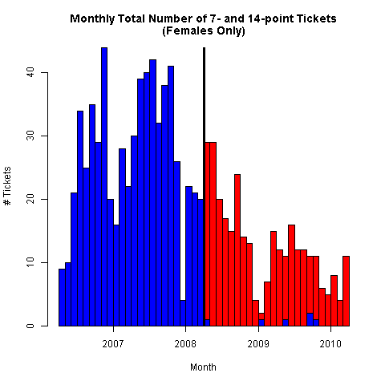

# Draft 1: Second version

Current point groups have been further consolidated in the regressions below.

# UNDER CONSTRUCTION!

Please see the old version in ```README_v1.md```.


## Data

The example dataset contains traffic violations in the Province of Quebec in the years from 1998 to 2010.
The dataset is the complete record of demerit points for the Province of Quebec through those years.
However, the dataset contains only the total number of demerit points awarded at a single roadside stop, not the points for a single violation.
There are no labels for the particular infraction.
The dataset also contains the age and sex of each driver, along with an individual identifier.
The data are aggregated by sex, age_group, demerit point value and recorded daily.
Each aggregate observation for a given point value is weighted by the number of drivers in a particular sex:age_group:point category for a particular day.
These totals are obtained from the SAAQ website [here](http://www.bdso.gouv.qc.ca/pls/ken/ken213_afich_tabl.page_tabl?p_iden_tran=REPERRUNYAW46-44034787356|@}zb&p_lang=2&p_m_o=SAAQ&p_id_ss_domn=718&p_id_raprt=3370).
It is numerically the same as recording 1 or zero with one observation for each licensed driver every day (except that most would be zeros).

### Drivers' History

A new categorical variable ```curr_pts_grp``` was added to capture the number of demerit points that a driver has accumulated over the past two years.
This was simple to calculate for the violation events.
For the non-events, an aggregate calculation was performed to take an inventory of the population of drivers with different point histories for each sex and age category.
To reduce the computational burden, the violation history was aggregated into the number of points for point levels 0-10, and in categories 11-20, 21-30 and 30-150, 150 being the highest observed.
In roughly 35% of the driver-days, drivers have no point history.
A further 45% have up to 10 demerit points in the last two years.
The 11-20 category accounts for the next decile.
The remaining decile  is split 7-3% between the next two categories, 21-30 and 30-150, respectively.
The last three categories were consolidated into a 10-150 point category.


### Policy Change: Excessive Speeding

On April 1, 2008 (no joke) the SAAQ implemented stiffer penalties on speeding violations, which involved doubling of the demerit points awarded for excessive speeding violations, higher fines and revocation of licenses.
Under this policy change, some violations are associated with different demerit point levels.

### Sample selection

The sample was limited to an equal window of two years before and after the date of the policy change,
from April 1, 2006 to March 31, 2010.
The summer months account for a large fraction of the infractions, so it is important to either impose symmetry over the calendar year or explicitly model the seasonality.


## Time Series Plots


### Pairs of Point Values for Related Speeding violations

Plots of the number of instances of tickets with selected pairs of point values.
Coloring should be clear from the context: original point value occurs before the
date of the policy change, the double-point tickets occur afterward.

The 5- and 10-point ticket volumes highlight the strategic choice of pairs of offences.


The 7- and 14- point pair is much cleaner comparison,
since the combinations of other tickets worth 7 points are relatively rare.




### Accumulated Points Balances (Included later)

For each driver, an accumulated demerit point balance
is calculated as the sum of the points awarded to each driver for all violations committed over a two-year rolling window.
A rolling window is used, as opposed to cumulative demerit points, to avoid continually growing balances over the sample period.
The two-year horizon is chosen because that is the time period over which demerit points remain on a driver's record,
potentially counting toward a revocation.

## Tables - Summary Statistics (Included later)


## Linear Probability Models

The following are linear probability regression models estimated from data aggregated by age groups and categories of previous demerit points.
The non-events, denominators for the event probabilities, are the total number of licensed drivers in the same sex and age groups and categories of previous demerit points.

### All violations combined

This includes all infractions, regardless of the relation to speeding or the policy change.

#### Male drivers:
```R
Coefficients:
                                Estimate Std. Error t value Pr(>|t|)    
(Intercept)                    1.058e-04  8.494e-06  12.459  < 2e-16 ***
age_grp16-19                   6.357e-04  8.947e-06  71.058  < 2e-16 ***
age_grp20-24                   4.917e-04  8.664e-06  56.754  < 2e-16 ***
age_grp25-34                   3.177e-04  8.562e-06  37.110  < 2e-16 ***
age_grp35-44                   2.416e-04  8.552e-06  28.248  < 2e-16 ***
age_grp45-54                   1.914e-04  8.548e-06  22.394  < 2e-16 ***
age_grp55-64                   1.307e-04  8.565e-06  15.258  < 2e-16 ***
age_grp65-199                  3.865e-05  8.580e-06   4.505 6.64e-06 ***
policyTRUE                    -6.887e-07  1.218e-05  -0.057  0.95490    
curr_pts_grp1-3                6.517e-04  1.299e-06 501.573  < 2e-16 ***
curr_pts_grp4-6                1.267e-03  2.185e-06 580.057  < 2e-16 ***
curr_pts_grp7-9                1.751e-03  3.454e-06 506.902  < 2e-16 ***
curr_pts_grp10-150             2.580e-03  4.297e-06 600.395  < 2e-16 ***
age_grp16-19:policyTRUE       -7.275e-05  1.277e-05  -5.695 1.24e-08 ***
age_grp20-24:policyTRUE       -7.515e-05  1.241e-05  -6.054 1.41e-09 ***
age_grp25-34:policyTRUE       -6.118e-05  1.227e-05  -4.986 6.16e-07 ***
age_grp35-44:policyTRUE       -3.318e-05  1.226e-05  -2.707  0.00679 **
age_grp45-54:policyTRUE       -2.398e-05  1.225e-05  -1.958  0.05025 .  
age_grp55-64:policyTRUE       -1.828e-05  1.227e-05  -1.489  0.13639    
age_grp65-199:policyTRUE      -2.175e-06  1.229e-05  -0.177  0.85954    
policyTRUE:curr_pts_grp1-3    -6.777e-05  1.794e-06 -37.787  < 2e-16 ***
policyTRUE:curr_pts_grp4-6    -1.287e-04  2.954e-06 -43.558  < 2e-16 ***
policyTRUE:curr_pts_grp7-9    -1.460e-04  4.660e-06 -31.342  < 2e-16 ***
policyTRUE:curr_pts_grp10-150 -5.112e-04  5.568e-06 -91.808  < 2e-16 ***
---
Signif. codes:  0 ‘***’ 0.001 ‘**’ 0.01 ‘*’ 0.05 ‘.’ 0.1 ‘ ’ 1

Residual standard error: 0.02288 on 5335033197 degrees of freedom
Multiple R-squared:  0.0004588,	Adjusted R-squared:  0.0004588
F-statistic: 1.065e+05 on 23 and 5335033197 DF,  p-value: < 2.2e-16
```

#### Female drivers:
```R

```

### One-point violations (for speeding 11-20 over)

This is the cleanest point level because there is a single violation that could have occurred.


#### Male drivers:
```R
Coefficients:
                                Estimate Std. Error t value Pr(>|t|)    
(Intercept)                    1.578e-06  2.407e-06   0.656 0.511938    
age_grp16-19                   4.866e-05  2.535e-06  19.196  < 2e-16 ***
age_grp20-24                   2.725e-05  2.455e-06  11.102  < 2e-16 ***
age_grp25-34                   2.548e-05  2.426e-06  10.506  < 2e-16 ***
age_grp35-44                   2.536e-05  2.423e-06  10.465  < 2e-16 ***
age_grp45-54                   2.277e-05  2.422e-06   9.403  < 2e-16 ***
age_grp55-64                   1.828e-05  2.427e-06   7.532 4.99e-14 ***
age_grp65-199                  8.842e-06  2.431e-06   3.638 0.000275 ***
policyTRUE                     2.147e-06  3.450e-06   0.622 0.533738    
curr_pts_grp1-3                4.772e-05  3.681e-07 129.622  < 2e-16 ***
curr_pts_grp4-6                8.576e-05  6.190e-07 138.539  < 2e-16 ***
curr_pts_grp7-9                1.266e-04  9.786e-07 129.362  < 2e-16 ***
curr_pts_grp10-150             2.075e-04  1.217e-06 170.465  < 2e-16 ***
age_grp16-19:policyTRUE       -1.426e-06  3.619e-06  -0.394 0.693554    
age_grp20-24:policyTRUE       -5.016e-06  3.517e-06  -1.426 0.153758    
age_grp25-34:policyTRUE       -1.554e-06  3.476e-06  -0.447 0.654866    
age_grp35-44:policyTRUE        1.083e-06  3.473e-06   0.312 0.755196    
age_grp45-54:policyTRUE        2.173e-06  3.470e-06   0.626 0.531245    
age_grp55-64:policyTRUE        2.083e-06  3.477e-06   0.599 0.549022    
age_grp65-199:policyTRUE       2.318e-06  3.482e-06   0.666 0.505558    
policyTRUE:curr_pts_grp1-3     4.491e-06  5.081e-07   8.838  < 2e-16 ***
policyTRUE:curr_pts_grp4-6     8.749e-06  8.370e-07  10.452  < 2e-16 ***
policyTRUE:curr_pts_grp7-9     1.118e-05  1.320e-06   8.466  < 2e-16 ***
policyTRUE:curr_pts_grp10-150 -1.267e-05  1.578e-06  -8.030 9.72e-16 ***
---
Signif. codes:  0 ‘***’ 0.001 ‘**’ 0.01 ‘*’ 0.05 ‘.’ 0.1 ‘ ’ 1

Residual standard error: 0.006482 on 5335033197 degrees of freedom
Multiple R-squared:  3.518e-05,	Adjusted R-squared:  3.517e-05
F-statistic:  8160 on 23 and 5335033197 DF,  p-value: < 2.2e-16
```

#### Female drivers:
```R

```

### Two-point violations (speeding 21-30 over or 7 other violations)

#### Male drivers:
```R
Coefficients:
                                Estimate Std. Error t value Pr(>|t|)    
(Intercept)                   -6.756e-06  5.343e-06  -1.265 0.206036    
age_grp16-19                   1.873e-04  5.627e-06  33.284  < 2e-16 ***
age_grp20-24                   1.764e-04  5.450e-06  32.369  < 2e-16 ***
age_grp25-34                   1.601e-04  5.386e-06  29.727  < 2e-16 ***
age_grp35-44                   1.506e-04  5.379e-06  27.989  < 2e-16 ***
age_grp45-54                   1.394e-04  5.376e-06  25.924  < 2e-16 ***
age_grp55-64                   1.158e-04  5.387e-06  21.489  < 2e-16 ***
age_grp65-199                  6.916e-05  5.396e-06  12.815  < 2e-16 ***
policyTRUE                     1.236e-07  7.659e-06   0.016 0.987123    
curr_pts_grp1-3                2.514e-04  8.173e-07 307.635  < 2e-16 ***
curr_pts_grp4-6                4.597e-04  1.374e-06 334.489  < 2e-16 ***
curr_pts_grp7-9                6.028e-04  2.173e-06 277.441  < 2e-16 ***
curr_pts_grp10-150             7.824e-04  2.703e-06 289.493  < 2e-16 ***
age_grp16-19:policyTRUE        3.607e-06  8.035e-06   0.449 0.653488    
age_grp20-24:policyTRUE       -1.689e-07  7.808e-06  -0.022 0.982741    
age_grp25-34:policyTRUE       -7.592e-06  7.718e-06  -0.984 0.325256    
age_grp35-44:policyTRUE       -3.832e-06  7.710e-06  -0.497 0.619157    
age_grp45-54:policyTRUE       -1.427e-06  7.705e-06  -0.185 0.853087    
age_grp55-64:policyTRUE       -1.228e-06  7.719e-06  -0.159 0.873588    
age_grp65-199:policyTRUE       1.817e-06  7.730e-06   0.235 0.814166    
policyTRUE:curr_pts_grp1-3    -4.138e-06  1.128e-06  -3.668 0.000244 ***
policyTRUE:curr_pts_grp4-6    -3.209e-06  1.858e-06  -1.727 0.084162 .  
policyTRUE:curr_pts_grp7-9     5.409e-06  2.931e-06   1.845 0.064969 .  
policyTRUE:curr_pts_grp10-150 -1.069e-04  3.502e-06 -30.524  < 2e-16 ***
---
Signif. codes:  0 ‘***’ 0.001 ‘**’ 0.01 ‘*’ 0.05 ‘.’ 0.1 ‘ ’ 1

Residual standard error: 0.01439 on 5335033197 degrees of freedom
Multiple R-squared:  0.0001432,	Adjusted R-squared:  0.0001432
F-statistic: 3.321e+04 on 23 and 5335033197 DF,  p-value: < 2.2e-16
```

#### Female drivers:
```R

```

### Three-point violations (speeding 31-60 over or 9 other violations)

This demerit point level is influenced by the policy change in that the penalty for speeding 40-45 over in a 100km/hr zone is doubled to 6 points, with no other changes to the penalties for the other offences.
For this reason, both 3- and 6-point violations are included in the sample, after the policy change. That is, the 6-point violations are not included in the sample before the window.

#### Male drivers:
```R
Coefficients:
                                Estimate Std. Error t value Pr(>|t|)    
(Intercept)                    9.125e-05  5.884e-06  15.509  < 2e-16 ***
age_grp16-19                   2.764e-04  6.198e-06  44.600  < 2e-16 ***
age_grp20-24                   2.352e-04  6.002e-06  39.195  < 2e-16 ***
age_grp25-34                   1.255e-04  5.931e-06  21.167  < 2e-16 ***
age_grp35-44                   7.701e-05  5.924e-06  13.001  < 2e-16 ***
age_grp45-54                   4.586e-05  5.921e-06   7.745 9.53e-15 ***
age_grp55-64                   1.610e-05  5.933e-06   2.713 0.006662 **
age_grp65-199                 -1.970e-05  5.943e-06  -3.314 0.000919 ***
policyTRUE                     2.764e-06  8.435e-06   0.328 0.743110    
curr_pts_grp1-3                3.234e-04  9.001e-07 359.355  < 2e-16 ***
curr_pts_grp4-6                6.482e-04  1.513e-06 428.270  < 2e-16 ***
curr_pts_grp7-9                8.994e-04  2.393e-06 375.887  < 2e-16 ***
curr_pts_grp10-150             1.330e-03  2.976e-06 446.857  < 2e-16 ***
age_grp16-19:policyTRUE       -5.189e-05  8.849e-06  -5.864 4.51e-09 ***
age_grp20-24:policyTRUE       -5.395e-05  8.599e-06  -6.275 3.50e-10 ***
age_grp25-34:policyTRUE       -4.736e-05  8.500e-06  -5.572 2.52e-08 ***
age_grp35-44:policyTRUE       -3.262e-05  8.491e-06  -3.841 0.000122 ***
age_grp45-54:policyTRUE       -2.847e-05  8.485e-06  -3.355 0.000793 ***
age_grp55-64:policyTRUE       -2.441e-05  8.501e-06  -2.872 0.004078 **
age_grp65-199:policyTRUE      -1.209e-05  8.513e-06  -1.421 0.155406    
policyTRUE:curr_pts_grp1-3    -5.405e-05  1.242e-06 -43.509  < 2e-16 ***
policyTRUE:curr_pts_grp4-6    -9.960e-05  2.047e-06 -48.668  < 2e-16 ***
policyTRUE:curr_pts_grp7-9    -1.083e-04  3.228e-06 -33.554  < 2e-16 ***
policyTRUE:curr_pts_grp10-150 -2.816e-04  3.857e-06 -73.012  < 2e-16 ***
---
Signif. codes:  0 ‘***’ 0.001 ‘**’ 0.01 ‘*’ 0.05 ‘.’ 0.1 ‘ ’ 1

Residual standard error: 0.01585 on 5335033197 degrees of freedom
Multiple R-squared:  0.0002452,	Adjusted R-squared:  0.0002452
F-statistic: 5.689e+04 on 23 and 5335033197 DF,  p-value: < 2.2e-16
```

#### Female drivers:
```R

```


### Four-point violations (speeding 31-45 over or 9 other violations)

Four demerit points can be awarded for any of 10 individual offences or for a one- or two-point speeding violation, combined with a three- or two-point violation for an offence other than speeding, or, finally, for any two non-speeding offences worth two points each.

#### Male drivers:
```R
Coefficients:
                                Estimate Std. Error t value Pr(>|t|)    
(Intercept)                    1.715e-05  8.927e-07  19.212  < 2e-16 ***
age_grp16-19                   5.133e-05  9.402e-07  54.593  < 2e-16 ***
age_grp20-24                   1.027e-06  9.105e-07   1.128 0.259402    
age_grp25-34                  -1.330e-05  8.998e-07 -14.784  < 2e-16 ***
age_grp35-44                  -1.638e-05  8.987e-07 -18.230  < 2e-16 ***
age_grp45-54                  -1.718e-05  8.982e-07 -19.129  < 2e-16 ***
age_grp55-64                  -1.722e-05  9.001e-07 -19.127  < 2e-16 ***
age_grp65-199                 -1.704e-05  9.016e-07 -18.897  < 2e-16 ***
policyTRUE                    -5.052e-06  1.280e-06  -3.948 7.88e-05 ***
curr_pts_grp1-3                3.258e-06  1.365e-07  23.858  < 2e-16 ***
curr_pts_grp4-6                1.235e-05  2.296e-07  53.778  < 2e-16 ***
curr_pts_grp7-9                2.305e-05  3.630e-07  63.511  < 2e-16 ***
curr_pts_grp10-150             5.597e-05  4.515e-07 123.959  < 2e-16 ***
age_grp16-19:policyTRUE       -4.963e-07  1.343e-06  -0.370 0.711618    
age_grp20-24:policyTRUE        4.391e-06  1.304e-06   3.366 0.000762 ***
age_grp25-34:policyTRUE        5.040e-06  1.290e-06   3.908 9.30e-05 ***
age_grp35-44:policyTRUE        5.029e-06  1.288e-06   3.904 9.47e-05 ***
age_grp45-54:policyTRUE        5.024e-06  1.287e-06   3.903 9.51e-05 ***
age_grp55-64:policyTRUE        4.920e-06  1.290e-06   3.815 0.000136 ***
age_grp65-199:policyTRUE       4.927e-06  1.291e-06   3.815 0.000136 ***
policyTRUE:curr_pts_grp1-3    -9.158e-07  1.885e-07  -4.859 1.18e-06 ***
policyTRUE:curr_pts_grp4-6    -2.304e-06  3.105e-07  -7.420 1.17e-13 ***
policyTRUE:curr_pts_grp7-9    -4.380e-06  4.897e-07  -8.945  < 2e-16 ***
policyTRUE:curr_pts_grp10-150 -1.667e-05  5.852e-07 -28.494  < 2e-16 ***
---
Signif. codes:  0 ‘***’ 0.001 ‘**’ 0.01 ‘*’ 0.05 ‘.’ 0.1 ‘ ’ 1

Residual standard error: 0.002404 on 5335033197 degrees of freedom
Multiple R-squared:  3.131e-05,	Adjusted R-squared:  3.131e-05
F-statistic:  7263 on 23 and 5335033197 DF,  p-value: < 2.2e-16
```

#### Female drivers:
```R

```
### Five-point violations (speeding 46-60 over or a handheld device violation)

This captures a variety of speeding violations, based on the speed zone, some of which are changed to 10 points.
In both cases, the 5 point ticket can be a combination of some of the above offences.
For this reason, both 5- and 10-point violations are included in the sample after the policy change.


#### Male drivers:
```R
Coefficients:
                                Estimate Std. Error t value Pr(>|t|)    
(Intercept)                   -2.451e-06  1.326e-06  -1.848   0.0646 .  
age_grp16-19                   4.752e-05  1.397e-06  34.015  < 2e-16 ***
age_grp20-24                   3.989e-05  1.353e-06  29.488  < 2e-16 ***
age_grp25-34                   1.938e-05  1.337e-06  14.497  < 2e-16 ***
age_grp35-44                   8.736e-06  1.335e-06   6.542 6.06e-11 ***
age_grp45-54                   5.213e-06  1.335e-06   3.905 9.41e-05 ***
age_grp55-64                   2.808e-06  1.337e-06   2.099   0.0358 *  
age_grp65-199                  1.609e-06  1.340e-06   1.201   0.2298    
policyTRUE                     9.810e-07  1.901e-06   0.516   0.6059    
curr_pts_grp1-3                2.023e-05  2.029e-07  99.690  < 2e-16 ***
curr_pts_grp4-6                4.704e-05  3.412e-07 137.867  < 2e-16 ***
curr_pts_grp7-9                7.446e-05  5.394e-07 138.046  < 2e-16 ***
curr_pts_grp10-150             1.400e-04  6.709e-07 208.739  < 2e-16 ***
age_grp16-19:policyTRUE       -1.364e-05  1.995e-06  -6.840 7.91e-12 ***
age_grp20-24:policyTRUE       -1.596e-05  1.938e-06  -8.232  < 2e-16 ***
age_grp25-34:policyTRUE       -8.913e-06  1.916e-06  -4.652 3.29e-06 ***
age_grp35-44:policyTRUE       -4.188e-06  1.914e-06  -2.188   0.0287 *  
age_grp45-54:policyTRUE       -2.903e-06  1.913e-06  -1.517   0.1291    
age_grp55-64:policyTRUE       -1.516e-06  1.916e-06  -0.791   0.4289    
age_grp65-199:policyTRUE      -8.500e-07  1.919e-06  -0.443   0.6578    
policyTRUE:curr_pts_grp1-3    -1.045e-05  2.801e-07 -37.313  < 2e-16 ***
policyTRUE:curr_pts_grp4-6    -2.480e-05  4.613e-07 -53.746  < 2e-16 ***
policyTRUE:curr_pts_grp7-9    -3.842e-05  7.276e-07 -52.804  < 2e-16 ***
policyTRUE:curr_pts_grp10-150 -6.388e-05  8.695e-07 -73.469  < 2e-16 ***
---
Signif. codes:  0 ‘***’ 0.001 ‘**’ 0.01 ‘*’ 0.05 ‘.’ 0.1 ‘ ’ 1

Residual standard error: 0.003573 on 5335033197 degrees of freedom
Multiple R-squared:  3.41e-05,	Adjusted R-squared:  3.409e-05
F-statistic:  7909 on 23 and 5335033197 DF,  p-value: < 2.2e-16
```

#### Female drivers:
```R

```

### Seven-point violations (speeding 61-80 over or combinations)

The only offence that merits precisely 7 demerit points is speeding 61-80 over, only before the policy change, after which it was changed to a 14-point offence.

There are plenty of 7-point offences before the change but not many 7-point combinations of offences afterwards.
Likewise, there were hardly any 14-point events before the change, because it would involve combining a number of unusually-paired offences, which might include, say, one 12 point offence plus 2 points for a minor offence.

Still, there is some confounding with the policy change effect from other offences, since 14 points can be earned from the 10-point speeding (which was once 5 points) combined with a four-point violation.
Together, these changes are found in the regression with the event defined as either a 7- or 14-point violation.

The following regression is done including both 7- and 14-point violations in the sample after the policy change but only 7-point violations before.

#### Male drivers:
```R
Coefficients:
                                Estimate Std. Error t value Pr(>|t|)    
(Intercept)                   -3.538e-07  5.532e-07  -0.640   0.5224    
age_grp16-19                   1.518e-05  5.826e-07  26.059  < 2e-16 ***
age_grp20-24                   9.826e-06  5.642e-07  17.415  < 2e-16 ***
age_grp25-34                   3.561e-06  5.576e-07   6.387 1.69e-10 ***
age_grp35-44                   6.582e-07  5.569e-07   1.182   0.2372    
age_grp45-54                   9.076e-10  5.566e-07   0.002   0.9987    
age_grp55-64                  -2.009e-07  5.578e-07  -0.360   0.7186    
age_grp65-199                 -3.963e-08  5.587e-07  -0.071   0.9435    
policyTRUE                     1.279e-07  7.929e-07   0.161   0.8718    
curr_pts_grp1-3                3.139e-06  8.461e-08  37.094  < 2e-16 ***
curr_pts_grp4-6                8.331e-06  1.423e-07  58.552  < 2e-16 ***
curr_pts_grp7-9                1.397e-05  2.249e-07  62.102  < 2e-16 ***
curr_pts_grp10-150             3.820e-05  2.798e-07 136.527  < 2e-16 ***
age_grp16-19:policyTRUE       -6.171e-06  8.319e-07  -7.418 1.19e-13 ***
age_grp20-24:policyTRUE       -4.107e-06  8.083e-07  -5.081 3.75e-07 ***
age_grp25-34:policyTRUE       -1.959e-06  7.990e-07  -2.451   0.0142 *  
age_grp35-44:policyTRUE       -3.008e-07  7.983e-07  -0.377   0.7064    
age_grp45-54:policyTRUE        1.725e-08  7.977e-07   0.022   0.9827    
age_grp55-64:policyTRUE        1.580e-07  7.991e-07   0.198   0.8432    
age_grp65-199:policyTRUE       1.969e-08  8.003e-07   0.025   0.9804    
policyTRUE:curr_pts_grp1-3    -1.994e-06  1.168e-07 -17.072  < 2e-16 ***
policyTRUE:curr_pts_grp4-6    -5.329e-06  1.924e-07 -27.697  < 2e-16 ***
policyTRUE:curr_pts_grp7-9    -7.087e-06  3.034e-07 -23.355  < 2e-16 ***
policyTRUE:curr_pts_grp10-150 -1.916e-05  3.626e-07 -52.842  < 2e-16 ***
---
Signif. codes:  0 ‘***’ 0.001 ‘**’ 0.01 ‘*’ 0.05 ‘.’ 0.1 ‘ ’ 1

Residual standard error: 0.00149 on 5335033197 degrees of freedom
Multiple R-squared:  1.15e-05,	Adjusted R-squared:  1.149e-05
F-statistic:  2667 on 23 and 5335033197 DF,  p-value: < 2.2e-16
```

#### Female drivers:
```R

```

### Nine-points and up (speeding 80 or more and 10 other 9- or 12-point offences)

This includes as events all infractions classified as 9 points and up before the policy change.
That is, all the 9-, 12-, 15-, 18- and  21-point violations before the policy change.
Then I include all of the point values that are double those values after the policy change.
That is, in addition to the above, I include all the 24-, 30-, and 36-point violations.
This excludes the 10- and 14-point violations that are the doubled 5- and 7-point violations in the previous regressions.
It does, however, include the 7 different non-speeding 9-point violations
and the 3 different non-speeding 12-point violations,
which are the same before and after the policy change.
Note that 12- and 15- point violations never happen after the policy change (```policy == TRUE```) and 24-points and up are technically possible but never happen before the change.
It appears that the non-speeding 12-point violations never happen after the change.

Points in rows vs. post-policy change TRUE for males:
```R
> table(saaq_data[sel_obs & saaq_data[, 'events'], 'points'],
+       saaq_data[sel_obs & saaq_data[, 'events'], 'policy'], useNA = 'ifany')

     FALSE TRUE
  9   6140 5020
  12   125    0
  15    17    0
  18     4  549
  24     0   96
  30     0   17
  36     0    4
```
(Units are number of rows, that is date-age-sex-point observations, not necessarily individuals.)

Finally, the 4 crazies who got 18 points before the change are equally matched by 4 others (yes, only 4 individuals, 1 per row in each).


#### Male drivers:
```R
Coefficients:
                                Estimate Std. Error t value Pr(>|t|)    
(Intercept)                    5.309e-06  6.014e-07   8.828  < 2e-16 ***
age_grp16-19                   7.485e-06  6.334e-07  11.816  < 2e-16 ***
age_grp20-24                   1.193e-06  6.134e-07   1.945   0.0517 .  
age_grp25-34                  -2.989e-06  6.062e-07  -4.932 8.16e-07 ***
age_grp35-44                  -4.206e-06  6.054e-07  -6.947 3.72e-12 ***
age_grp45-54                  -4.457e-06  6.051e-07  -7.365 1.77e-13 ***
age_grp55-64                  -4.686e-06  6.064e-07  -7.727 1.10e-14 ***
age_grp65-199                 -4.046e-06  6.074e-07  -6.661 2.72e-11 ***
policyTRUE                    -1.678e-06  8.621e-07  -1.947   0.0516 .  
curr_pts_grp1-3                2.327e-06  9.199e-08  25.294  < 2e-16 ***
curr_pts_grp4-6                5.319e-06  1.547e-07  34.385  < 2e-16 ***
curr_pts_grp7-9                9.505e-06  2.446e-07  38.867  < 2e-16 ***
curr_pts_grp10-150             2.257e-05  3.042e-07  74.197  < 2e-16 ***
age_grp16-19:policyTRUE       -8.627e-07  9.044e-07  -0.954   0.3401    
age_grp20-24:policyTRUE        5.573e-07  8.788e-07   0.634   0.5260    
age_grp25-34:policyTRUE        1.129e-06  8.687e-07   1.299   0.1938    
age_grp35-44:policyTRUE        1.491e-06  8.678e-07   1.718   0.0857 .  
age_grp45-54:policyTRUE        1.439e-06  8.672e-07   1.659   0.0972 .  
age_grp55-64:policyTRUE        1.555e-06  8.688e-07   1.790   0.0735 .  
age_grp65-199:policyTRUE       1.550e-06  8.700e-07   1.781   0.0749 .  
policyTRUE:curr_pts_grp1-3    -5.196e-07  1.270e-07  -4.092 4.27e-05 ***
policyTRUE:curr_pts_grp4-6    -1.483e-06  2.092e-07  -7.090 1.34e-12 ***
policyTRUE:curr_pts_grp7-9    -3.254e-06  3.299e-07  -9.863  < 2e-16 ***
policyTRUE:curr_pts_grp10-150 -7.255e-06  3.942e-07 -18.404  < 2e-16 ***
---
Signif. codes:  0 ‘***’ 0.001 ‘**’ 0.01 ‘*’ 0.05 ‘.’ 0.1 ‘ ’ 1

Residual standard error: 0.00162 on 5335033197 degrees of freedom
Multiple R-squared:  4.774e-06,	Adjusted R-squared:  4.77e-06
F-statistic:  1107 on 23 and 5335033197 DF,  p-value: < 2.2e-16
```

#### Female drivers:
```R

```

There is not much going on in the higher point categories for the ladies.

Points in rows vs. post-policy change TRUE for females:
```R
> table(saaq_data[sel_obs & saaq_data[, 'events'], 'points'],
+       saaq_data[sel_obs & saaq_data[, 'events'], 'policy'], useNA = 'ifany')

     FALSE TRUE
  9   2263 2136
  12     1    0
  15     1    0
  18     0   23
  24     0    4
```

All of the incidents above 12 points in the above table are individuals (i.e. one driver per row).
That is, it only happened 6 times that a lady got a ticket for speeding more than 100 km/hr over the speed limit.
Compare this to 263 events for males.
So, for the female drivers, most of the action in this regression is from the 9- point to the 18-point speeding violation,
although most of the 9-point violations relate to the 7 offences other than speeding.
