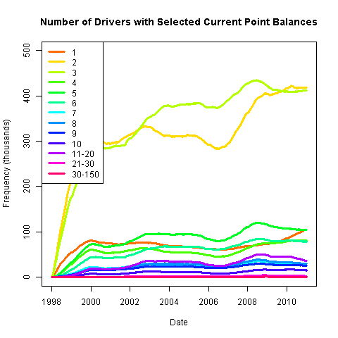
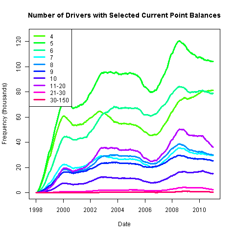

# Preliminary Analysis

## Data

The example dataset contains traffic violations in the Province of Quebec in the years from 1998 to 2010.
The dataset is the complete record of demerit points for the Province of Quebec through those years.
However, the dataset contains only the total number of demerit points awarded at a single roadside stop, not the points for a single violation.
There are no labels for the particular infraction.
The dataset also contains the age and sex of each driver, along with an individual identifier.
The data are aggregated by sex, age_group, demerit point value and recorded daily.
Each aggregate observation for a given point value is weighted by the number of drivers in a particular sex:age_group:point category for a particular day.
These totals are obtained from the SAAQ website [here](http://www.bdso.gouv.qc.ca/pls/ken/ken213_afich_tabl.page_tabl?p_iden_tran=REPERRUNYAW46-44034787356|@}zb&p_lang=2&p_m_o=SAAQ&p_id_ss_domn=718&p_id_raprt=3370).
It is numerically the same as recording 1 or zero with one observation for each licensed driver every day (except that most would be zeros).

On April 1, 2008 (no joke) the SAAQ implemented stiffer penalties on speeding violations, which involved doubling of the demerit points awarded for excessive speeding violations, higher fines and revocation of licenses.
Under this policy change, some violations are associated with different demerit point levels.

## Time Series Plots

### Single Violation Events

For 1-point speeding tickets, there is an increase after the policy change.

For 2-point tickets, there is an increase leading up to the policy change and this is sustained afterwards.

For 3-point tickets, there appears to be a decline back toward pre-2006 levels.

For the 4-point tickets, there is no visible effect of the policy change (these tickets are unrelated to speeding).
However, you can see a change in policy in 2002.
We should truncate the sample to start after that point and a balanced sample around a symmetric event window satisfies this constraint.
Furthermore, there is clearly a pattern of seasonality, indicating that the April 1, 2006 - April 1, 2010 window will alleviate the need to correct for seasonality.

### Pairs of Point Values for Related Speeding violations

The following plots show the time series of the number of instances of tickets with selected pairs of point values.

### Accumulated Points Balances

For each driver, an accumulated demerit point balance
is calculated as the sum of the points awarded to each driver for all violations committed over a two-year rolling window.
A rolling window is used, as opposed to cumulative demerit points, to avoid continually growing balances over the sample period.
The two-year horizon is chosen because that is the time period over which demerit points remain on a driver's record,
potentially counting toward a revocation.

#### All non-zero categories:

#### Categories 4 points and above:

#### Categories 7 points and above:

Through the series of graphs, it seems to me as though there is this trend of increasing
numbers of drivers with the higher demerit point balances.
This trend hits its peak when the new policy is instituted and drivers' balances
decline as previous points expire and are not being replaced at the same rate.

There is a series of ups and downs over the years, however, the first increase is just the accumulation of the first two years of events up to 2000.
